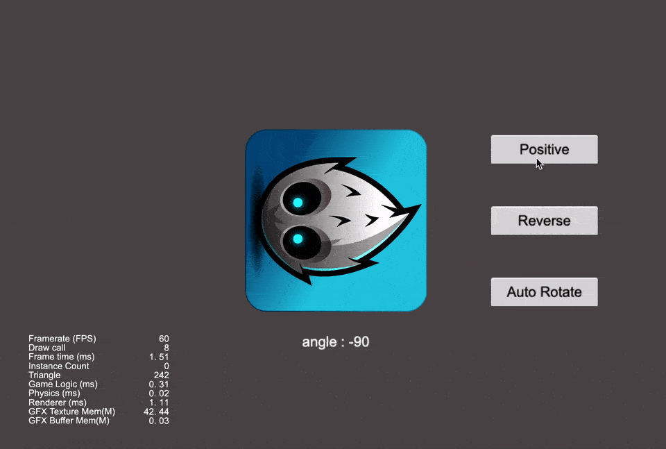

## Cocos Creator How To Use

### 简介

基于 CocosCreator 3.0.0 版本创建的 **自适应最小角度旋转** 工程

### 效果预览

### 实现思路
1. 假如我们已知一个旋转后的角度 angle, 取值范围可能是(-180, 180)，我们通过获取需要旋转的角度 diffAngle，旋转角度
2. 假如当前的角度 currentAngle 为 -100，需要旋转后的角度 r 为 -160，我们通过 diffAngle = r - currentAngle, 可以获得 diffAngle 为 -60,则逆时针从当前的角度(-100)逆时针旋转 60 to -160