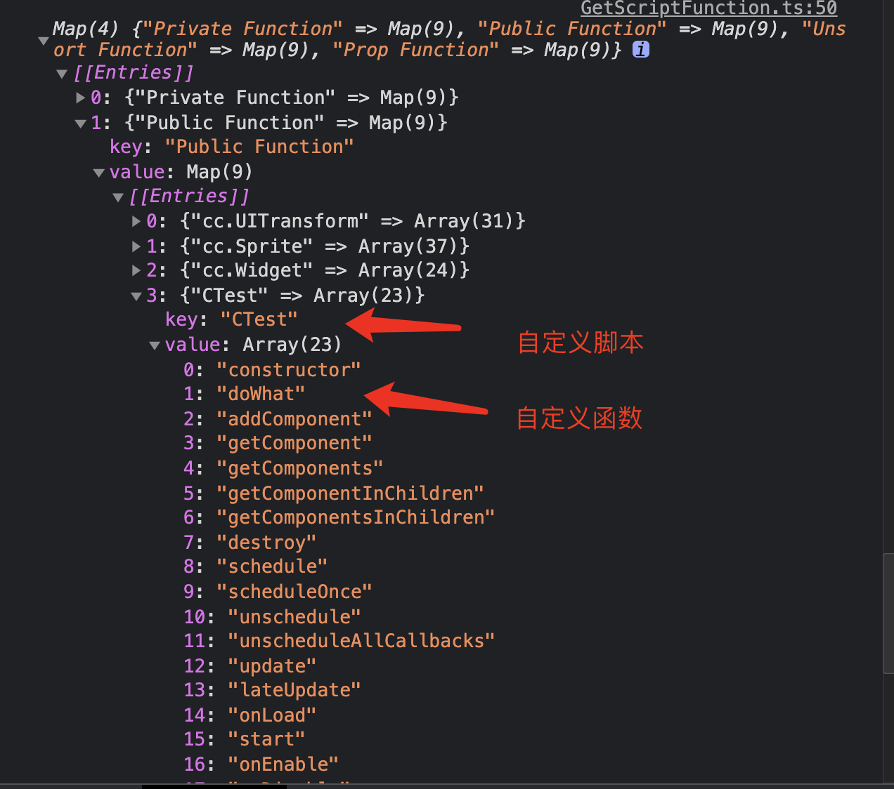
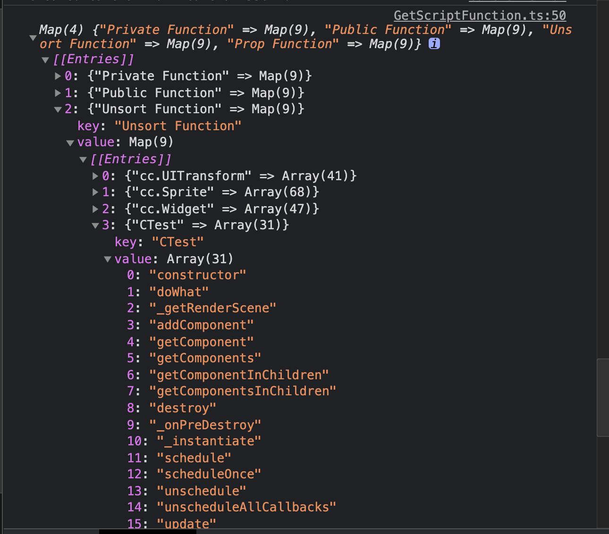

## Cocos Creator How To Use

### 简介

基于 CocosCreator 3.0.0 版本创建的 **动态获取脚本的方法名** 工程

### 实现思路
1. 使用js.getClassByName 尝试获取，终于获取到了。
2. 在节点下随便挂了几个组件，以及自定义的脚本。
3. 目前获取数据随便分类了一下，如果需要需要自行判断。

### 使用
- "Private Function" 私有方法(需要规范定义  _xxx 或者 __xxx )

- "Public Function" 非私有方法/公共方法

- "Unsort Function" 不区分私有/共有

- "Prop Function"  prop方法
