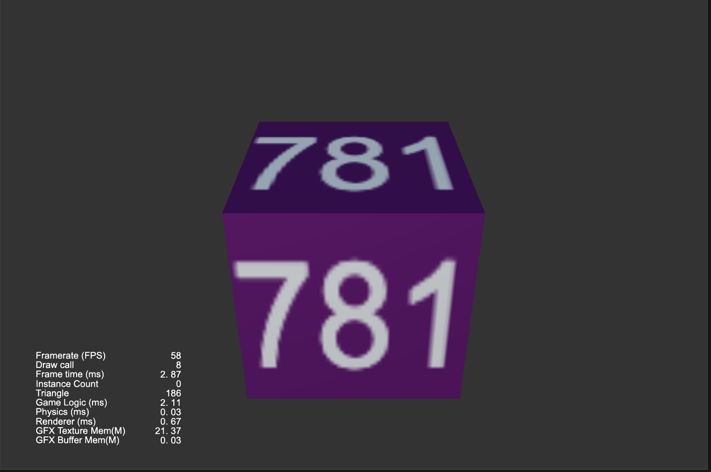

### 简介

基于 CocosCreator 3.4.2 版本创建的 **3D模型上的文字** 工程

### 效果预览

### 实现思路
1. Cube 上贴6个 Quad, Quad 使用 standard 材质，选择透明材质（transpaent）
2. 把文本（Label）的贴图贴在 Quad 的材质中

### 相关链接
https://forum.cocos.org/t/topic/100139/12