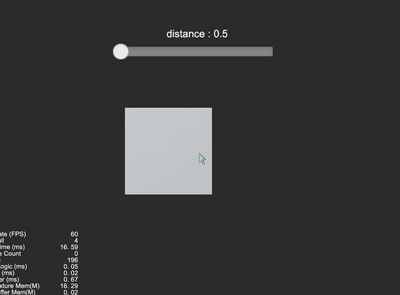

## Cocos Creator How To Use

### DemandCase
| 编号 | 类目 | 子项 | 演示 |
| :---: | :---: | :---: | :---: |
| 1 | 需求案例 | [物体是否在摄像机范围内](https://github.com/yeshao2069/CocosCreatorHowToUse/tree/v3.0.x/Demo/ObjectIsInCameraView) |

 |
| 2 | 需求案例 | [使用动画帧事件](https://github.com/yeshao2069/CocosCreatorHowToUse/tree/v3.0.x/Demo/Creator3.0.0_UseAnimationFrameEvents) | 

 |
| 3 | 需求案例 | [动态获取脚本的方法名](https://github.com/yeshao2069/CocosCreatorHowToUse/tree/v3.0.x/Demo/Creator3.0.0_GetScriptFunction) | 

 |
| 4 | 需求案例 | [动态获取动画属性数据](https://github.com/yeshao2069/CocosCreatorHowToUse/tree/v3.0.x/Demo/Creator3.0.0_GetAnimationClipDataByTime) |  

 |
| 5 | 需求案例 | [点击响应](https://github.com/yeshao2069/CocosCreatorHowToUse/tree/v3.0.x/Demo/Creator3.0.0_2D_PressResponse) |   |
| 6 | 需求案例 | [物体始终在人物右侧](https://github.com/yeshao2069/CocosCreatorHowToUse/tree/v3.0.x/Demo/Creator3.0.0_3D_ObjectAlwaysFollow) | 

 |
| 7 | 需求案例 | [圆形进度条](https://github.com/yeshao2069/CocosCreatorHowToUse/tree/v3.0.x/Demo/Creator3.0.0_2D_CircularProgressBar) | 

 |
| 8 | 需求案例 | [椭圆轨迹运动](https://github.com/yeshao2069/CocosCreatorHowToUse/tree/v3.0.x/Demo/Creator3.0.0_2D_EllipseMove) | 

 |
| 9 | 需求案例 | [贝塞尔曲线路径在线绘制工具](https://github.com/yeshao2069/CocosCreatorHowToUse/tree/v3.0.x/Demo/Creator3.0.0_BezierCurvePathCreator) | 

 |
| 10 | 需求案例 | [动态加载FBX模型中的Mesh](https://github.com/yeshao2069/CocosCreatorHowToUse/tree/v3.0.x/Demo/Creator3.0.0_3D_DynamicLoadMesh) | 

 |
| 11 | 需求案例 | [旋转后矩形是否包含点](https://github.com/yeshao2069/CocosCreatorHowToUse/tree/v3.0.x/Demo/Creator3.0.0_2D_AbovePoint) | 

 |
| 12 | 需求案例 | [弯曲的道路](https://github.com/yeshao2069/CocosCreatorHowToUse/tree/v3.0.x/Demo/Creator3.0.0_3D_RoadCurved) | 

 |
| 13 | 需求案例 | [3D位置转化](https://github.com/yeshao2069/CocosCreatorHowToUse/tree/v3.0.x/Demo/Creator3.0.0_ScreenToWorldPoint) | 

 |
| 14 | 需求案例 | [动态生成单色精灵](https://github.com/yeshao2069/CocosCreatorHowToUse/tree/v3.0.x/Demo/Creator3.0.0_2D_AutoGenerateSpriteframe) | 

 |
| 15 | 需求案例 | [不规则按钮](https://github.com/yeshao2069/CocosCreatorHowToUse/tree/v3.0.x/Demo/Creator3.0.0_2D_IrregularButton) | 

 |
| 16 | 需求案例 | [自适应最小角度点击旋转](https://github.com/yeshao2069/CocosCreatorHowToUse/tree/v3.0.x/Demo/Creator3.0.0_2D_AdaptiveRotation) | 

 |
| 17 | 需求案例 | [自适应最小角度旋转](https://github.com/yeshao2069/CocosCreatorHowToUse/tree/v3.0.x/Demo/Creator3.0.0_2D_AdaptiveAngleRotation) | 

 |