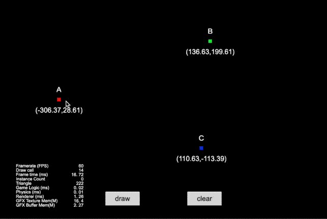

## Cocos Creator How To Use

### Graphics
| 序号 | 类目 | 子项 | 演示 |
| :---: | :---: | :---: | :---: |
| 1 | Graphics | [画饼状图](https://github.com/yeshao2069/CocosCreatorHowToUse/tree/v3.4.x/Graphics/Creator3.4.2_2D_GraphicsArc)  | 

 |
| 2 | Graphics | [画正方形](https://github.com/yeshao2069/CocosCreatorHowToUse/tree/v3.4.x/Graphics/Creator3.4.2_2D_GraphicsRect)  | 

 |
| 3 | Graphics | [画菱形](https://github.com/yeshao2069/CocosCreatorHowToUse/tree/v3.4.x/Graphics/Creator3.4.2_2D_GraphicsLineTo)  | 

 |
| 4 | Graphics | [画椭圆形](https://github.com/yeshao2069/CocosCreatorHowToUse/tree/v3.4.x/Graphics/Creator3.4.2_2D_GraphicsEllipse)  | 

 |
| 5 | Graphics | [三点画圆](https://github.com/yeshao2069/CocosCreatorHowToUse/tree/v3.4.x/Graphics/Creator3.4.2_2D_GraphicsDrawCircle)  | 

 |
| 6 | Graphics | [涂鸦](https://github.com/yeshao2069/CocosCreatorHowToUse/tree/v3.4.x/Graphics/Creator3.4.2_2D_Doodle)  | 

 |
| 7 | Graphics | [画Sine曲线](https://github.com/yeshao2069/CocosCreatorHowToUse/tree/v3.4.x/Graphics/Creator3.4.2_2D_GraphicsSineWaves)  | 

 |
| 8 | Graphics | [自由画线](https://github.com/yeshao2069/CocosCreatorHowToUse/tree/v3.4.x/Graphics/Creator3.4.2_2D_DrawLine)  | 

 |
| 9 | Graphics | [烟花爆炸](https://github.com/yeshao2069/CocosCreatorHowToUse/tree/v3.4.x/Graphics/Creator3.4.2_2D_GraphicsFireworksExplosion)  | 

 |