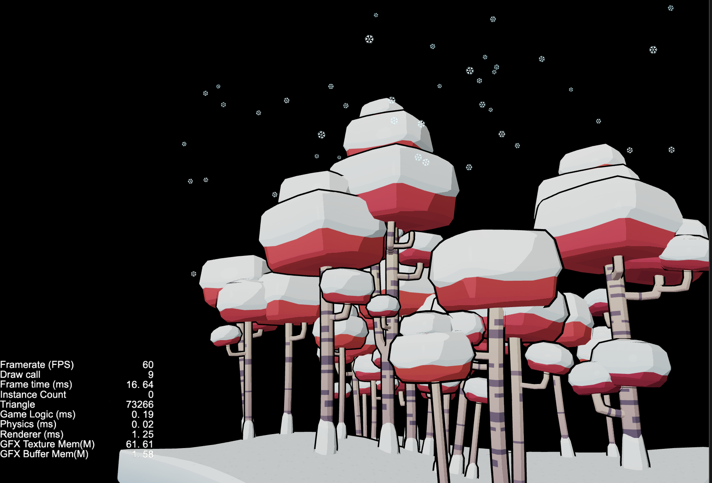

## Cocos Creator How To Use

### Model
| 编号 | 类目 | 子项 | 演示 |
| :---: | :---: | :---: | :---: |
| 1 | Model示例 | [表情动画](https://github.com/yeshao2069/CocosCreatorHowToUse/tree/v3.0.x/Model/Creator3.0.0_3D_MorphHead) | 

 |
| 2 | Model示例 | [跳舞的女人](https://github.com/yeshao2069/CocosCreatorHowToUse/tree/v3.0.x/Model/Creator3.0.0_3D_DanceWoman) | 

 |
| 3 | Model示例 | [使用卡通材质](https://github.com/yeshao2069/CocosCreatorHowToUse/tree/v3.0.x/Model/Creator3.0.0_3D_Toon)  | 

 |
| 4 | Model示例 | [动态加载材质](https://github.com/yeshao2069/CocosCreatorHowToUse/tree/v3.0.x/Model/Creator3.0.0_3D_DynamicLoadMaterial)  | 

  |
| 5 | Model示例 | [冬来了](https://github.com/yeshao2069/CocosCreatorHowToUse/tree/v3.0.x/Model/Creator3.0.0_3D_Winter)  | 

  |
| 6 | Model示例 | [骑士](https://github.com/yeshao2069/CocosCreatorHowToUse/tree/v3.0.x/Model/Creator3.0.0_3D_Knight)  | 

  |