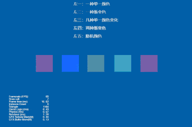
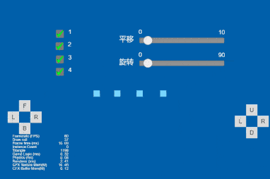
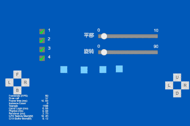

## Cocos Creator How To Use

### Particle
| 序号 | 类目 | 子项 | 演示 |
| :---: | :---: | :---: | :---: |
| 1 | Particle | [火焰](https://github.com/yeshao2069/CocosCreatorHowToUse/tree/v3.4.x/Particle/Creator3.4.2_3D_FlameSimulation)  | 

 |
| 2 | Particle | [粒子拖尾1](https://github.com/yeshao2069/CocosCreatorHowToUse/tree/v3.4.x/Particle/Creator3.4.2_3D_ParticleTrails01)  | 

 |
| 3 | Particle | [粒子拖尾2](https://github.com/yeshao2069/CocosCreatorHowToUse/tree/v3.4.x/Particle/Creator3.4.2_3D_ParticleTrails02)  | 

 |
| 4 | Particle | [粒子拖尾3](https://github.com/yeshao2069/CocosCreatorHowToUse/tree/v3.4.x/Particle/Creator3.4.2_3D_ParticleTrails03)  | 

 |
| 5 | Particle | [粒子拖尾4](https://github.com/yeshao2069/CocosCreatorHowToUse/tree/v3.4.x/Particle/Creator3.4.2_3D_ParticleTrails04)  | 

 |
| 6 | Particle | [颜色模块](https://github.com/yeshao2069/CocosCreatorHowToUse/tree/v3.4.x/Particle/Creator3.4.2_3D_ParticleColor)  | 

 |
| 7 | Particle | [加速度模块](https://github.com/yeshao2069/CocosCreatorHowToUse/tree/v3.4.x/Particle/Creator3.4.2_3D_ParticleForce)  | 

 |
| 8 | Particle | [限速模块](https://github.com/yeshao2069/CocosCreatorHowToUse/tree/v3.4.x/Particle/Creator3.4.2_3D_ParticleLimitVelocity)  | 

 |
| 9 | Particle | [主模块](https://github.com/yeshao2069/CocosCreatorHowToUse/tree/v3.4.x/Particle/Creator3.4.2_3D_ParticleMain)  | 

 |
| 10 | Particle | [渲染模块](https://github.com/yeshao2069/CocosCreatorHowToUse/tree/v3.4.x/Particle/Creator3.4.2_3D_ParticleRenderer)  | 

 |
| 11 | Particle | [旋转模块](https://github.com/yeshao2069/CocosCreatorHowToUse/tree/v3.4.x/Particle/Creator3.4.2_3D_ParticleRotation)  | 

 |
| 12 | Particle | [发射器模块](https://github.com/yeshao2069/CocosCreatorHowToUse/tree/v3.4.x/Particle/Creator3.4.2_3D_ParticleShape)  | 

 |
| 13 | Particle | [大小模块](https://github.com/yeshao2069/CocosCreatorHowToUse/tree/v3.4.x/Particle/Creator3.4.2_3D_ParticleSize)  | 

 |
| 14 | Particle | [贴图动画模块](https://github.com/yeshao2069/CocosCreatorHowToUse/tree/v3.4.x/Particle/Creator3.4.2_3D_ParticleTextureAnimation)  | 

 |
| 15 | Particle | [速度模块](https://github.com/yeshao2069/CocosCreatorHowToUse/tree/v3.4.x/Particle/Creator3.4.2_3D_ParticleVelocity)  | 

 |
| 16 | Particle | [2D粒子显隐](https://github.com/yeshao2069/CocosCreatorHowToUse/tree/v3.4.x/Particle/Creator3.4.2_2D_ToggleParticle)  | 

 |
| 17 | Particle | [2D粒子完成后自动移除](https://github.com/yeshao2069/CocosCreatorHowToUse/tree/v3.4.x/Particle/Creator3.4.2_2D_AutoRemoveParticle)  | 

 |