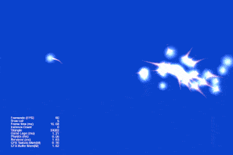
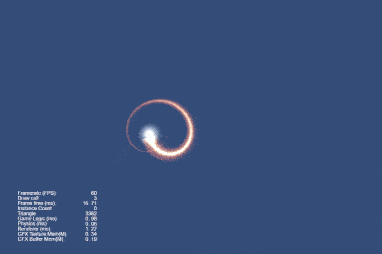
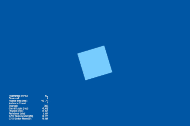
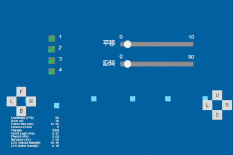

## Cocos Creator How To Use

### Particle
| 编号 | 类目 | 子项 | 演示 |
| :---: |:---: |:---: |:---: |
| 1 | 粒子示例 | [火焰效果](https://gitee.com/yeshao2069/cocos-creator-how-to-use/tree/v3.0.x/Particle/Creator3.0.0_3D_FlameSimulation) | 

 |
| 2 | 粒子示例 | [粒子拖尾模块1](https://gitee.com/yeshao2069/cocos-creator-how-to-use/tree/v3.0.x/Particle/Creator3.0.0_3D_ParticleTrails01)  | 

 |
| 3 | 粒子示例 | [粒子拖尾模块2](https://gitee.com/yeshao2069/cocos-creator-how-to-use/tree/v3.0.x/Particle/Creator3.0.0_3D_ParticleTrails02)  | 

 |
| 4 | 粒子示例 | [粒子拖尾模块3](https://gitee.com/yeshao2069/cocos-creator-how-to-use/tree/v3.0.x/Particle/Creator3.0.0_3D_ParticleTrails03)  | 

 |
| 5 | 粒子示例 | [粒子拖尾模块4](https://gitee.com/yeshao2069/cocos-creator-how-to-use/tree/v3.0.x/Particle/Creator3.0.0_3D_ParticleTrails04)  | 

 |
| 6 | 粒子示例 | [粒子颜色模块](https://gitee.com/yeshao2069/cocos-creator-how-to-use/tree/v3.0.x/Particle/Creator3.0.0_3D_ParticleColor)  | 

 |
| 7 | 粒子示例 | [粒子加速度模块](https://gitee.com/yeshao2069/cocos-creator-how-to-use/tree/v3.0.x/Particle/Creator3.0.0_3D_ParticleForce)  | 

 |
| 8 | 粒子示例 | [粒子限速模块](https://gitee.com/yeshao2069/cocos-creator-how-to-use/tree/v3.0.x/Particle/Creator3.0.0_3D_ParticleLimitVelocity)  | 

 |
| 9 | 粒子示例 | [粒子主模块](https://gitee.com/yeshao2069/cocos-creator-how-to-use/tree/v3.0.x/Particle/Creator3.0.0_3D_ParticleMain)  | 

 |
| 10 | 粒子示例 | [粒子渲染模块](https://gitee.com/yeshao2069/cocos-creator-how-to-use/tree/v3.0.x/Particle/Creator3.0.0_3D_ParticleRenderer)  | 

 |
| 11 | 粒子示例 | [粒子旋转模块](https://gitee.com/yeshao2069/cocos-creator-how-to-use/tree/v3.0.x/Particle/Creator3.0.0_3D_ParticleRotation)  | 

 |
| 12 | 粒子示例 | [粒子发射器模块](https://gitee.com/yeshao2069/cocos-creator-how-to-use/tree/v3.0.x/Particle/Creator3.0.0_3D_ParticleShapeModule)  | 

 |
| 13 | 粒子示例 | [粒子大小模块](https://gitee.com/yeshao2069/cocos-creator-how-to-use/tree/v3.0.x/Particle/Creator3.0.0_3D_ParticleSize)  | 

 |
| 14 | 粒子示例 | [粒子贴图动画模块](https://gitee.com/yeshao2069/cocos-creator-how-to-use/tree/v3.0.x/Particle/Creator3.0.0_3D_ParticleTextureAnimation)  | 

 |
| 15 | 粒子示例 | [粒子速度模块](https://gitee.com/yeshao2069/cocos-creator-how-to-use/tree/v3.0.x/Particle/Creator3.0.0_3D_ParticleVelocity)  | 

 |
| 16 | 粒子示例 | [2D粒子显隐](https://gitee.com/yeshao2069/cocos-creator-how-to-use/tree/v3.0.x/Particle/Creator3.0.0_2D_ToggleParticle)  | 

 |
| 17 | 粒子示例 | [2D粒子完成后自动移除](https://gitee.com/yeshao2069/cocos-creator-how-to-use/tree/v3.0.x/Particle/Creator3.0.0_2D_ParticleAutoRemove)  | 

 |