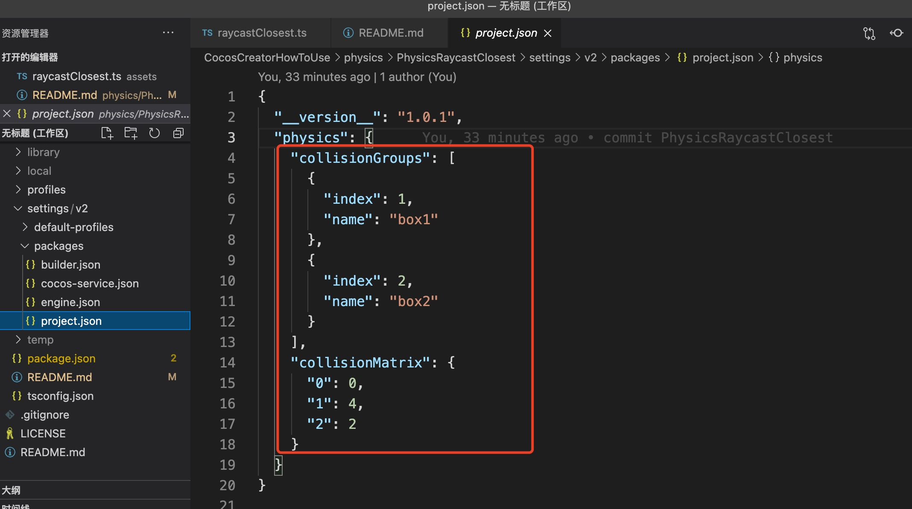

## Cocos Creator How To Use

### 简介

基于 CocosCreator 3.0.0 版本创建的 **检测碰撞体是否存在** 工程

### 使用
1. 首先需要知道 物理的[碰撞矩阵](https://docs.cocos.com/creator/3.0/manual/zh/editor/project/physics-configs.html?h=%E7%A2%B0%E6%92%9E%E7%9F%A9%E9%98%B5)，碰撞矩阵是物理分组掩码功能的进一步封装，它用于初始化物理元素的分组和掩码。默认情况下只有一个 DEFAULT 分组，新建分组默认不与其它组碰撞

2. 在编辑器中，碰撞矩阵分组的存储格式为 {index, name} ，index 是从 0 到 31 的位数，而 name 是该组的名称，新项目工程会有一个默认分组：{index: 0, name: 'DEFAULT'}。点击 + 按钮可以新增分组。
    注：新增分组的 index 和 name 均不能为空，且不能与现有项重复。
    注：分组不可以删除，但可以修改分组的名称。
    注：物理的碰撞矩阵设置路径是 菜单栏选择项目->项目设置->物理->碰撞矩阵。

3. 所以我们采用设置两个碰撞分组box1和box2，碰撞对配置为box1-box2

4. 其次，我们可以在项目工程目录下 settings/v2/packages/project.json文件中看到我们配置的碰撞矩阵分组信息。我们看到collisionGroups为碰撞矩阵分组，collisionMatrix为碰撞矩阵。碰撞矩阵中的数值是根据在配置碰撞矩阵的每行的标志位来计算的，比如第0行，2进制000表示0。再则第1行，2进制100表示4

5. 再则，我们新建两个cube模型，cube1的坐标(0,0,0)，cube2的坐标(6,0,0)。使用cube1去检测cube2的方式。我们需要为两个cube添加boxcollider碰撞盒和rigidbody刚体。碰撞盒设置为碰撞模式(isTrigger不勾选，勾选了就是触发器了，不会产生物理反馈)。刚体需要设置group，也就是碰撞矩形分组。我们设置cube1为box1，cube2为box2

6. 计算mask。mask=(1<<cube1的分组索引)|(1<<cube2的分组索引)，比如 mask=(1<<1)|(1<<2)

7. 获取ray。ray有6个参数，分别为起点的x,y,z坐标和需要检测的方向的x,y,z

8. 通过物理引擎的raycastClosest实现检测碰撞体是否存在