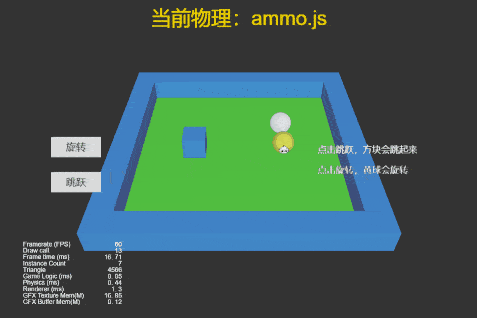

## Cocos Creator How To Use

### Physics
| 编号 | 类目 | 子项 | 演示 |
| :---: | :---: | :---: | :---: |
| 1 | 物理示例 | [检测碰撞体是否存在](https://github.com/yeshao2069/CocosCreatorHowToUse/tree/v3.0.x/Physics/Creator3.0.0_3D_PhysicsRaycastClosest) | 

   |
| 2 | 物理示例 | [射线检测](https://github.com/yeshao2069/CocosCreatorHowToUse/tree/v3.0.x/Physics/Creator3.0.0_3D_PhysicsRaycast) | 

 |
| 3 | 物理示例 | [使用物理材质](https://github.com/yeshao2069/CocosCreatorHowToUse/tree/v3.0.x/Physics/Creator3.0.0_3D_PhysicsMaterial) | 

 |
| 4 | 物理示例 | [使用网格碰撞器组件](https://github.com/yeshao2069/CocosCreatorHowToUse/tree/v3.0.x/Physics/Creator3.0.0_3D_PhysicsMeshCollider) | 

 |
| 5 | 物理示例 | [物体旋转跳跃](https://github.com/yeshao2069/CocosCreatorHowToUse/tree/v3.0.x/Physics/Creator3.0.0_3D_PhysicsRotateAndJumpWithVelocity) | 

 |
| 6 | 物理示例 | [使用触发器-触发事件](https://github.com/yeshao2069/CocosCreatorHowToUse/tree/v3.0.x/Physics/Creator3.0.0_3D_PhysicsTriggerEvent) | 

 |
| 7 | 物理示例 | [运行时更新碰撞体数据](https://github.com/yeshao2069/CocosCreatorHowToUse/tree/v3.0.x/Physics/Creator3.0.0_3D_PhysicsRuntimeUpdate) | 

 |
| 8 | 物理示例 | [使用平面碰撞器组件](https://github.com/yeshao2069/CocosCreatorHowToUse/tree/v3.0.x/Physics/Creator3.0.0_3D_PhysicsPlaneCollider) | 

 |
| 9 | 物理示例 | [物理同步](https://github.com/yeshao2069/CocosCreatorHowToUse/tree/v3.0.x/Physics/Creator3.0.0_3D_PhysicsSync) | 

 |
| 10 | 物理示例 | [物理分组掩码](https://github.com/yeshao2069/CocosCreatorHowToUse/tree/v3.0.x/Physics/Creator3.0.0_3D_PhysicsGroupMask) | 

 |
| 11 | 物理示例 | [物理动态运行](https://github.com/yeshao2069/CocosCreatorHowToUse/tree/v3.0.x/Physics/Creator3.0.0_3D_PhysicsRunDynamic) | 

 |
| 12 | 物理示例 | [不规则物体碰撞](https://github.com/yeshao2069/CocosCreatorHowToUse/tree/v3.0.x/Physics/Creator3.0.0_3D_PhysicsConvexColliders) | 

 |
| 13 | 物理示例 | [点对点约束](https://github.com/yeshao2069/CocosCreatorHowToUse/tree/v3.0.x/Physics/Creator3.0.0_3D_PhysicsPointToPointConstraint) | 

 |
| 14 | 物理示例 | [碰撞点数据](https://github.com/yeshao2069/CocosCreatorHowToUse/tree/v3.0.x/Physics/Creator3.0.0_3D_PhysicsContactData) | 

 |
| 15 | 物理示例 | [链条约束](https://github.com/yeshao2069/CocosCreatorHowToUse/tree/v3.0.x/Physics/Creator3.0.0_3D_PhysicsHingeConstraint) | 

 |
| 16 | 物理示例 | [使用恒力组件](https://github.com/yeshao2069/CocosCreatorHowToUse/tree/v3.0.x/Physics/Creator3.0.0_3D_PhysicsForceConstant) | 

 |
| 17 | 物理示例 | [使用碰撞器-碰撞事件](https://github.com/yeshao2069/CocosCreatorHowToUse/tree/v3.0.x/Physics/Creator3.0.0_3D_PhysicsCollisionEvent) | 

 |
| 18 | 物理示例 | [胶囊体触发器](https://github.com/yeshao2069/CocosCreatorHowToUse/tree/v3.0.x/Physics/Creator3.0.0_3D_PhysicsCapsuleTrigger) | 

 |