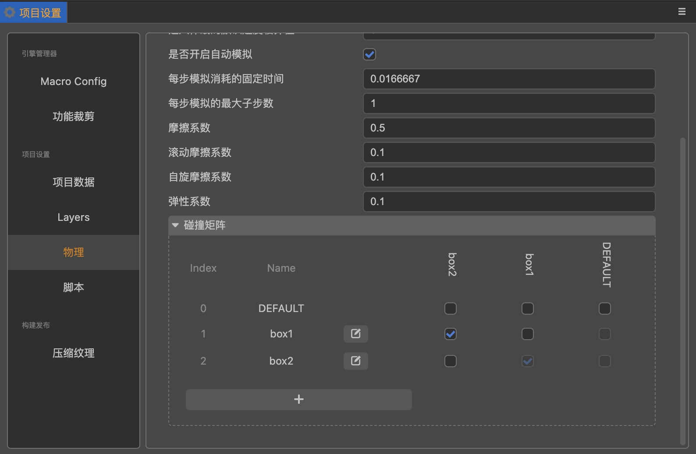
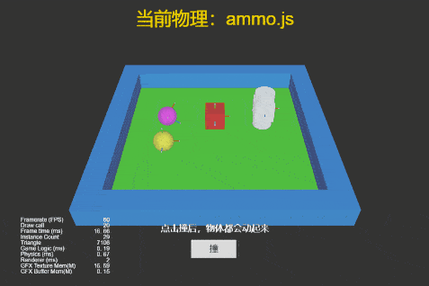

## Cocos Creator How To Use

### Physics
| 序号 | 类目 | 子项 | 演示 |
| :---: | :---: | :---: | :---: |
| 1 | Physics | [检测碰撞体是否存在](https://gitee.com/yeshao2069/cocos-creator-how-to-use/tree/v3.4.x/Physics/Creator3.4.2_3D_PhysicsRaycastClosest) | 

  |
| 2 | Physics | [射线检测](https://gitee.com/yeshao2069/cocos-creator-how-to-use/tree/v3.4.x/Physics/Creator3.4.2_3D_PhysicsRaycast) | 

 |
| 3 | Physics | [使用物理材质](https://gitee.com/yeshao2069/cocos-creator-how-to-use/tree/v3.4.x/Physics/Creator3.4.2_3D_PhysicsMaterial) | 

 |
| 4 | Physics | [使用网格碰撞器组件](https://gitee.com/yeshao2069/cocos-creator-how-to-use/tree/v3.4.x/Physics/Creator3.4.2_3D_PhysicsMeshCollider) | 

 |
| 5 | Physics | [物体旋转跳跃](https://gitee.com/yeshao2069/cocos-creator-how-to-use/tree/v3.4.x/Physics/Creator3.4.2_3D_PhysicsRotateJumpWithVelocity) | 

 |
| 6 | Physics | [使用触发器-触发事件](https://gitee.com/yeshao2069/cocos-creator-how-to-use/tree/v3.4.x/Physics/Creator3.4.2_3D_PhysicsTriggerEvent) | 

 |
| 7 | Physics | [运行时更新碰撞体数据](https://gitee.com/yeshao2069/cocos-creator-how-to-use/tree/v3.4.x/Physics/Creator3.4.2_3D_PhysicsRuntimeUpdate) | 

 |
| 8 | Physics | [使用平面碰撞器组件](https://gitee.com/yeshao2069/cocos-creator-how-to-use/tree/v3.4.x/Physics/Creator3.4.2_3D_PhysicsPlaneCollider) | 

 |
| 9 | Physics | [物理同步](https://gitee.com/yeshao2069/cocos-creator-how-to-use/tree/v3.4.x/Physics/Creator3.4.2_3D_PhysicsSync) | 
 |
| 10 | Physics | [物理分组掩码](https://gitee.com/yeshao2069/cocos-creator-how-to-use/tree/v3.4.x/Physics/Creator3.4.2_3D_PhysicsGroupMask) | 

 |
| 11 | Physics | [物理动态运行](https://gitee.com/yeshao2069/cocos-creator-how-to-use/tree/v3.4.x/Physics/Creator3.4.2_3D_PhysicsRunDynamic) | 

 |
| 12 | Physics | [不规则物体碰撞](https://gitee.com/yeshao2069/cocos-creator-how-to-use/tree/v3.4.x/Physics/Creator3.4.2_3D_PhysicsConvexColliders) | 

 |
| 13 | Physics | [点对点约束](https://gitee.com/yeshao2069/cocos-creator-how-to-use/tree/v3.4.x/Physics/Creator3.4.2_3D_PhysicsPointToPointConstraint) | 

 |
| 14 | Physics | [碰撞点数据测试](https://gitee.com/yeshao2069/cocos-creator-how-to-use/tree/v3.4.x/Physics/Creator3.4.2_3D_PhysicsContactData) | 

 |
| 15 | Physics | [链条约束](https://gitee.com/yeshao2069/cocos-creator-how-to-use/tree/v3.4.x/Physics/Creator3.4.2_3D_PhysicsHingeConstraint) | 

 |
| 16 | Physics | [使用恒力组件](https://gitee.com/yeshao2069/cocos-creator-how-to-use/tree/v3.4.x/Physics/Creator3.4.2_3D_PhysicsForceConstant) | 

 |
| 17 | Physics | [使用碰撞器-碰撞事件](https://gitee.com/yeshao2069/cocos-creator-how-to-use/tree/v3.4.x/Physics/Creator3.4.2_3D_PhysicsCollisionEvent) | 

 |
| 18 | Physics | [胶囊体触发器测试](https://gitee.com/yeshao2069/cocos-creator-how-to-use/tree/v3.4.x/Physics/Creator3.4.2_3D_PhysicsCapsuleTrigger) | 

 |