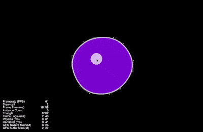
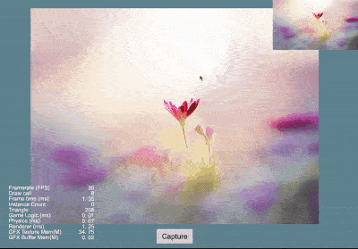
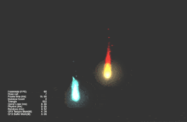
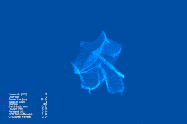
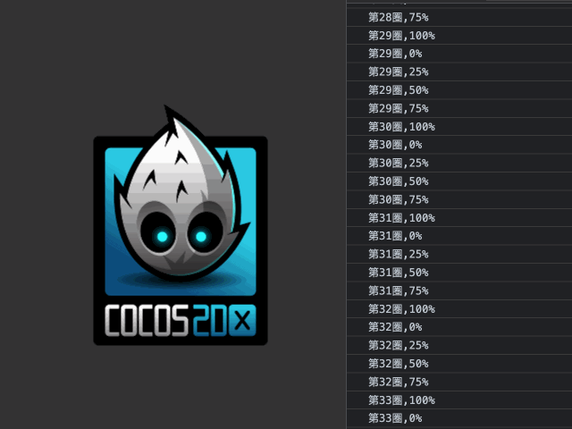

## Cocos Creator How To Use
### Write by yeshao2069.
### Cocos Creator How To Use is to simplify the use of some functions that users understand the API.
### Cocos Creator v3.5.x
&nbsp;

### Quick
| 编号1 | 分类1 | 标记1 | 编号2 | 分类2 | 标记2 |
| :---: | :---: | :---: | :---: | :---: | :---: |
| 1 | [用户界面](#ui) | [UI](#ui) | 2 | [性能](#performance) | [Performance](#performance) |
| 3 | [音频](#audio) | [Audio](#audio) | 4 | [视频](#video) | [Video](#video) |
| 5 | [帧动画](#animation) | [Animation](#animation) | 6 | [Spine动画](#spine) | [Spine](#spine) |
| 7 | [龙骨动画](#dragonbone) | [DragonBones](#dragonbone) | 8 | [绘图](#graphics) | [Graphics](#graphics) |
| 9 | [物理](#physics) | [Physics](#physics) | 10 | [缓动](#tween) | [Tween](#tween) |
| 11 | [渲染](#render) | [Render](#render) | 12 | [模型](#model) | [Model](#model) |
| 13 | [粒子](#particle) | [Particle](#particle) | 14 | [需求](#case) | [Case](#case) |

## Examples

### UI
| 编号 | 分类 | 项目 | 编辑器版本 | 演示 |
| :---: | :---: | :---: | :---: | :---: |
| 1 | [UI](https://gitee.com/yeshao2069/cocos-creator-how-to-use/tree/v3.5.x/proj/UI) | [返回顶部](#quick) | 无 | 无 |
| 1.1 | Label | [超大文本](https://gitee.com/yeshao2069/cocos-creator-how-to-use/tree/v3.5.x/proj/UI/Creator3.5.0_2D_LargeSystemFontText) | 3.5.0 | 

 |
| 1.2 | Button | [简单按钮](https://gitee.com/yeshao2069/cocos-creator-how-to-use/tree/v3.5.x/proj/UI/Creator3.5.0_2D_SimpleButton) | 3.5.0 | 

 |
| 1.3 | ListView | [列表视图示例](https://gitee.com/yeshao2069/cocos-creator-how-to-use/tree/v3.5.x/proj/UI/Creator3.5.0_2D_ListViewUse) | 3.5.0 | 

 |
| 1.4 | WebView | [网页视图示例](https://gitee.com/yeshao2069/cocos-creator-how-to-use/tree/v3.5.x/proj/UI/Creator3.5.0_2D_WebViewUse) | 3.5.0 | 

 |
| 1.5 | RichText | [富文本示例](https://gitee.com/yeshao2069/cocos-creator-how-to-use/tree/v3.5.x/proj/UI/Creator3.5.0_2D_RichTextUse) | 3.5.0 | 

 |
| 1.6 | PageView | [页面视图示例](https://gitee.com/yeshao2069/cocos-creator-how-to-use/tree/v3.5.x/proj/UI/Creator3.5.0_2D_PageViewUse) | 3.5.0 | 

 |
| 1.7 | Mask | [遮罩示例](https://gitee.com/yeshao2069/cocos-creator-how-to-use/tree/v3.5.x/proj/UI/Creator3.5.0_2D_MaskUse) | 3.5.0 | 

 |
| 1.8 | UI | [更新列表信息](https://gitee.com/yeshao2069/cocos-creator-how-to-use/tree/v3.5.x/proj/UI/Creator3.5.0_2D_UpdateListWithData) | 3.5.0 | 

 |
| 1.9 | Camera | [摄像机示例](https://gitee.com/yeshao2069/cocos-creator-how-to-use/tree/v3.5.x/proj/UI/Creator3.5.0_2D_CameraUseSample) | 3.5.0 | 

 |

### Performance
| 编号 | 分类 | 项目 | 编辑器版本 | 演示 |
| :---: | :---: | :---: | :---: | :---: |
| 2 | [Performance](https://gitee.com/yeshao2069/cocos-creator-how-to-use/tree/v3.5.x/proj/Performance) | [返回顶部](#quick) | 无 | 无 |
| 2.1 | Performance | [GPU Instancing](https://gitee.com/yeshao2069/cocos-creator-how-to-use/tree/v3.5.x/proj/Performance/Creator3.5.0_3D_GpuInstancing) | 3.5.0 | 

 |
| 2.2 | Performance | [静态合批](https://gitee.com/yeshao2069/cocos-creator-how-to-use/tree/v3.5.x/proj/Performance/Creator3.5.0_3D_StaticBatch) | 3.5.0 | 

 |
| 2.3 | Performance | [VB合并](https://gitee.com/yeshao2069/cocos-creator-how-to-use/tree/v3.5.x/proj/Performance/Creator3.5.0_3D_VBBatch) | 3.5.0 | 

 |
| 2.4 | Performance | [遮挡查询剔除(原生)](https://gitee.com/yeshao2069/cocos-creator-how-to-use/tree/v3.5.x/proj/Performance/Creator3.5.0_3D_NativeOcclusionQuery) | 3.5.0 | 

 |

### Audio
| 编号 | 分类 | 项目 | 编辑器版本 | 演示 |
| :---: | :---: | :---: | :---: | :---: |
| 3 | [Audio](https://gitee.com/yeshao2069/cocos-creator-how-to-use/tree/v3.5.x/proj/Audio) | [返回顶部](#quick) | 无 | 无 |
| 3.1 | Audio | [多个音效同时播放](https://gitee.com/yeshao2069/cocos-creator-how-to-use/tree/v3.5.x/proj/Audio/Creator3.5.0_PlayOneShot) | 3.5.0 | 无 |
| 3.2 | Audio | [添加全局按钮音效](https://gitee.com/yeshao2069/cocos-creator-how-to-use/tree/v3.5.x/proj/Audio/Creator3.5.0_AddGlobalButtonSound) | 3.5.0 | 无 |
| 3.3 | Audio | [模拟钢琴播放](https://gitee.com/yeshao2069/cocos-creator-how-to-use/tree/v3.5.x/proj/Audio/Creator3.5.0_PianoPlay) | 3.5.0 |  

 | 

### Video
| 编号 | 分类 | 项目 | 编辑器版本 | 演示 |
| :---: | :---: | :---: | :---: | :---: |
| 4 | [Video](https://gitee.com/yeshao2069/cocos-creator-how-to-use/tree/v3.5.x/proj/Video) | [返回顶部](#quick) | 无 | 无 |
| 4.1 | Video | [视频使用](https://gitee.com/yeshao2069/cocos-creator-how-to-use/tree/v3.5.x/proj/Video/Creator3.5.0_VideoPlayer) | 3.5.0 | 

 |
| 4.2 | Video | [视频置于UI之下*](https://gitee.com/yeshao2069/cocos-creator-how-to-use/tree/v3.5.x/proj/Video/Creator3.5.0_VideoStayOnBottom) | 3.5.0 | 

 |

### Animation
| 编号 | 分类 | 项目 | 编辑器版本 | 演示 |
| :---: | :---: | :---: | :---: | :---: |
| 5 | [Animation](https://gitee.com/yeshao2069/cocos-creator-how-to-use/tree/v3.5.x/proj/Animation) | [返回顶部](#quick) | 无 | 无 |
| 5.1 | Animation | [精灵帧动画](https://gitee.com/yeshao2069/cocos-creator-how-to-use/tree/v3.5.x/proj/Animation/Creator3.5.0_2D_SpriteFrameAnimation) | 3.5.0 | 

 |
| 5.2 | Animation | [精灵帧移动动画](https://gitee.com/yeshao2069/cocos-creator-how-to-use/tree/v3.5.x/proj/Animation/Creator3.5.0_2D_SpriteMoveAnimation) | 3.5.0 | 

 |
| 5.3 | Animation | [动态创建精灵帧动画](https://gitee.com/yeshao2069/cocos-creator-how-to-use/tree/v3.5.x/proj/Animation/Creator3.5.0_2D_CreateAnimationClip) | 3.5.0 | 
 
 |
| 5.4 | Animation | [水](https://gitee.com/yeshao2069/cocos-creator-how-to-use/tree/v3.5.x/proj/Animation/Creator3.5.0_2D_AnimationWater) | 3.5.0 | 
 
 |
| 5.5 | Animation | [美人鱼](https://gitee.com/yeshao2069/cocos-creator-how-to-use/tree/v3.5.x/proj/Animation/Creator3.5.0_2D_AnimationFish) | 3.5.0 | 
 
 |

### Spine
| 编号 | 分类 | 项目 | 编辑器版本 | 演示 |
| :---: | :---: | :---: | :---: | :---: |
| 6 | [Spine](https://gitee.com/yeshao2069/cocos-creator-how-to-use/tree/v3.5.x/proj/Spine) | [返回顶部](#quick) | 无 | 无 |
| 6.1 | Spine | [加载Spine动画](https://gitee.com/yeshao2069/cocos-creator-how-to-use/tree/v3.5.x/proj/Spine/Creator3.5.0_2D_LoadSpine) | 3.5.0 | 

 |
| 6.2 | Spine | [Spine挂点](https://gitee.com/yeshao2069/cocos-creator-how-to-use/tree/v3.5.x/proj/Spine/Creator3.5.0_2D_SpineAttach) | 3.5.0 | 

 |
| 6.3 | Spine | [Spine特效](https://gitee.com/yeshao2069/cocos-creator-how-to-use/tree/v3.5.x/proj/Spine/Creator3.5.0_2D_SpineMesh) | 3.5.0 | 

 |
| 6.4 | Spine | [Spine换肤](https://gitee.com/yeshao2069/cocos-creator-how-to-use/tree/v3.5.x/proj/Spine/Creator3.5.0_2D_SpineSkin) | 3.5.0 | 

 |
| 6.5 | Spine | [Spine挂点碰撞检测](https://gitee.com/yeshao2069/cocos-creator-how-to-use/tree/v3.5.x/proj/Spine/Creator3.5.0_2D_SpineCollider) | 3.5.0 | 

 |
| 6.6 | Spine | [Spine动作切换](https://gitee.com/yeshao2069/cocos-creator-how-to-use/tree/v3.5.x/proj/Spine/Creator3.5.0_2D_SpineBoy) | 3.5.0 | 

 |

### DragonBones
| 编号 | 分类 | 项目 | 编辑器版本 | 演示 |
| :---: | :---: | :---: | :---: | :---: |
| 7 | [DragonBones](https://gitee.com/yeshao2069/cocos-creator-how-to-use/tree/v3.5.x/proj/DragonBones) | [返回顶部](#quick) | 无 | 无 |
| 7.1 | DragonBones | [替换龙骨动画](https://gitee.com/yeshao2069/cocos-creator-how-to-use/tree/v3.5.x/proj/DragonBones/Creator3.5.0_2D_DragonBonesReplaceSlot) | 3.5.0 | 

 |
| 7.2 | DragonBones | [加载龙骨动画](https://gitee.com/yeshao2069/cocos-creator-how-to-use/tree/v3.5.x/proj/DragonBones/Creator3.5.0_2D_LoadDragonBones) | 3.5.0 | 

 |
| 7.3 | DragonBones | [龙骨动画碰撞检测](https://gitee.com/yeshao2069/cocos-creator-how-to-use/tree/v3.5.x/proj/DragonBones/Creator3.5.0_2D_DragonBonesCollider) | 3.5.0 | 

 |
| 7.4 | DragonBones | [龙骨动画挂点](https://gitee.com/yeshao2069/cocos-creator-how-to-use/tree/v3.5.x/proj/DragonBones/Creator3.5.0_2D_DragonBonesAttach) | 3.5.0 | 

 |
| 7.5 | DragonBones | [切换龙骨动画](https://gitee.com/yeshao2069/cocos-creator-how-to-use/tree/v3.5.x/proj/DragonBones/Creator3.5.0_2D_DragonBones) | 3.5.0 | 

 |

### Graphics
| 编号 | 分类 | 项目 | 编辑器版本 | 演示 |
| :---: | :---: | :---: | :---: | :---: |
| 8 | [Graphics](https://gitee.com/yeshao2069/cocos-creator-how-to-use/tree/v3.5.x/proj/Graphics) | [返回顶部](#quick) | 无 | 无 |
| 8.1 | Graphics | [画饼状图](https://gitee.com/yeshao2069/cocos-creator-how-to-use/tree/v3.5.x/proj/Graphics/Creator3.5.0_2D_GraphicsArc) | 3.5.0 | 

 |
| 8.2 | Graphics | [画正方形](https://gitee.com/yeshao2069/cocos-creator-how-to-use/tree/v3.5.x/proj/Graphics/Creator3.5.0_2D_GraphicsRect) | 3.5.0 | 

 |
| 8.3 | Graphics | [画菱形](https://gitee.com/yeshao2069/cocos-creator-how-to-use/tree/v3.5.x/proj/Graphics/Creator3.5.0_2D_GraphicsLineTo) | 3.5.0 | 

 |
| 8.4 | Graphics | [画椭圆形](https://gitee.com/yeshao2069/cocos-creator-how-to-use/tree/v3.5.x/proj/Graphics/Creator3.5.0_2D_GraphicsEllipse) | 3.5.0 | 

 |
| 8.5 | Graphics | [三点画圆](https://gitee.com/yeshao2069/cocos-creator-how-to-use/tree/v3.5.x/proj/Graphics/Creator3.5.0_2D_GraphicsDrawCircle) | 3.5.0 | 

 |
| 8.6 | Graphics | [涂鸦](https://gitee.com/yeshao2069/cocos-creator-how-to-use/tree/v3.5.x/proj/Graphics/Creator3.5.0_2D_Doodle) | 3.5.0 | 

 |
| 8.7 | Graphics | [画Sine曲线](https://gitee.com/yeshao2069/cocos-creator-how-to-use/tree/v3.5.x/proj/Graphics/Creator3.5.0_2D_GraphicsSineWaves) | 3.5.0 | 

 |
| 8.8 | Graphics | [自由画线](https://gitee.com/yeshao2069/cocos-creator-how-to-use/tree/v3.5.x/proj/Graphics/Creator3.5.0_2D_DrawLine) | 3.5.0 | 

 |
| 8.9 | Graphics | [烟花爆炸](https://gitee.com/yeshao2069/cocos-creator-how-to-use/tree/v3.5.x/proj/Graphics/Creator3.5.0_2D_GraphicsFireworksExplosion) | 3.5.0 | 

 |
| 8.10 | Graphics | [画房子](https://gitee.com/yeshao2069/cocos-creator-how-to-use/tree/v3.5.x/proj/Graphics/Creator3.5.0_2D_GraphicsHouse) | 3.5.0 | 

 |
| 8.11 | Graphics | [环形进度条](https://gitee.com/yeshao2069/cocos-creator-how-to-use/tree/v3.5.x/proj/Graphics/Creator3.5.1_2D_GraphicsRingProgressbar) | 3.5.1 | 

 |

### Physics
| 编号 | 分类 | 项目 | 编辑器版本 | 演示 |
| :---: | :---: | :---: | :---: | :---: |
| 9 | [Physics](https://gitee.com/yeshao2069/cocos-creator-how-to-use/tree/v3.5.x/proj/Physics) | [返回顶部](#quick) | 无 | 无 |
| 9.1 | Physics | [检测碰撞体是否存在](https://gitee.com/yeshao2069/cocos-creator-how-to-use/tree/v3.5.x/proj/Physics/Creator3.5.0_3D_PhysicsRaycastClosest) | 3.5.0 | 

 |
| 9.2 | Physics | [射线检测](https://gitee.com/yeshao2069/cocos-creator-how-to-use/tree/v3.5.x/proj/Physics/Creator3.5.0_3D_PhysicsRaycast) | 3.5.0 | 

 |
| 9.3 | Physics | [使用物理材质](https://gitee.com/yeshao2069/cocos-creator-how-to-use/tree/v3.5.x/proj/Physics/Creator3.5.0_3D_PhysicsMaterial) | 3.5.0 | 

 |
| 9.4 | Physics | [使用网格碰撞器组件](https://gitee.com/yeshao2069/cocos-creator-how-to-use/tree/v3.5.x/proj/Physics/Creator3.5.0_3D_PhysicsMeshCollider) | 3.5.0 | 

 |
| 9.5 | Physics | [物体旋转跳跃](https://gitee.com/yeshao2069/cocos-creator-how-to-use/tree/v3.5.x/proj/Physics/Creator3.5.0_3D_PhysicsRotateJumpWithVelocity) | 3.5.0 | 

 |
| 9.6 | Physics | [使用触发器-触发事件](https://gitee.com/yeshao2069/cocos-creator-how-to-use/tree/v3.5.x/proj/Physics/Creator3.5.0_3D_PhysicsTriggerEvent) | 3.5.0 | 

 |
| 9.7 | Physics | [运行时更新碰撞体数据](https://gitee.com/yeshao2069/cocos-creator-how-to-use/tree/v3.5.x/proj/Physics/Creator3.5.0_3D_PhysicsRuntimeUpdate) | 3.5.0 | 

 |
| 9.8 | Physics | [使用平面碰撞器组件](https://gitee.com/yeshao2069/cocos-creator-how-to-use/tree/v3.5.x/proj/Physics/Creator3.5.0_3D_PhysicsPlaneCollider) | 3.5.0 | 

 |
| 9.9 | Physics | [物理同步](https://gitee.com/yeshao2069/cocos-creator-how-to-use/tree/v3.5.x/proj/Physics/Creator3.5.0_3D_PhysicsSync) | 3.5.0 | 
 |
| 9.10 | Physics | [物理分组掩码](https://gitee.com/yeshao2069/cocos-creator-how-to-use/tree/v3.5.x/proj/Physics/Creator3.5.0_3D_PhysicsGroupMask) | 3.5.0 | 

 |
| 9.11 | Physics | [物理动态运行](https://gitee.com/yeshao2069/cocos-creator-how-to-use/tree/v3.5.x/proj/Physics/Creator3.5.0_3D_PhysicsRunDynamic) | 3.5.0 | 

 |
| 9.12 | Physics | [不规则物体碰撞](https://gitee.com/yeshao2069/cocos-creator-how-to-use/tree/v3.5.x/proj/Physics/Creator3.5.0_3D_PhysicsConvexColliders) | 3.5.0 | 

 |
| 9.13 | Physics | [点对点约束](https://gitee.com/yeshao2069/cocos-creator-how-to-use/tree/v3.5.x/proj/Physics/Creator3.5.0_3D_PhysicsPointToPointConstraint) | 3.5.0 | 

 |
| 9.14 | Physics | [碰撞点数据测试](https://gitee.com/yeshao2069/cocos-creator-how-to-use/tree/v3.5.x/proj/Physics/Creator3.5.0_3D_PhysicsContactData) | 3.5.0 | 

 |
| 9.15 | Physics | [链条约束](https://gitee.com/yeshao2069/cocos-creator-how-to-use/tree/v3.5.x/proj/Physics/Creator3.5.0_3D_PhysicsHingeConstraint) | 3.5.0 | 

 |
| 9.16 | Physics | [使用恒力组件](https://gitee.com/yeshao2069/cocos-creator-how-to-use/tree/v3.5.x/proj/Physics/Creator3.5.0_3D_PhysicsForceConstant) | 3.5.0 | 

 |
| 9.17 | Physics | [使用碰撞器-碰撞事件](https://gitee.com/yeshao2069/cocos-creator-how-to-use/tree/v3.5.x/proj/Physics/Creator3.5.0_3D_PhysicsCollisionEvent) | 3.5.0 | 

 |
| 9.18 | Physics | [胶囊体触发器测试](https://gitee.com/yeshao2069/cocos-creator-how-to-use/tree/v3.5.x/proj/Physics/Creator3.5.0_3D_PhysicsCapsuleTrigger) | 3.5.0 | 

 |

### Tween
| 编号 | 分类 | 项目 | 编辑器版本 | 演示 |
| :---: | :---: | :---: | :---: | :---: |
| 10 | [Tween](https://gitee.com/yeshao2069/cocos-creator-how-to-use/tree/v3.5.x/proj/Tween) | [返回顶部](#quick) | 无 | 无 |
| 10.1 | Tween | [透明度渐变](https://gitee.com/yeshao2069/cocos-creator-how-to-use/tree/v3.5.x/proj/Tween/Creator3.5.0_2D_TweenOpacityChange) | 3.5.0 | 

 |
| 10.2 | Tween | [旋转](https://gitee.com/yeshao2069/cocos-creator-how-to-use/tree/v3.5.x/proj/Tween/Creator3.5.0_3D_TweenRotateChange) | 3.5.0 | 

 |
| 10.3 | Tween | [环形运动](https://gitee.com/yeshao2069/cocos-creator-how-to-use/tree/v3.5.x/proj/Tween/Creator3.5.0_2D_TweenCircleMove) | 3.5.0 | 

 |
| 10.4 | Tween | [旋转并缩放](https://gitee.com/yeshao2069/cocos-creator-how-to-use/tree/v3.5.x/proj/Tween/Creator3.5.0_2D_TweenRotateAndScaleForever) | 3.5.0 | 

 |
| 10.5 | Tween | [使用Easing示例](https://gitee.com/yeshao2069/cocos-creator-how-to-use/tree/v3.5.x/proj/Tween/Creator3.5.0_2D_TweenShowMonster) | 3.5.0 | 

 |
| 10.6 | Tween | [Tween封装](https://gitee.com/yeshao2069/cocos-creator-how-to-use/tree/v3.5.x/proj/Tween/Creator3.5.0_2D_TweenCCUtils) | 3.5.0 |  |

### Model
| 编号 | 分类 | 项目 | 编辑器版本 | 演示 |
| :---: | :---: | :---: | :---: | :---: |
| 11 | [Model](https://gitee.com/yeshao2069/cocos-creator-how-to-use/tree/v3.5.x/proj/Model) | [返回顶部](#quick) | 无 | 无 |
| 11.1 | Model | [表情动画](https://gitee.com/yeshao2069/cocos-creator-how-to-use/tree/v3.5.x/proj/Model/Creator3.5.0_3D_MorphHead) | 3.5.0 | 

 |
| 11.2 | Model | [跳舞的女人](https://gitee.com/yeshao2069/cocos-creator-how-to-use/tree/v3.5.x/proj/Model/Creator3.5.0_3D_DanceWoman) | 3.5.0 | 

 |
| 11.3 | Model | [使用卡通材质](https://gitee.com/yeshao2069/cocos-creator-how-to-use/tree/v3.5.x/proj/Model/Creator3.5.0_3D_Toon) | 3.5.0 | 

 |
| 11.4 | Model | [动态加载材质](https://gitee.com/yeshao2069/cocos-creator-how-to-use/tree/v3.5.x/proj/Model/Creator3.5.0_3D_DynamicLoadMaterial) | 3.5.0 | 

 |
| 11.5 | Model | [冬来了](https://gitee.com/yeshao2069/cocos-creator-how-to-use/tree/v3.5.x/proj/Model/Creator3.5.0_3D_Winter) | 3.5.0 | 

 |
| 11.6 | Model | [骑士](https://gitee.com/yeshao2069/cocos-creator-how-to-use/tree/v3.5.x/proj/Model/Creator3.5.0_3D_Knight) | 3.5.0 | 

 |
| 11.7 | Model | [动态创建网格](https://gitee.com/yeshao2069/cocos-creator-how-to-use/tree/v3.5.x/proj/Model/Creator3.5.0_3D_CreateMesh) | 3.5.0 | 

 |

### Renderer
| 编号 | 分类 | 项目 | 编辑器版本 | 演示 |
| :---: | :---: | :---: | :---: | :---: |
| 12 | [Renderer](https://gitee.com/yeshao2069/cocos-creator-how-to-use/tree/v3.5.x/proj/Renderer) | [返回顶部](#quick) | 无 | 无 |
| 12.1 | Renderer | [2D在3D中渲染](https://gitee.com/yeshao2069/cocos-creator-how-to-use/tree/v3.5.x/proj/Renderer/Creator3.5.0_2dRenderingIn3d) | 3.5.0 | 

 |
| 12.2 | Renderer | [Web截图](https://gitee.com/yeshao2069/cocos-creator-how-to-use/tree/v3.5.x/proj/Renderer/Creator3.5.0_Capture) | 3.5.0 | 

 |

### Particle
| 编号 | 分类 | 项目 | 编辑器版本 | 演示 |
| :---: | :---: | :---: | :---: | :---: |
| 13 | [Particle](https://gitee.com/yeshao2069/cocos-creator-how-to-use/tree/v3.5.x/proj/Particle) | [返回顶部](#quick) | 无 | 无 |
| 13.1 | Particle | [火焰](https://gitee.com/yeshao2069/cocos-creator-how-to-use/tree/v3.5.x/proj/Particle/Creator3.5.1_3D_FlameSimulation) | 3.5.1 | 

 |
| 13.2 | Particle | [粒子拖尾1](https://gitee.com/yeshao2069/cocos-creator-how-to-use/tree/v3.5.x/proj/Particle/Creator3.5.1_3D_ParticleTrails01) | 3.5.1 | 

 |
| 13.3 | Particle | [粒子拖尾2](https://gitee.com/yeshao2069/cocos-creator-how-to-use/tree/v3.5.x/proj/Particle/Creator3.5.1_3D_ParticleTrails02) | 3.5.1 | 

 |
| 13.4 | Particle | [粒子拖尾3](https://gitee.com/yeshao2069/cocos-creator-how-to-use/tree/v3.5.x/proj/Particle/Creator3.5.1_3D_ParticleTrails03) | 3.5.1 | 

 |
| 13.5 | Particle | [粒子拖尾4](https://gitee.com/yeshao2069/cocos-creator-how-to-use/tree/v3.5.x/proj/Particle/Creator3.5.1_3D_ParticleTrails04) | 3.5.1 | 

 |
| 13.6 | Particle | [颜色模块](https://gitee.com/yeshao2069/cocos-creator-how-to-use/tree/v3.5.x/proj/Particle/Creator3.5.1_3D_ParticleColor) | 3.5.1 | 

 |
| 13.7 | Particle | [加速度模块](https://gitee.com/yeshao2069/cocos-creator-how-to-use/tree/v3.5.x/proj/Particle/Creator3.5.1_3D_ParticleForce) | 3.5.1 | 

 |
| 13.8 | Particle | [限速模块](https://gitee.com/yeshao2069/cocos-creator-how-to-use/tree/v3.5.x/proj/Particle/Creator3.5.1_3D_ParticleLimitVelocity) | 3.5.1 | 

 |
| 13.9 | Particle | [主模块](https://gitee.com/yeshao2069/cocos-creator-how-to-use/tree/v3.5.x/proj/Particle/Creator3.5.1_3D_ParticleMain) | 3.5.1 | 

 |
| 13.10 | Particle | [渲染模块](https://gitee.com/yeshao2069/cocos-creator-how-to-use/tree/v3.5.x/proj/Particle/Creator3.5.1_3D_ParticleRenderer) | 3.5.1 | 

 |
| 13.11 | Particle | [旋转模块](https://gitee.com/yeshao2069/cocos-creator-how-to-use/tree/v3.5.x/proj/Particle/Creator3.5.1_3D_ParticleRotation) | 3.5.1 | 

 |
| 13.12 | Particle | [发射器模块](https://gitee.com/yeshao2069/cocos-creator-how-to-use/tree/v3.5.x/proj/Particle/Creator3.5.1_3D_ParticleShape) | 3.5.1 | 

 |
| 13.13 | Particle | [大小模块](https://gitee.com/yeshao2069/cocos-creator-how-to-use/tree/v3.5.x/proj/Particle/Creator3.5.1_3D_ParticleSize) | 3.5.1 | 

 |
| 13.14 | Particle | [贴图动画模块](https://gitee.com/yeshao2069/cocos-creator-how-to-use/tree/v3.5.x/proj/Particle/Creator3.5.1_3D_ParticleTextureAnimation) | 3.5.1 | 

 |
| 13.15 | Particle | [速度模块](https://gitee.com/yeshao2069/cocos-creator-how-to-use/tree/v3.5.x/proj/Particle/Creator3.5.1_3D_ParticleVelocity) | 3.5.1 | 

 |
| 13.16 | Particle | [2D粒子显隐](https://gitee.com/yeshao2069/cocos-creator-how-to-use/tree/v3.5.x/proj/Particle/Creator3.5.1_2D_ToggleParticle) | 3.5.1 | 

 |
| 13.17 | Particle | [2D粒子完成后自动移除](https://gitee.com/yeshao2069/cocos-creator-how-to-use/tree/v3.5.x/proj/Particle/Creator3.5.1_2D_AutoRemoveParticle) | 3.5.1 | 

 |
| 13.18 | Particle | [光标粒子](https://gitee.com/yeshao2069/cocos-creator-how-to-use/tree/v3.5.x/proj/Particle/Creator3.5.1_2D_CursorParticles) | 3.5.1 | 

 |

### Case
| 编号 | 分类 | 项目 | 编辑器版本 | 演示 |
| :---: | :---: | :---: | :---: | :---: |
| 14 | [Case](https://gitee.com/yeshao2069/cocos-creator-how-to-use/tree/v3.5.x/proj/Demo) | [返回顶部](#quick) | 无 | 无 |
| 14.1 | Case | [物体是否在摄像机范围内](https://gitee.com/yeshao2069/cocos-creator-how-to-use/tree/v3.5.x/proj/Demo/Creator3.5.0_3D_ObjectIsInCameraView) | 3.5.0 |

 |
| 14.2 | Case | [使用动画帧事件](https://gitee.com/yeshao2069/cocos-creator-how-to-use/tree/v3.5.x/proj/Demo/Creator3.5.1_UseAnimationFrameEvents) | 3.5.1 | 

 |
| 14.3 | Case | [动态获取脚本的方法名](https://gitee.com/yeshao2069/cocos-creator-how-to-use/tree/v3.5.x/proj/Demo/Creator3.5.0_GetScriptFunction) | 3.5.0 | 

 |
| 14.4 | Case | [动态获取动画属性数据](https://gitee.com/yeshao2069/cocos-creator-how-to-use/tree/v3.5.x/proj/Demo/Creator3.5.0_GetAnimationClipDataByTime) | 3.5.0 |  

 |
| 14.5 | Case | [点击响应](https://gitee.com/yeshao2069/cocos-creator-how-to-use/tree/v3.5.x/proj/Demo/Creator3.5.0_PressResponseTest) | 3.5.0 | 无 |
| 14.6 | Case | [物体始终在人物右侧](https://gitee.com/yeshao2069/cocos-creator-how-to-use/tree/v3.5.x/proj/Demo/Creator3.5.1_3D_ObjectAlwaysFollow) | 3.5.1 | 

 |
| 14.7 | Case | [圆形进度条](https://gitee.com/yeshao2069/cocos-creator-how-to-use/tree/v3.5.x/proj/Demo/Creator3.5.0_2D_CircularProgressBar) | 3.5.0 | 

 |
| 14.8 | Case | [椭圆轨迹运动](https://gitee.com/yeshao2069/cocos-creator-how-to-use/tree/v3.5.x/proj/Demo/Creator3.5.0_2D_EllipseMove) | 3.5.0 | 

 |
| 14.9 | Case | [贝塞尔曲线路径在线绘制工具](https://gitee.com/yeshao2069/cocos-creator-how-to-use/tree/v3.5.x/proj/Demo/Creator3.5.1_BezierCurvePathCreator) | 3.5.1 | 

 |
| 14.10 | Case | [动态加载FBX模型中的Mesh](https://gitee.com/yeshao2069/cocos-creator-how-to-use/tree/v3.5.x/proj/Demo/Creator3.5.0_3D_DynamicLoadMesh) | 3.5.0 | 

 |
| 14.11 | Case | [旋转后矩形是否包含点](https://gitee.com/yeshao2069/cocos-creator-how-to-use/tree/v3.5.x/proj/Demo/Creator3.5.0_2D_AbovePointTest) | 3.5.0 | 

 |
| 14.12 | Case | [弯曲的道路](https://gitee.com/yeshao2069/cocos-creator-how-to-use/tree/v3.5.x/proj/Demo/Creator3.5.0_3D_RoadCurved) | 3.5.0 | 

 |
| 14.13 | Case | [3D位置转化](https://gitee.com/yeshao2069/cocos-creator-how-to-use/tree/v3.5.x/proj/Demo/Creator3.5.0_ScreenToWorldPoint) | 3.5.0 | 

 |
| 14.14 | Case | [动态生成单色精灵](https://gitee.com/yeshao2069/cocos-creator-how-to-use/tree/v3.5.x/proj/Demo/Creator3.5.0_2D_Sprite_AutoGenerateSpriteframe) | 3.5.0 | 

 |
| 14.15 | Case | [不规则按钮](https://gitee.com/yeshao2069/cocos-creator-how-to-use/tree/v3.5.x/proj/Demo/Creator3.5.0_2D_IrregularButton) | 3.5.0 | 

 |
| 14.16 | Case | [自适应最小角度旋转](https://gitee.com/yeshao2069/cocos-creator-how-to-use/tree/v3.5.x/proj/Demo/Creator3.5.0_2D_AdaptiveAngleRotation) | 3.5.0 | 

 |
| 14.17 | Case | [自适应最小角度点击旋转](https://gitee.com/yeshao2069/cocos-creator-how-to-use/tree/v3.5.x/proj/Demo/Creator3.5.0_2D_AdaptiveRotation) | 3.5.0 | 

 |
| 14.18 | Case | [3D模型上的文字](https://gitee.com/yeshao2069/cocos-creator-how-to-use/tree/v3.5.x/proj/Demo/Creator3.5.0_3D_LabelOnCube) | 3.5.0 | 

 |

- ·*· 代表有问题