## Cocos Creator How To Use
### Purpose
Cocos Creator How To Use is to simplify the use of some functions that users understand the API.
### Version
Cocos Creator v3.6.x
&nbsp;

### Quick
| No. | Sort | Project |
| :---: | :---: | :--- |
| 1 | [UI](https://github.com/yeshao2069/CocosCreatorHowToUse/tree/v3.6.x/proj/UI) | [Large System Font Text](#largesystemfonttext)、 [Simple Button](#simplebutton)、 [ListView Usage](#listviewuse)、 [WebView Usage](#webviewuse)、 [RichText Usage](#richtextuse)、 [PageView Usage](#pageviewuse)、 [Mask Usage](#maskuse)、 [Update ListView With Data](#updatelistwithdata)、 [Camera Usage](#camerausesample)、 [Popup Controller](#popupcontroller)、 [Text Alignment At Both Ends](#textalignmentatbothends) |
| 2 | [Performance](https://github.com/yeshao2069/CocosCreatorHowToUse/tree/v3.6.x/proj/Performance) | [GPU Instancing](#gpuinstancing)、 [Static Batch](#staticbatch)、 [VB Batch](#vbbatch)、 [Occlusion Query(Native)](#nativeocclusionquery) |
| 3 | [Audio](https://github.com/yeshao2069/CocosCreatorHowToUse/tree/v3.6.x/proj/Audio) | [PlayOneShot Usage](#playoneshot)、 [Add Global Button Sound](#addglobalbuttonsound)、 [Play Piano](#pianoplay) |
| 4 | [Video](https://github.com/yeshao2069/CocosCreatorHowToUse/tree/v3.6.x/proj/Video) | [VideoPlayer Usage](#videoplayer)、 [VideoPlayer Stay On Bottom](#videostayonbottom) |
| 5 | [Animation](https://github.com/yeshao2069/CocosCreatorHowToUse/tree/v3.6.x/proj/Animation) | [SpriteFrame Animation](#spriteframeanimation)、 [SpriteFrame Move Animation](#spritemoveanimation)、 [Dynamic Create AnimationClip](#createanimationclip)、 [SpriteFrame Animation Water](#animationwater)、 [SpriteFrame Animation Fish](#animationfish)、 [Ms. Amoy](#msamoy) |
| 6 | [Spine](https://github.com/yeshao2069/CocosCreatorHowToUse/tree/v3.6.x/proj/Spine) | [Dynamic Load Spine](#loadspine)、 [Spine Attach](#spineattach)、 [Spine Mesh](#spinemesh)、 [Spine Change Skin](#spineskin)、 [Spine Collider](#spinecollider)、 [Spine Boy](#spineboy)、 [Spine Specified Frame](#spinespecifiedframe) |
| 7 | [DragonBones](https://github.com/yeshao2069/CocosCreatorHowToUse/tree/v3.6.x/proj/DragonBones) | [DragonBones Replace Slot](#dragonbonesreplaceslot)、 [Dynamic Load DragonBones](#loaddragonbones)、 [DragonBones Collider](#dragonbonescollider)、 [DragonBones Attach](#dragonbonesattach)、 [DragonBones Change](#dragonbones)、 [DragonBones Specified Frame](#dragonbonesspecifiedframe) |
| 8 | [Graphics](https://github.com/yeshao2069/CocosCreatorHowToUse/tree/v3.6.x/proj/Graphics) | [Graphics Arc](#graphicsarc)、 [Graphics Rect](#graphicsrect)、 [Graphics LineTo](#graphicslineto)、 [Graphics Ellipse](#graphicsellipse)、 [Graphics Draw Circle](#graphicsdrawcircle)、 [Doodle](#doodle)、 [Graphics Sine Waves](#graphicssinewaves)、 [Graphics Draw Line](#drawline)、 [Graphics Fireworks Explosion](#graphicsfireworksexplosion)、 [Graphics House](#graphicshouse)、 [Graphics Ring ProgressBar](#graphicsringprogressbar) |
| 9 | Physics System（[Physics](https://github.com/yeshao2069/CocosCreatorHowToUse/tree/v3.6.x/proj/Physics)、[Physics2](https://github.com/yeshao2069/CocosCreatorHowToUse/tree/v3.6.x/proj/Physics2)） | [Physics Raycast Closest](#physicsraycastclosest)、 [Physics Raycast](#physicsraycast)、 [Physics Material](#physicsmaterial)、 [Physics MeshCollider](#physicsmeshcollider)、 [Physics Rotate Jump With Velocity](#physicsrotatejumpwithvelocity)、 [Physics Trigger Event](#physicstriggerevent)、 [Physics Runtime Update](#physicsruntimeupdate)、 [Physics Plane Collider](#physicsplanecollider)、 [Physics Sync](#physicssync)、 [Physics Group Mask](#physicsgroupmask)、 [Physics Run Dynamic](#physicsrundynamic)、 [Physics Convex Colliders](#physicsconvexcolliders)、 [Physics Point To Point Constraint](#physicspointtopointconstraint)、 [Physics Contact Data](#physicscontactdata)、 [Physics Hinge Constraint](#physicshingeconstraint)、 [Physics Force Constant](#physicsforceconstant)、 [Physics Collision Event](#physicscollisionevent)、 [Physics Capsule Trigger](#physicscapsuletrigger)、 [Buoyancy 2D](#buoyancy2d)、 [Buoyancy 3D](#buoyancy3d)、 [Falling Ball](#fallingball)、 [Box2D Cutting Objects](#box2dcuttingobjects)、 [Box2D Gravity Radial](#box2dgravityradial)、 [Box2D Manifold](#box2dmanifold)、 [Box2D One Way Platform](#box2donewayplatform)、 [Box2D Raycast](#box2draycast)、 [Box2D Raycast Reflection](#box2draycastreflection)、 [Box2D Distance Joint](#box2ddistancejoint)、 [Box2D Distance Joint Chain](#box2ddistancejointchain)、 [Box2D Fixed Joint Rag Doll](#box2dfixedjointragdoll)、 [Box2D Hinge Joint](#box2dhingejoint)、 [Box2D Hinge Joint Crank](#box2dhingejointcrank)、 [Box2D Mouse Joint](#box2dmousejoint)、 [Box2D Relative Joint Human](#box2drelativejointhuman)、 [Box2D Relative Joint Linear Offset](#box2drelativejointlinearoffset)、 [Box2D Slider Joint](#box2dsliderjoint)、 [Box2D Spring Joint Damp](#box2dspringjointdamp)、 [Box2D Spring Joint Frequency](#box2dspringjointfrequency)、 [Box2D Wheel Joint](#box2dwheeljoint)、 [Box2D Animated](#box2danimated)、 [Box2D Linear Impulse](#box2dlinearimpulse)、 [Box2D Varing Frication](#box2dvaringfriction)、 [Box2D Varing Restitution](#box2dvaringrestitution)、 [Physical 2D Hit Test](#physicalhittest)、 [Physical Tag](#physicaltag)、 [Physical Shape](#physicalshape)、 [Physical Mask](#physicalmask) |
| 10 | [Tween](https://github.com/yeshao2069/CocosCreatorHowToUse/tree/v3.6.x/proj/Tween) | [Tween Opacity Change](#tweenopacitychange)、 [Tween Rotate Change](#tweenrotatechange)、 [Tween Circle Move](#tweencirclemove)、 [Tween Rotate And Scale Forever](#tweenrotateandscaleforever)、 [Tween Show Monster](#tweenshowmonster)、 [Tween CC Utils](#tweenccutils) |
| 11 | [Model](https://github.com/yeshao2069/CocosCreatorHowToUse/tree/v3.6.x/proj/Model) | [Morph Head](#morphhead)、 [Model Dancing Woman](#dancewoman)、 [Model Toon](#toon)、 [Model Dynamic Load Material](#dynamicloadmaterial)、 [Model Winter](#winter)、 [Model Knight](#knight)、 [Model Dynamic Create Mesh](#createmesh)、 [Skeletal Animation Specified Frame](#skeletalanimationspecifiedframe)、 [Skeletal Animation Attach](#skeletalanimattach) |
| 12 | [Renderer](https://github.com/yeshao2069/CocosCreatorHowToUse/tree/v3.6.x/proj/Renderer) | [2D Rendering In 3D](#2drenderingin3d)、 [Web Capture](#capture) |
| 13 | [Particle](https://github.com/yeshao2069/CocosCreatorHowToUse/tree/v3.6.x/proj/Particle) | [Particle Flame Simulation](#flamesimulation)、 [Particle Trails One](#particletrails01)、 [Particle Trails Two](#particletrails02)、 [Particle Trails Three](#particletrails03)、 [Particle Trails Four](#particletrails04)、 [Particle Color Module](#particlecolor)、 [Particle Force Module](#particleforce)、 [Particle Limit Velocity Module](#particlelimitvelocity)、 [Particle Main Module](#particlemain)、 [Particle Renderer Module](#particlerenderer)、 [Particle Rotation Module](#particlerotation)、 [Particle Shape Module](#particleshape)、 [Particle Size Module](#particlesize)、 [Particle Texture Animation Module](#particletextureanimation)、 [Particle Velocity Module](#particlevelocity)、 [Particle 2D Toggle](#toggleparticle)、 [Particle 2D Auto Remove](#autoremoveparticle)、 [Cursor Particles](#cursorparticles)、 [Dust Storm Particle](#duststorm)、 [Small Explosion Particle](#smallexplosion)、 [Electrical Sparks Particle](#electricalsparks)、 [Jet Fires Particle](#jetfires)、 [Ground Fog Particle](#particlegroundfog)、 [Energy Explosion Particle](#particleenergyexplosion) |
| 14 | [Npm](https://github.com/yeshao2069/CocosCreatorHowToUse/tree/v3.6.x/proj/Npm) | [zlib Usage](#zlibuse) |
| 15 | [Demo](https://github.com/yeshao2069/CocosCreatorHowToUse/tree/v3.6.x/proj/Demo) | [Object Is In Camera View](#objectisincameraview)、 [Animation Frame Events Usage](#useanimationframeevents)、 [Dynamic Get Script Function](#getscriptfunction)、 [Dynamic Get Animation Clip Data By Time](#getanimationclipdatabytime)、 [Press Response Test](#pressresponsetest)、 [Object Always Follow](#objectalwaysfollow)、 [Circular ProgressBar](#circularprogressbar)、 [Ellipase Move](#ellipsemove)、 [Bezier Curve Path Creator](#beziercurvepathcreator)、 [Dynamic Load Mesh](#dynamicloadmesh)、 [Above Point Test](#abovepointtest)、 [Curved Road](#roadcurved)、 [Screen To World Point](#screentoworldpoint)、 [Auto Generate SpriteFrame](#autogeneratespriteframe)、 [Irregular Button](#irregularbutton)、 [Adaptive Angle Rotation](#adaptiveanglerotation)、 [Adaptive Rotation](#adaptiverotation)、 [Label On Cube](#labeloncube)、 [Model Anchor](#modelanchor) |
| 16 | [MiniGame](https://github.com/yeshao2069/CocosCreatorHowToUse/tree/v3.6.x/proj/MiniGame) | [WeChat Mini Game Open Data Context](#wechatminigameopendatacontext) |

### Sample
### LargeSystemFontText
| No. | Project | Creator Version | Back To Top | Mark |
| :---: | :---: | :---: | :---: | :---: |
| 1.1 | [Large System Font Text](https://github.com/yeshao2069/CocosCreatorHowToUse/tree/v3.6.x/proj/UI/Creator3.6.0_2D_LargeSystemFontText) | 3.6.0 | [Back To Top](#quick) | Creator Demo UPDATE [Link](https://gitee.com/mirrors_cocos-creator/example-cases/tree/v2.4.3/assets/cases/02_ui/02_label) |

### SimpleButton
| No. | Project | Creator Version | Back To Top | Mark |
| :---: | :---: | :---: | :---: | :---: |
| 1.2 | [Simple Button](https://github.com/yeshao2069/CocosCreatorHowToUse/tree/v3.6.x/proj/UI/Creator3.6.0_2D_SimpleButton) | 3.6.0 | [Back To Top](#quick) | Creator Demo UPDATE [Link](https://gitee.com/mirrors_cocos-creator/example-cases/tree/v2.4.3/assets/cases/02_ui/03_button) |

### ListViewUse
| No. | Project | Creator Version | Back To Top | Mark |
| :---: | :---: | :---: | :---: | :---: |
| 1.3 | [ListView Usage](https://github.com/yeshao2069/CocosCreatorHowToUse/tree/v3.6.x/proj/UI/Creator3.6.0_2D_ListViewUse) | 3.6.0 | [Back To Top](#quick) | Creator Demo UPDATE [Link](https://gitee.com/mirrors_cocos-creator/example-cases/tree/v2.4.3/assets/cases/02_ui/05_listView) |

### WebViewUse
| No. | Project | Creator Version | Back To Top | Mark |
| :---: | :---: | :---: | :---: | :---: |
| 1.4 | [WebView Usage](https://github.com/yeshao2069/CocosCreatorHowToUse/tree/v3.6.x/proj/UI/Creator3.6.0_2D_WebViewUse) | 3.6.0 | [Back To Top](#quick) | Creator Demo UPDATE [Link](https://gitee.com/mirrors_cocos-creator/example-cases/tree/v2.4.3/assets/cases/02_ui/10_webview) |

### RichTextUse
| No. | Project | Creator Version | Back To Top | Mark |
| :---: | :---: | :---: | :---: | :---: |
| 1.5 | [RichText Usage](https://github.com/yeshao2069/CocosCreatorHowToUse/tree/v3.6.x/proj/UI/Creator3.6.0_2D_RichTextUse) | 3.6.0 | [Back To Top](#quick) | Creator Demo UPDATE [Link](https://gitee.com/mirrors_cocos-creator/example-cases/tree/v2.4.3/assets/cases/02_ui/11_richtext) |

### PageViewUse
| No. | Project | Creator Version | Back To Top | Mark |
| :---: | :---: | :---: | :---: | :---: |
| 1.6 | [PageView Usage](https://github.com/yeshao2069/CocosCreatorHowToUse/tree/v3.6.x/proj/UI/Creator3.6.0_2D_PageViewUse) | 3.6.0 | [Back To Top](#quick) | Creator Demo UPDATE [Link](https://gitee.com/mirrors_cocos-creator/example-cases/tree/v2.4.3/assets/cases/02_ui/14_pageView) |

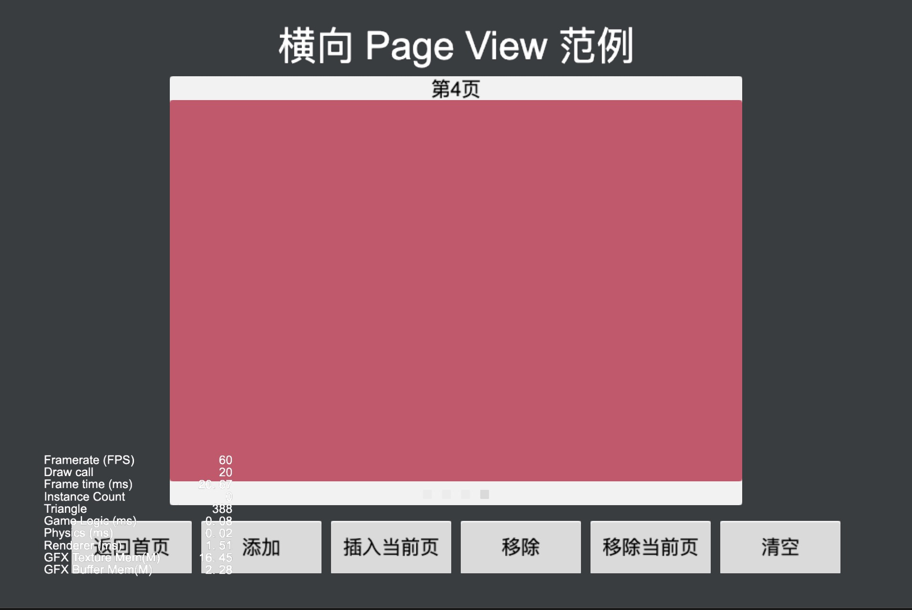

### MaskUse
| No. | Project | Creator Version | Back To Top | Mark |
| :---: | :---: | :---: | :---: | :---: |
| 1.7 | [Mask Usage](https://github.com/yeshao2069/CocosCreatorHowToUse/tree/v3.6.x/proj/UI/Creator3.6.0_2D_MaskUse) | 3.6.0 | [Back To Top](#quick) | Creator Demo UPDATE [Link](https://gitee.com/mirrors_cocos-creator/example-cases/tree/v2.4.3/assets/cases/02_ui/15_mask) |

### UpdateListWithData
| No. | Project | Creator Version | Back To Top | Mark |
| :---: | :---: | :---: | :---: | :---: |
| 1.8 | [Update ListView With Data](https://github.com/yeshao2069/CocosCreatorHowToUse/tree/v3.6.x/proj/UI/Creator3.6.0_2D_UpdateListWithData) | 3.6.0 | [Back To Top](#quick) | Creator Demo UPDATE [Link](https://gitee.com/mirrors_cocos-creator/demo-ui/tree/v3.0/assets/scene) |

### CameraUseSample
| No. | Project | Creator Version | Back To Top | Mark |
| :---: | :---: | :---: | :---: | :---: |
| 1.9 | [Camera Usage](https://github.com/yeshao2069/CocosCreatorHowToUse/tree/v3.6.x/proj/UI/Creator3.6.0_2D_CameraUseSample) | 3.6.0 | [Back To Top](#quick) |  |

### PopupController
| No. | Project | Creator Version | Back To Top | Mark |
| :---: | :---: | :---: | :---: | :---: |
| 1.10 | [Popup Controller](https://github.com/yeshao2069/CocosCreatorHowToUse/tree/v3.6.x/proj/UI/Creator3.6.1_2D_PopupController) | 3.6.1 | [Back To Top](#quick) |  |

### TextAlignmentAtBothEnds
| No. | Project | Creator Version | Back To Top | Mark |
| :---: | :---: | :---: | :---: | :---: |
| 1.11 | [Text Alignment At Both Ends](https://github.com/yeshao2069/CocosCreatorHowToUse/tree/v3.6.x/proj/UI/Creator3.6.2_2D_TextAlignmentAtBothEnds) | 3.6.2 | [Back To Top](#quick) |  |

### GpuInstancing
| No. | Project | Creator Version | Back To Top | Mark |
| :---: | :---: | :---: | :---: | :---: |
| 2.1 | [GPU Instancing](https://github.com/yeshao2069/CocosCreatorHowToUse/tree/v3.6.x/proj/Performance/Creator3.6.0_3D_GpuInstancing) | 3.6.0 | [Back To Top](#quick) |  |

### StaticBatch
| No. | Project | Creator Version | Back To Top | Mark |
| :---: | :---: | :---: | :---: | :---: |
| 2.2 | [Static Batch](https://github.com/yeshao2069/CocosCreatorHowToUse/tree/v3.6.x/proj/Performance/Creator3.6.0_3D_StaticBatch) | 3.6.0 | [Back To Top](#quick) |  |

 |

### VBBatch
| No. | Project | Creator Version | Back To Top | Mark |
| :---: | :---: | :---: | :---: | :---: |
| 2.3 | [VB Batch](https://github.com/yeshao2069/CocosCreatorHowToUse/tree/v3.6.x/proj/Performance/Creator3.6.0_3D_VBBatch) | 3.6.0 | [Back To Top](#quick) |  |

### NativeOcclusionQuery
| No. | Project | Creator Version | Back To Top | Mark |
| :---: | :---: | :---: | :---: | :---: |
| 2.4 | [Occlusion Query(Native)](https://github.com/yeshao2069/CocosCreatorHowToUse/tree/v3.6.x/proj/Performance/Creator3.6.0_3D_NativeOcclusionQuery) | 3.6.0 | [Back To Top](#quick) |  |

### PlayOneShot
| No. | Project | Creator Version | Back To Top | Mark |
| :---: | :---: | :---: | :---: | :---: |
| 3.1 | [PlayOneShot Usage](https://github.com/yeshao2069/CocosCreatorHowToUse/tree/v3.6.x/proj/Audio/Creator3.6.0_PlayOneShot) | 3.6.0 | [Back To Top](#quick) |  |

### AddGlobalButtonSound
| No. | Project | Creator Version | Back To Top | Mark |
| :---: | :---: | :---: | :---: | :---: |
| 3.2 | [Add Global Button Sound](https://github.com/yeshao2069/CocosCreatorHowToUse/tree/v3.6.x/proj/Audio/Creator3.6.0_AddGlobalButtonSound) | 3.6.0 | [Back To Top](#quick) |  |

### PianoPlay
| No. | Project | Creator Version | Back To Top | Mark |
| :---: | :---: | :---: | :---: | :---: |
| 3.3 | [Play Piano](https://github.com/yeshao2069/CocosCreatorHowToUse/tree/v3.6.x/proj/Audio/Creator3.6.0_PianoPlay) | 3.6.0 | [Back To Top](#quick) |  |

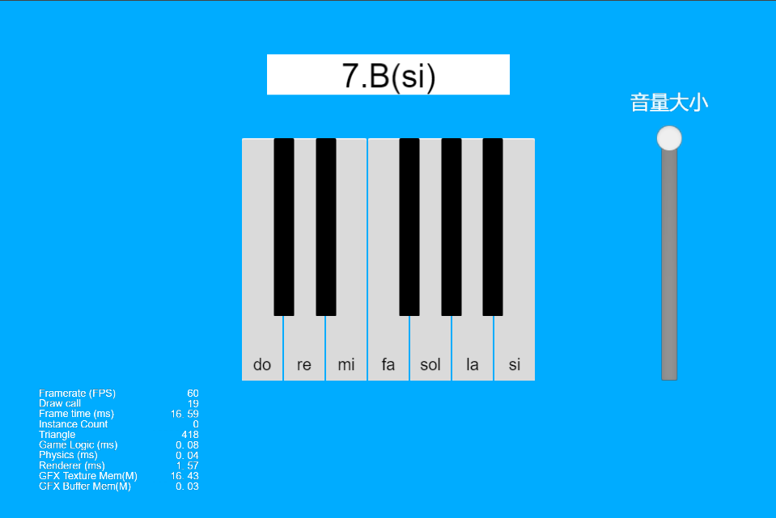

### VideoPlayer
| No. | Project | Creator Version | Back To Top | Mark |
| :---: | :---: | :---: | :---: | :---: |
| 4.1 | [VideoPlayer Usage](https://github.com/yeshao2069/CocosCreatorHowToUse/tree/v3.6.x/proj/Video/Creator3.6.0_VideoPlayer) | 3.6.0 | [Back To Top](#quick) |  |

 |

### VideoStayOnBottom
| No. | Project | Creator Version | Back To Top | Mark |
| :---: | :---: | :---: | :---: | :---: |
| 4.2 | [VideoPlayer Stay On Bottom](https://github.com/yeshao2069/CocosCreatorHowToUse/tree/v3.6.x/proj/Video/Creator3.6.0_VideoStayOnBottom) | 3.6.0 | [Back To Top](#quick) |  |

### SpriteFrameAnimation
| No. | Project | Creator Version | Back To Top | Mark |
| :---: | :---: | :---: | :---: | :---: |
| 5.1 | [SpriteFrame Animation](https://github.com/yeshao2069/CocosCreatorHowToUse/tree/v3.6.x/proj/Animation/Creator3.6.0_2D_SpriteFrameAnimation) | 3.6.0 | [Back To Top](#quick) |  |

### SpriteMoveAnimation
| No. | Project | Creator Version | Back To Top | Mark |
| :---: | :---: | :---: | :---: | :---: |
| 5.2 | [SpriteFrame Move Animation](https://github.com/yeshao2069/CocosCreatorHowToUse/tree/v3.6.x/proj/Animation/Creator3.6.0_2D_SpriteMoveAnimation) | 3.6.0 | [Back To Top](#quick) |  |

### CreateAnimationClip
| No. | Project | Creator Version | Back To Top | Mark |
| :---: | :---: | :---: | :---: | :---: |
| 5.3 | [Dynamic Create AnimationClip](https://github.com/yeshao2069/CocosCreatorHowToUse/tree/v3.6.x/proj/Animation/Creator3.6.0_2D_CreateAnimationClip) | 3.6.0 | [Back To Top](#quick) |  |

 

### AnimationWater
| No. | Project | Creator Version | Back To Top | Mark |
| :---: | :---: | :---: | :---: | :---: |
| 5.4 | [SpriteFrame Animation Water](https://github.com/yeshao2069/CocosCreatorHowToUse/tree/v3.6.x/proj/Animation/Creator3.6.0_2D_AnimationWater) | 3.6.0 | [Back To Top](#quick) |  |

 

### AnimationFish
| No. | Project | Creator Version | Back To Top | Mark |
| :---: | :---: | :---: | :---: | :---: |
| 5.5 | [SpriteFrame Animation Fish](https://github.com/yeshao2069/CocosCreatorHowToUse/tree/v3.6.x/proj/Animation/Creator3.6.0_2D_AnimationFish) | 3.6.0 | [Back To Top](#quick) |  |

 

### MsAmoy
| No. | Project | Creator Version | Back To Top | Mark |
| :---: | :---: | :---: | :---: | :---: |
| 5.6 | [Ms. Amoy](https://github.com/yeshao2069/CocosCreatorHowToUse/tree/v3.6.x/proj/Animation/Creator3.6.0_3D_MsAmoy) | 3.6.0 | [Back To Top](#quick) |  |

 

### LoadSpine
| No. | Project | Creator Version | Back To Top | Mark |
| :---: | :---: | :---: | :---: | :---: |
| 6.1 | [Dynamic Load Spine](https://github.com/yeshao2069/CocosCreatorHowToUse/tree/v3.6.x/proj/Spine/Creator3.6.0_2D_LoadSpine) | 3.6.0 | [Back To Top](#quick) |  |

### SpineAttach
| No. | Project | Creator Version | Back To Top | Mark |
| :---: | :---: | :---: | :---: | :---: |
| 6.2 | [Spine Attach](https://github.com/yeshao2069/CocosCreatorHowToUse/tree/v3.6.x/proj/Spine/Creator3.6.0_2D_SpineAttach) | 3.6.0 | [Back To Top](#quick) |  |

### SpineMesh
| No. | Project | Creator Version | Back To Top | Mark |
| :---: | :---: | :---: | :---: | :---: |
| 6.3 | [Spine Mesh](https://github.com/yeshao2069/CocosCreatorHowToUse/tree/v3.6.x/proj/Spine/Creator3.6.0_2D_SpineMesh) | 3.6.0 | [Back To Top](#quick) |  |

### SpineSkin
| No. | Project | Creator Version | Back To Top | Mark |
| :---: | :---: | :---: | :---: | :---: |
| 6.4 | [Spine Change Skin](https://github.com/yeshao2069/CocosCreatorHowToUse/tree/v3.6.x/proj/Spine/Creator3.6.0_2D_SpineSkin) | 3.6.0 | [Back To Top](#quick) |  |

### SpineCollider
| No. | Project | Creator Version | Back To Top | Mark |
| :---: | :---: | :---: | :---: | :---: |
| 6.5 | [Spine Collider](https://github.com/yeshao2069/CocosCreatorHowToUse/tree/v3.6.x/proj/Spine/Creator3.6.0_2D_SpineCollider) | 3.6.0 | [Back To Top](#quick) |  |

### SpineBoy
| No. | Project | Creator Version | Back To Top | Mark |
| :---: | :---: | :---: | :---: | :---: |
| 6.6 | [Spine Boy](https://github.com/yeshao2069/CocosCreatorHowToUse/tree/v3.6.x/proj/Spine/Creator3.6.0_2D_SpineBoy) | 3.6.0 | [Back To Top](#quick) |  |

### SpineSpecifiedFrame
| No. | Project | Creator Version | Back To Top | Mark |
| :---: | :---: | :---: | :---: | :---: |
| 6.7 | [Spine Specified Frame](https://github.com/yeshao2069/CocosCreatorHowToUse/tree/v3.6.x/proj/Spine/Creator3.6.0_2D_SpineSpecifiedFrame) | 3.6.0 | [Back To Top](#quick) |  |

### DragonBonesReplaceSlot
| No. | Project | Creator Version | Back To Top | Mark |
| :---: | :---: | :---: | :---: | :---: |
| 7.1 | [DragonBones Replace Slot](https://github.com/yeshao2069/CocosCreatorHowToUse/tree/v3.6.x/proj/DragonBones/Creator3.6.0_2D_DragonBonesReplaceSlot) | 3.6.0 | [Back To Top](#quick) |  |

### LoadDragonBones
| No. | Project | Creator Version | Back To Top | Mark |
| :---: | :---: | :---: | :---: | :---: |
| 7.2 | [Load DragonBones](https://github.com/yeshao2069/CocosCreatorHowToUse/tree/v3.6.x/proj/DragonBones/Creator3.6.0_2D_LoadDragonBones) | 3.6.0 | [Back To Top](#quick) |  |

### DragonBonesCollider
| No. | Project | Creator Version | Back To Top | Mark |
| :---: | :---: | :---: | :---: | :---: |
| 7.3 | [DragonBones Collider](https://github.com/yeshao2069/CocosCreatorHowToUse/tree/v3.6.x/proj/DragonBones/Creator3.6.0_2D_DragonBonesCollider) | 3.6.0 | [Back To Top](#quick) |  |

### DragonBonesAttach
| No. | Project | Creator Version | Back To Top | Mark |
| :---: | :---: | :---: | :---: | :---: |
| 7.4 | [DragonBones Attach](https://github.com/yeshao2069/CocosCreatorHowToUse/tree/v3.6.x/proj/DragonBones/Creator3.6.0_2D_DragonBonesAttach) | 3.6.0 | [Back To Top](#quick) |  |

### DragonBones
| No. | Project | Creator Version | Back To Top | Mark |
| :---: | :---: | :---: | :---: | :---: |
| 7.5 | [DragonBones](https://github.com/yeshao2069/CocosCreatorHowToUse/tree/v3.6.x/proj/DragonBones/Creator3.6.0_2D_DragonBones) | 3.6.0 | [Back To Top](#quick) |  |

### DragonBonesSpecifiedFrame
| No. | Project | Creator Version | Back To Top | Mark |
| :---: | :---: | :---: | :---: | :---: |
| 7.6 | [DragonBones Specified Frame](https://github.com/yeshao2069/CocosCreatorHowToUse/tree/v3.6.x/proj/DragonBones/Creator3.6.0_2D_DragonBonesSpecifiedFrame) | 3.6.0 | [Back To Top](#quick) |  |

### GraphicsArc
| No. | Project | Creator Version | Back To Top | Mark |
| :---: | :---: | :---: | :---: | :---: |
| 8.1 | [Graphics Arc](https://github.com/yeshao2069/CocosCreatorHowToUse/tree/v3.6.x/proj/Graphics/Creator3.6.0_2D_GraphicsArc) | 3.6.0 | [Back To Top](#quick) |  |

### GraphicsRect
| No. | Project | Creator Version | Back To Top | Mark |
| :---: | :---: | :---: | :---: | :---: |
| 8.2 | [Graphics Rect](https://github.com/yeshao2069/CocosCreatorHowToUse/tree/v3.6.x/proj/Graphics/Creator3.6.0_2D_GraphicsRect) | 3.6.0 | [Back To Top](#quick) |  |

### GraphicsLineTo
| No. | Project | Creator Version | Back To Top | Mark |
| :---: | :---: | :---: | :---: | :---: |
| 8.3 | [Graphics LineTo](https://github.com/yeshao2069/CocosCreatorHowToUse/tree/v3.6.x/proj/Graphics/Creator3.6.0_2D_GraphicsLineTo) | 3.6.0 | [Back To Top](#quick) |  |

### GraphicsEllipse
| No. | Project | Creator Version | Back To Top | Mark |
| :---: | :---: | :---: | :---: | :---: |
| 8.4 | [Graphics Ellipse](https://github.com/yeshao2069/CocosCreatorHowToUse/tree/v3.6.x/proj/Graphics/Creator3.6.0_2D_GraphicsEllipse) | 3.6.0 | [Back To Top](#quick) |  |

### GraphicsDrawCircle
| No. | Project | Creator Version | Back To Top | Mark |
| :---: | :---: | :---: | :---: | :---: |
| 8.5 | [Graphics Draw Circle](https://github.com/yeshao2069/CocosCreatorHowToUse/tree/v3.6.x/proj/Graphics/Creator3.6.0_2D_GraphicsDrawCircle) | 3.6.0 | [Back To Top](#quick) |  |

### Doodle
| No. | Project | Creator Version | Back To Top | Mark |
| :---: | :---: | :---: | :---: | :---: |
| 8.6 | [Doodle](https://github.com/yeshao2069/CocosCreatorHowToUse/tree/v3.6.x/proj/Graphics/Creator3.6.0_2D_Doodle) | 3.6.0 | [Back To Top](#quick) |  |

### GraphicsSineWaves
| No. | Project | Creator Version | Back To Top | Mark |
| :---: | :---: | :---: | :---: | :---: |
| 8.7 | [Graphics Sine Waves](https://github.com/yeshao2069/CocosCreatorHowToUse/tree/v3.6.x/proj/Graphics/Creator3.6.0_2D_GraphicsSineWaves) | 3.6.0 | [Back To Top](#quick) |  |

### DrawLine
| No. | Project | Creator Version | Back To Top | Mark |
| :---: | :---: | :---: | :---: | :---: |
| 8.8 | [Graphics Draw Line](https://github.com/yeshao2069/CocosCreatorHowToUse/tree/v3.6.x/proj/Graphics/Creator3.6.0_2D_DrawLine) | 3.6.0 | [Back To Top](#quick) |  |

### GraphicsFireworksExplosion
| No. | Project | Creator Version | Back To Top | Mark |
| :---: | :---: | :---: | :---: | :---: |
| 8.9 | [Graphics Fireworks Explosion](https://github.com/yeshao2069/CocosCreatorHowToUse/tree/v3.6.x/proj/Graphics/Creator3.6.0_2D_GraphicsFireworksExplosion) | 3.6.0 | [Back To Top](#quick) |  |

### GraphicsHouse
| No. | Project | Creator Version | Back To Top | Mark |
| :---: | :---: | :---: | :---: | :---: |
| 8.10 | [Graphics House](https://github.com/yeshao2069/CocosCreatorHowToUse/tree/v3.6.x/proj/Graphics/Creator3.6.0_2D_GraphicsHouse) | 3.6.0 | [Back To Top](#quick) |  |

### GraphicsRingProgressbar
| No. | Project | Creator Version | Back To Top | Mark |
| :---: | :---: | :---: | :---: | :---: |
| 8.11 | [Graphics Ring Progressbar](https://github.com/yeshao2069/CocosCreatorHowToUse/tree/v3.6.x/proj/Graphics/Creator3.6.0_2D_GraphicsRingProgressbar) | 3.6.0 | [Back To Top](#quick) |  |

### PhysicsRaycastClosest
| No. | Project | Creator Version | Back To Top | Mark |
| :---: | :---: | :---: | :---: | :---: |
| 9.1 | [Physics Raycast Closest](https://github.com/yeshao2069/CocosCreatorHowToUse/tree/v3.6.x/proj/Physics/Creator3.6.0_3D_PhysicsRaycastClosest) | 3.6.0 | [Back To Top](#quick) |  |

### PhysicsRaycast
| No. | Project | Creator Version | Back To Top | Mark |
| :---: | :---: | :---: | :---: | :---: |
| 9.2 | [Physics Raycast](https://github.com/yeshao2069/CocosCreatorHowToUse/tree/v3.6.x/proj/Physics/Creator3.6.0_3D_PhysicsRaycast) | 3.6.0 | [Back To Top](#quick) |  |

### PhysicsMaterial
| No. | Project | Creator Version | Back To Top | Mark |
| :---: | :---: | :---: | :---: | :---: |
| 9.3 | [Physics Material](https://github.com/yeshao2069/CocosCreatorHowToUse/tree/v3.6.x/proj/Physics/Creator3.6.0_3D_PhysicsMaterial) | 3.6.0 | [Back To Top](#quick) |  |

### PhysicsMeshCollider
| No. | Project | Creator Version | Back To Top | Mark |
| :---: | :---: | :---: | :---: | :---: |
| 9.4 | [Physics Mesh Collider](https://github.com/yeshao2069/CocosCreatorHowToUse/tree/v3.6.x/proj/Physics/Creator3.6.0_3D_PhysicsMeshCollider) | 3.6.0 | [Back To Top](#quick) |  |

### PhysicsRotateJumpWithVelocity
| No. | Project | Creator Version | Back To Top | Mark |
| :---: | :---: | :---: | :---: | :---: |
| 9.5 | [Physics Rotate Jump With Velocity](https://github.com/yeshao2069/CocosCreatorHowToUse/tree/v3.6.x/proj/Physics/Creator3.6.0_3D_PhysicsRotateJumpWithVelocity) | 3.6.0 | [Back To Top](#quick) |  |

### PhysicsTriggerEvent
| No. | Project | Creator Version | Back To Top | Mark |
| :---: | :---: | :---: | :---: | :---: |
| 9.6 | [Physics Trigger Event](https://github.com/yeshao2069/CocosCreatorHowToUse/tree/v3.6.x/proj/Physics/Creator3.6.0_3D_PhysicsTriggerEvent) | 3.6.0 | [Back To Top](#quick) |  |

### PhysicsRuntimeUpdate
| No. | Project | Creator Version | Back To Top | Mark |
| :---: | :---: | :---: | :---: | :---: |
| 9.7 | [Physics Runtime Update](https://github.com/yeshao2069/CocosCreatorHowToUse/tree/v3.6.x/proj/Physics/Creator3.6.0_3D_PhysicsRuntimeUpdate) | 3.6.0 | [Back To Top](#quick) |  |

### PhysicsPlaneCollider
| No. | Project | Creator Version | Back To Top | Mark |
| :---: | :---: | :---: | :---: | :---: |
| 9.8 | [Physics Plane Collider](https://github.com/yeshao2069/CocosCreatorHowToUse/tree/v3.6.x/proj/Physics/Creator3.6.0_3D_PhysicsPlaneCollider) | 3.6.0 | [Back To Top](#quick) |  |

### PhysicsSync
| No. | Project | Creator Version | Back To Top | Mark |
| :---: | :---: | :---: | :---: | :---: |
| 9.9 | [Physics Sync](https://github.com/yeshao2069/CocosCreatorHowToUse/tree/v3.6.x/proj/Physics/Creator3.6.0_3D_PhysicsSync) | 3.6.0 | [Back To Top](#quick) |  |

### PhysicsGroupMask
| No. | Project | Creator Version | Back To Top | Mark |
| :---: | :---: | :---: | :---: | :---: |
| 9.10 | [Physics Group Mask](https://github.com/yeshao2069/CocosCreatorHowToUse/tree/v3.6.x/proj/Physics/Creator3.6.0_3D_PhysicsGroupMask) | 3.6.0 | [Back To Top](#quick) |  |

### PhysicsRunDynamic
| No. | Project | Creator Version | Back To Top | Mark |
| :---: | :---: | :---: | :---: | :---: |
| 9.11 | [Physics Runtime Dynamic](https://github.com/yeshao2069/CocosCreatorHowToUse/tree/v3.6.x/proj/Physics/Creator3.6.0_3D_PhysicsRunDynamic) | 3.6.0 | [Back To Top](#quick) |  |

### PhysicsConvexColliders
| No. | Project | Creator Version | Back To Top | Mark |
| :---: | :---: | :---: | :---: | :---: |
| 9.12 | [Physics Convex Colliders](https://github.com/yeshao2069/CocosCreatorHowToUse/tree/v3.6.x/proj/Physics/Creator3.6.0_3D_PhysicsConvexColliders) | 3.6.0 | [Back To Top](#quick) |  |

### PhysicsPointToPointConstraint
| No. | Project | Creator Version | Back To Top | Mark |
| :---: | :---: | :---: | :---: | :---: |
| 9.13 | [Physics Point To Point Constraint](https://github.com/yeshao2069/CocosCreatorHowToUse/tree/v3.6.x/proj/Physics/Creator3.6.0_3D_PhysicsPointToPointConstraint) | 3.6.0 | [Back To Top](#quick) |  |

### PhysicsContactData
| No. | Project | Creator Version | Back To Top | Mark |
| :---: | :---: | :---: | :---: | :---: |
| 9.14 | [Physics Contact Data](https://github.com/yeshao2069/CocosCreatorHowToUse/tree/v3.6.x/proj/Physics/Creator3.6.0_3D_PhysicsContactData) | 3.6.0 | [Back To Top](#quick) |  |

### PhysicsHingeConstraint
| No. | Project | Creator Version | Back To Top | Mark |
| :---: | :---: | :---: | :---: | :---: |
| 9.15 | [Physics Hinge Constraint](https://github.com/yeshao2069/CocosCreatorHowToUse/tree/v3.6.x/proj/Physics/Creator3.6.0_3D_PhysicsHingeConstraint) | 3.6.0 | [Back To Top](#quick) |  |

### PhysicsForceConstant
| No. | Project | Creator Version | Back To Top | Mark |
| :---: | :---: | :---: | :---: | :---: |
| 9.16 | [Physics Force Constant](https://github.com/yeshao2069/CocosCreatorHowToUse/tree/v3.6.x/proj/Physics/Creator3.6.0_3D_PhysicsForceConstant) | 3.6.0 | [Back To Top](#quick) |  |

### PhysicsCollisionEvent
| No. | Project | Creator Version | Back To Top | Mark |
| :---: | :---: | :---: | :---: | :---: |
| 9.17 | [Physics Collision Event](https://github.com/yeshao2069/CocosCreatorHowToUse/tree/v3.6.x/proj/Physics/Creator3.6.0_3D_PhysicsCollisionEvent) | 3.6.0 | [Back To Top](#quick) |  |

### PhysicsCapsuleTrigger
| No. | Project | Creator Version | Back To Top | Mark |
| :---: | :---: | :---: | :---: | :---: |
| 9.18 | [Physics Capsule Trigger](https://github.com/yeshao2069/CocosCreatorHowToUse/tree/v3.6.x/proj/Physics/Creator3.6.0_3D_PhysicsCapsuleTrigger) | 3.6.0 | [Back To Top](#quick) |  |

### Buoyancy2D
| No. | Project | Creator Version | Back To Top | Mark |
| :---: | :---: | :---: | :---: | :---: |
| 9.19 | [Buoyancy 2D](https://github.com/yeshao2069/CocosCreatorHowToUse/tree/v3.6.x/proj/Physics/Creator3.6.0_2D_Buoyancy) | 3.6.0 | [Back To Top](#quick) |  |

### Buoyancy3D
| No. | Project | Creator Version | Back To Top | Mark |
| :---: | :---: | :---: | :---: | :---: |
| 9.20 | [Buoyancy 3D](https://github.com/yeshao2069/CocosCreatorHowToUse/tree/v3.6.x/proj/Physics/Creator3.6.0_3D_Buoyancy) | 3.6.0 | [Back To Top](#quick) |  |

### FallingBall
| No. | Project | Creator Version | Back To Top | Mark |
| :---: | :---: | :---: | :---: | :---: |
| 9.21 | [Physics Falling Ball](https://github.com/yeshao2069/CocosCreatorHowToUse/tree/v3.6.x/proj/Physics/Creator3.6.1_3D_FallingBall) | 3.6.1 | [Back To Top](#quick) |  |

### Box2DCuttingObjects
| No. | Project | Creator Version | Back To Top | Mark |
| :---: | :---: | :---: | :---: | :---: |
| 9.22 | [Box2D Cutting Objects](https://github.com/yeshao2069/CocosCreatorHowToUse/tree/v3.6.x/proj/Physics/Creator3.6.1_Box2D_CuttingObjects) | 3.6.1 | [Back To Top](#quick) |  |

### Box2DGravityRadial
| No. | Project | Creator Version | Back To Top | Mark |
| :---: | :---: | :---: | :---: | :---: |
| 9.23 | [Box2D Gravity Radial](https://github.com/yeshao2069/CocosCreatorHowToUse/tree/v3.6.x/proj/Physics/Creator3.6.1_Box2D_GravityRadial) | 3.6.1 | [Back To Top](#quick) |  |

### Box2DManifold
| No. | Project | Creator Version | Back To Top | Mark |
| :---: | :---: | :---: | :---: | :---: |
| 9.24 | [Box2D Manifold](https://github.com/yeshao2069/CocosCreatorHowToUse/tree/v3.6.x/proj/Physics/Creator3.6.1_Box2D_Manifold) | 3.6.1 | [Back To Top](#quick) |  |

### Box2DOneWayPlatform
| No. | Project | Creator Version | Back To Top | Mark |
| :---: | :---: | :---: | :---: | :---: |
| 9.25 | [Box2D One Way Platform](https://github.com/yeshao2069/CocosCreatorHowToUse/tree/v3.6.x/proj/Physics/Creator3.6.1_Box2D_OneWayPlatform) | 3.6.1 | [Back To Top](#quick) |  |

### Box2DRaycast
| No. | Project | Creator Version | Back To Top | Mark |
| :---: | :---: | :---: | :---: | :---: |
| 9.26 | [Box2D Raycast](https://github.com/yeshao2069/CocosCreatorHowToUse/tree/v3.6.x/proj/Physics/Creator3.6.1_Box2D_Raycast) | 3.6.1 | [Back To Top](#quick) |  |

### Box2DRaycastReflection
| No. | Project | Creator Version | Back To Top | Mark |
| :---: | :---: | :---: | :---: | :---: |
| 9.27 | [Box2D Raycast Reflection](https://github.com/yeshao2069/CocosCreatorHowToUse/tree/v3.6.x/proj/Physics/Creator3.6.1_Box2D_RaycastReflection) | 3.6.1 | [Back To Top](#quick) |  |

### Box2DDistanceJoint
| No. | Project | Creator Version | Back To Top | Mark |
| :---: | :---: | :---: | :---: | :---: |
| 9.28 | [Box2D Distance Joint](https://github.com/yeshao2069/CocosCreatorHowToUse/tree/v3.6.x/proj/Physics/Creator3.6.1_Box2D_DistanceJoint) | 3.6.1 | [Back To Top](#quick) |  |

### Box2DDistanceJointChain
| No. | Project | Creator Version | Back To Top | Mark |
| :---: | :---: | :---: | :---: | :---: |
| 9.29 | [Box2D Distance Joint Chain](https://github.com/yeshao2069/CocosCreatorHowToUse/tree/v3.6.x/proj/Physics/Creator3.6.1_Box2D_DistanceJointChain) | 3.6.1 | [Back To Top](#quick) |  |

### Box2DFixedJointRagdoll
| No. | Project | Creator Version | Back To Top | Mark |
| :---: | :---: | :---: | :---: | :---: |
| 9.30 | [Box2D Fixed Joint Ragdoll](https://github.com/yeshao2069/CocosCreatorHowToUse/tree/v3.6.x/proj/Physics/Creator3.6.1_Box2D_FixedJointRagdoll) | 3.6.1 | [Back To Top](#quick) |  |

### Box2DHingeJoint
| No. | Project | Creator Version | Back To Top | Mark |
| :---: | :---: | :---: | :---: | :---: |
| 9.31 | [Box2D Hinge Joint](https://github.com/yeshao2069/CocosCreatorHowToUse/tree/v3.6.x/proj/Physics2/Creator3.6.1_Box2D_HingeJoint) | 3.6.1 | [Back To Top](#quick) |  |

### Box2DHingeJointCrank
| No. | Project | Creator Version | Back To Top | Mark |
| :---: | :---: | :---: | :---: | :---: |
| 9.32 | [Box2D Hinge Joint Crank](https://github.com/yeshao2069/CocosCreatorHowToUse/tree/v3.6.x/proj/Physics2/Creator3.6.1_Box2D_HingeJointCrank) | 3.6.1 | [Back To Top](#quick) |  |

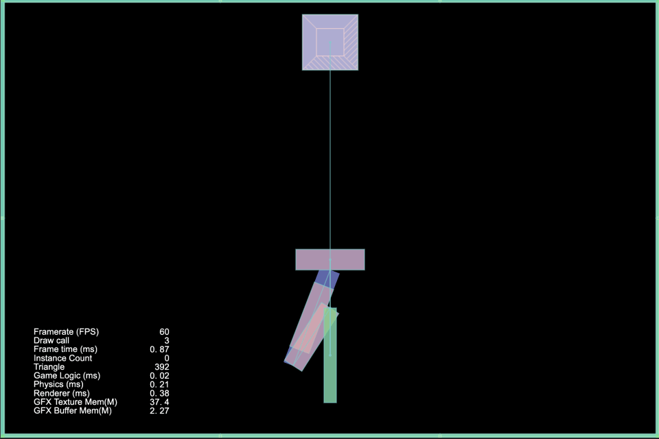

### Box2DMouseJoint
| No. | Project | Creator Version | Back To Top | Mark |
| :---: | :---: | :---: | :---: | :---: |
| 9.33 | [Box2D Mouse Joint](https://github.com/yeshao2069/CocosCreatorHowToUse/tree/v3.6.x/proj/Physics2/Creator3.6.1_Box2D_MouseJoint) | 3.6.1 | [Back To Top](#quick) |  |

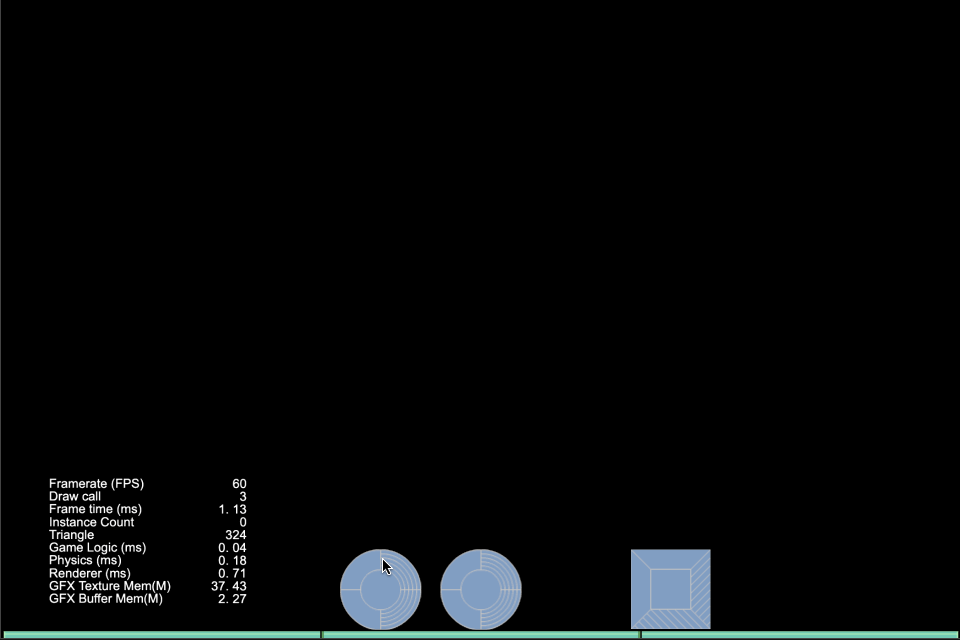

### Box2DRelativeJointHuman
| No. | Project | Creator Version | Back To Top | Mark |
| :---: | :---: | :---: | :---: | :---: |
| 9.34 | [Box2D Relative Joint Human](https://github.com/yeshao2069/CocosCreatorHowToUse/tree/v3.6.x/proj/Physics2/Creator3.6.1_Box2D_RelativeJointHuman) | 3.6.1 | [Back To Top](#quick) |  |

### Box2DRelativeJointLinearOffset
| No. | Project | Creator Version | Back To Top | Mark |
| :---: | :---: | :---: | :---: | :---: |
| 9.35 | [Box2D Relative Joint Linear Offset](https://github.com/yeshao2069/CocosCreatorHowToUse/tree/v3.6.x/proj/Physics2/Creator3.6.1_Box2D_RelativeJointLinearOffset) | 3.6.1 | [Back To Top](#quick) |  |

### Box2DSliderJoint
| No. | Project | Creator Version | Back To Top | Mark |
| :---: | :---: | :---: | :---: | :---: |
| 9.36 | [Box2D Slider Joint](https://github.com/yeshao2069/CocosCreatorHowToUse/tree/v3.6.x/proj/Physics2/Creator3.6.1_Box2D_SliderJoint) | 3.6.1 | [Back To Top](#quick) |  |

### Box2DSpringJointDamp
| No. | Project | Creator Version | Back To Top | Mark |
| :---: | :---: | :---: | :---: | :---: |
| 9.37 | [Box2D Spring Joint Damp](https://github.com/yeshao2069/CocosCreatorHowToUse/tree/v3.6.x/proj/Physics2/Creator3.6.1_Box2D_SpringJointDamp) | 3.6.1 | [Back To Top](#quick) |  |

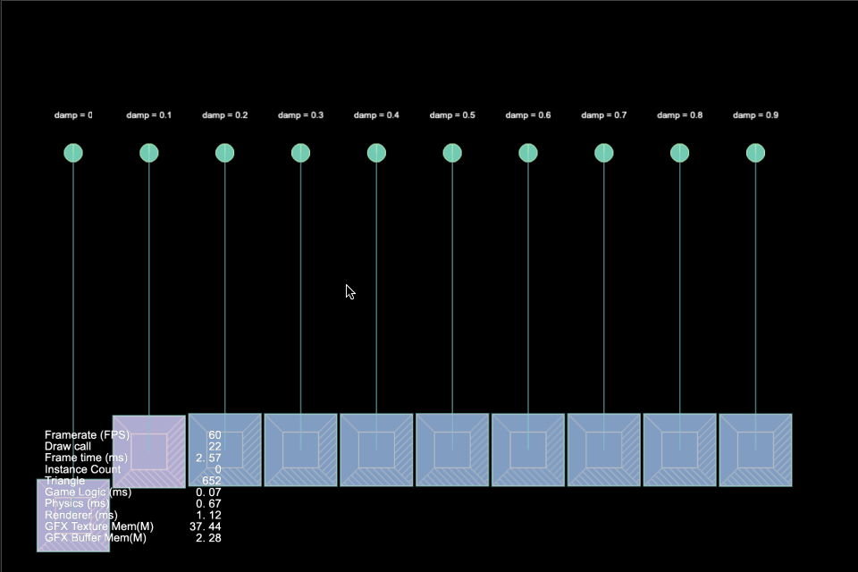

### Box2DSpringJointFrequency
| No. | Project | Creator Version | Back To Top | Mark |
| :---: | :---: | :---: | :---: | :---: |
| 9.38 | [Box2D Spring Joint Frequency](https://github.com/yeshao2069/CocosCreatorHowToUse/tree/v3.6.x/proj/Physics2/Creator3.6.1_Box2D_SpringJointFrequency) | 3.6.1 | [Back To Top](#quick) |  |

### Box2DWheelJoint
| No. | Project | Creator Version | Back To Top | Mark |
| :---: | :---: | :---: | :---: | :---: |
| 9.39 | [Box2D Wheel Joint](https://github.com/yeshao2069/CocosCreatorHowToUse/tree/v3.6.x/proj/Physics2/Creator3.6.1_Box2D_WheelJoint) | 3.6.1 | [Back To Top](#quick) |  |

### Box2DAnimated
| No. | Project | Creator Version | Back To Top | Mark |
| :---: | :---: | :---: | :---: | :---: |
| 9.40 | [Box2D Animated](https://github.com/yeshao2069/CocosCreatorHowToUse/tree/v3.6.x/proj/Physics2/Creator3.6.1_Box2D_Animated) | 3.6.1 | [Back To Top](#quick) |  |

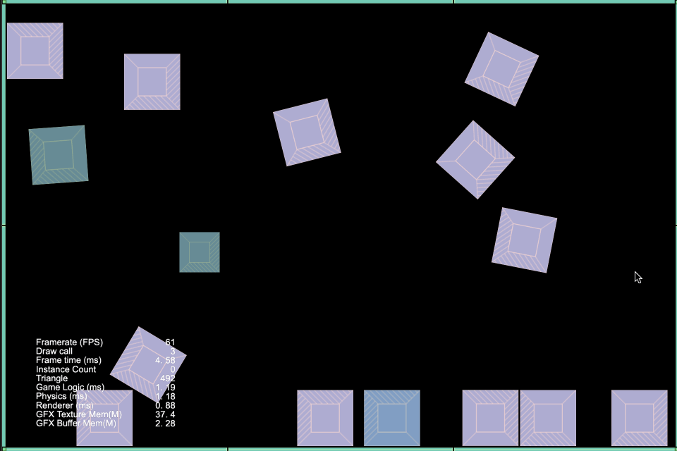

### Box2DLinearImpulse
| No. | Project | Creator Version | Back To Top | Mark |
| :---: | :---: | :---: | :---: | :---: |
| 9.41 | [Box2D Linear Impulse](https://github.com/yeshao2069/CocosCreatorHowToUse/tree/v3.6.x/proj/Physics2/Creator3.6.1_Box2D_LinearImpulse) | 3.6.1 | [Back To Top](#quick) |  |

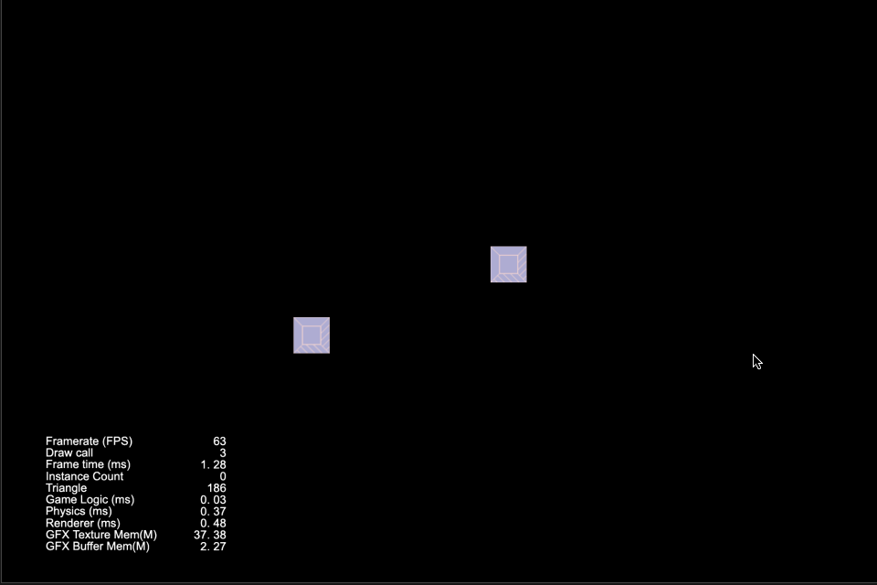

### Box2DVaringFriction
| No. | Project | Creator Version | Back To Top | Mark |
| :---: | :---: | :---: | :---: | :---: |
| 9.42 | [Box2D Varing Friction](https://github.com/yeshao2069/CocosCreatorHowToUse/tree/v3.6.x/proj/Physics2/Creator3.6.1_Box2D_VaringFriction) | 3.6.1 | [Back To Top](#quick) |  |

### Box2DVaringRestitution
| No. | Project | Creator Version | Back To Top | Mark |
| :---: | :---: | :---: | :---: | :---: |
| 9.43 | [Box2D Varing Restitution](https://github.com/yeshao2069/CocosCreatorHowToUse/tree/v3.6.x/proj/Physics2/Creator3.6.1_Box2D_VaringRestitution) | 3.6.1 | [Back To Top](#quick) |  |

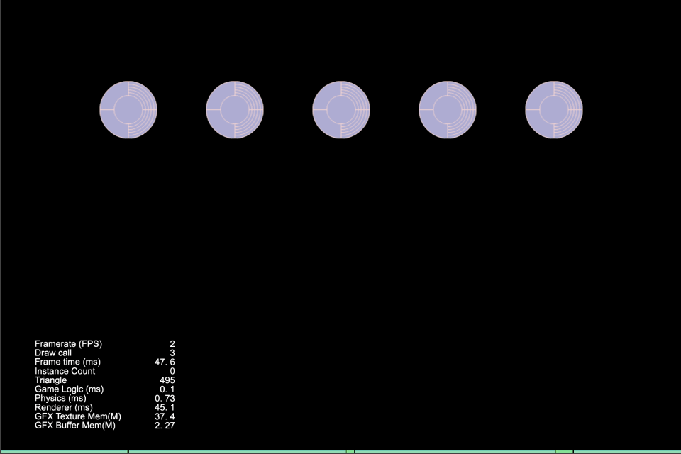

### PhysicalHitTest
| No. | Project | Creator Version | Back To Top | Mark |
| :---: | :---: | :---: | :---: | :---: |
| 9.44 | [Physical Hit Test](https://github.com/yeshao2069/CocosCreatorHowToUse/tree/v3.6.x/proj/Physics2/Creator3.6.2_2D_PhysicalHitTest) | 3.6.2 | [Back To Top](#quick) |  |

### PhysicalTag
| No. | Project | Creator Version | Back To Top | Mark |
| :---: | :---: | :---: | :---: | :---: |
| 9.45 | [Physical Tag](https://github.com/yeshao2069/CocosCreatorHowToUse/tree/v3.6.x/proj/Physics2/Creator3.6.2_2D_PhysicalTag) | 3.6.2 | [Back To Top](#quick) |  |

### PhysicalShape
| No. | Project | Creator Version | Back To Top | Mark |
| :---: | :---: | :---: | :---: | :---: |
| 9.46 | [Physical Shape](https://github.com/yeshao2069/CocosCreatorHowToUse/tree/v3.6.x/proj/Physics2/Creator3.6.2_2D_PhysicalShape) | 3.6.2 | [Back To Top](#quick) |  |

### PhysicalMask
| No. | Project | Creator Version | Back To Top | Mark |
| :---: | :---: | :---: | :---: | :---: |
| 9.47 | [Physical Mask](https://github.com/yeshao2069/CocosCreatorHowToUse/tree/v3.6.x/proj/Physics2/Creator3.6.2_2D_PhysicalMask) | 3.6.2 | [Back To Top](#quick) |  |

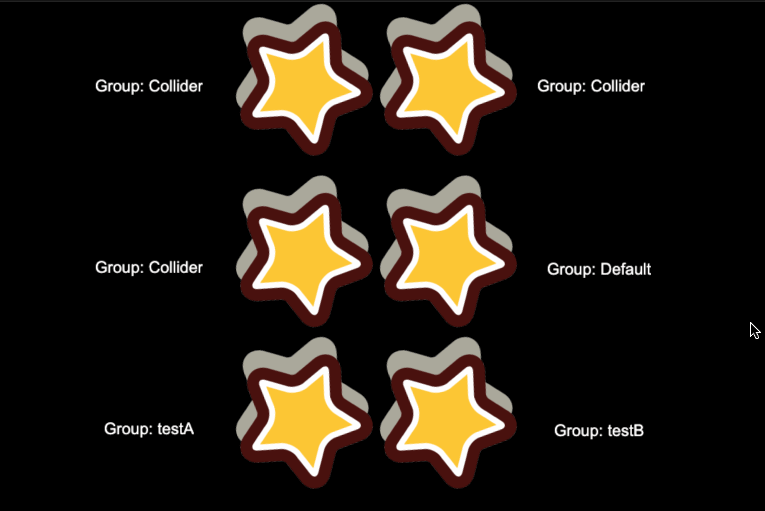

### TweenOpacityChange
| No. | Project | Creator Version | Back To Top | Mark |
| :---: | :---: | :---: | :---: | :---: |
| 10.1 | [Tween Opacity Change](https://github.com/yeshao2069/CocosCreatorHowToUse/tree/v3.6.x/proj/Tween/Creator3.6.0_2D_TweenOpacityChange) | 3.6.0 | [Back To Top](#quick) |  |

 |

### TweenRotateChange
| No. | Project | Creator Version | Back To Top | Mark |
| :---: | :---: | :---: | :---: | :---: |
| 10.2 | [Tween Rotate Change](https://github.com/yeshao2069/CocosCreatorHowToUse/tree/v3.6.x/proj/Tween/Creator3.6.0_3D_TweenRotateChange) | 3.6.0 | [Back To Top](#quick) |  |

### TweenCircleMove
| No. | Project | Creator Version | Back To Top | Mark |
| :---: | :---: | :---: | :---: | :---: |
| 10.3 | [Tween Circle Move](https://github.com/yeshao2069/CocosCreatorHowToUse/tree/v3.6.x/proj/Tween/Creator3.6.0_2D_TweenCircleMove) | 3.6.0 | [Back To Top](#quick) |  |

### TweenRotateAndScaleForever
| No. | Project | Creator Version | Back To Top | Mark |
| :---: | :---: | :---: | :---: | :---: |
| 10.4 | [Tween Rotate And Scale Forever](https://github.com/yeshao2069/CocosCreatorHowToUse/tree/v3.6.x/proj/Tween/Creator3.6.0_2D_TweenRotateAndScaleForever) | 3.6.0 | [Back To Top](#quick) |  |

### TweenShowMonster
| No. | Project | Creator Version | Back To Top | Mark |
| :---: | :---: | :---: | :---: | :---: |
| 10.5 | [Tween Show Monster](https://github.com/yeshao2069/CocosCreatorHowToUse/tree/v3.6.x/proj/Tween/Creator3.6.0_2D_TweenShowMonster) | 3.6.0 | [Back To Top](#quick) |  |

### TweenCCUtils
| No. | Project | Creator Version | Back To Top | Mark |
| :---: | :---: | :---: | :---: | :---: |
| 10.6 | [Tween CC Utils](https://github.com/yeshao2069/CocosCreatorHowToUse/tree/v3.6.x/proj/Tween/Creator3.6.0_2D_TweenCCUtils) | 3.6.0 | [Back To Top](#quick) |  |

### MorphHead
| No. | Project | Creator Version | Back To Top | Mark |
| :---: | :---: | :---: | :---: | :---: |
| 11.1 | [Morph Head](https://github.com/yeshao2069/CocosCreatorHowToUse/tree/v3.6.x/proj/Model/Creator3.6.0_3D_MorphHead) | 3.6.0 | [Back To Top](#quick) |  |

### DanceWoman
| No. | Project | Creator Version | Back To Top | Mark |
| :---: | :---: | :---: | :---: | :---: |
| 11.2 | [Model Dancing Woman](https://github.com/yeshao2069/CocosCreatorHowToUse/tree/v3.6.x/proj/Model/Creator3.6.0_3D_DanceWoman) | 3.6.0 | [Back To Top](#quick) |  |

### Toon
| No. | Project | Creator Version | Back To Top | Mark |
| :---: | :---: | :---: | :---: | :---: |
| 11.3 | [Model Toon](https://github.com/yeshao2069/CocosCreatorHowToUse/tree/v3.6.x/proj/Model/Creator3.6.0_3D_Toon) | 3.6.0 | [Back To Top](#quick) |  |

### DynamicLoadMaterial
| No. | Project | Creator Version | Back To Top | Mark |
| :---: | :---: | :---: | :---: | :---: |
| 11.4 | [Model Dynamic Load Material](https://github.com/yeshao2069/CocosCreatorHowToUse/tree/v3.6.x/proj/Model/Creator3.6.0_3D_DynamicLoadMaterial) | 3.6.0 | [Back To Top](#quick) |  |

### Winter
| No. | Project | Creator Version | Back To Top | Mark |
| :---: | :---: | :---: | :---: | :---: |
| 11.5 | [Model Winter](https://github.com/yeshao2069/CocosCreatorHowToUse/tree/v3.6.x/proj/Model/Creator3.6.0_3D_Winter) | 3.6.0 | [Back To Top](#quick) |  |

### Knight
| No. | Project | Creator Version | Back To Top | Mark |
| :---: | :---: | :---: | :---: | :---: |
| 11.6 | [Model Knight](https://github.com/yeshao2069/CocosCreatorHowToUse/tree/v3.6.x/proj/Model/Creator3.6.0_3D_Knight) | 3.6.0 | [Back To Top](#quick) |  |

### CreateMesh
| No. | Project | Creator Version | Back To Top | Mark |
| :---: | :---: | :---: | :---: | :---: |
| 11.7 | [Model Create Mesh](https://github.com/yeshao2069/CocosCreatorHowToUse/tree/v3.6.x/proj/Model/Creator3.6.0_3D_CreateMesh) | 3.6.0 | [Back To Top](#quick) |  |

### SkeletalAnimationSpecifiedFrame
| No. | Project | Creator Version | Back To Top | Mark |
| :---: | :---: | :---: | :---: | :---: |
| 11.8 | [Skeletal Animation Specified Frame](https://github.com/yeshao2069/CocosCreatorHowToUse/tree/v3.6.x/proj/Model/Creator3.6.0_3D_SkeletalAnimationSpecifiedFrame) | 3.6.0 | [Back To Top](#quick) |  |

### SkeletalAnimAttach
| No. | Project | Creator Version | Back To Top | Mark |
| :---: | :---: | :---: | :---: | :---: |
| 11.9 | [Skeletal Animation Attach](https://github.com/yeshao2069/CocosCreatorHowToUse/tree/v3.6.x/proj/Model/Creator3.6.0_3D_SkeletalAnimAttach) | 3.6.0 | [Back To Top](#quick) |  |

### 2dRenderingIn3d
| No. | Project | Creator Version | Back To Top | Mark |
| :---: | :---: | :---: | :---: | :---: |
| 12.1 | [2D Rendering In 3D](https://github.com/yeshao2069/CocosCreatorHowToUse/tree/v3.6.x/proj/Renderer/Creator3.6.0_2dRenderingIn3d) | 3.6.0 | [Back To Top](#quick) |  |

### Capture
| No. | Project | Creator Version | Back To Top | Mark |
| :---: | :---: | :---: | :---: | :---: |
| 12.2 | [Web Capture](https://github.com/yeshao2069/CocosCreatorHowToUse/tree/v3.6.x/proj/Renderer/Creator3.6.0_Capture) | 3.6.0 | [Back To Top](#quick) |  |

### FlameSimulation
| No. | Project | Creator Version | Back To Top | Mark |
| :---: | :---: | :---: | :---: | :---: |
| 13.1 | [Particle Flame Simulation](https://github.com/yeshao2069/CocosCreatorHowToUse/tree/v3.6.x/proj/Particle/Creator3.6.0_3D_FlameSimulation) | 3.6.0 | [Back To Top](#quick) |  |

### ParticleTrails01
| No. | Project | Creator Version | Back To Top | Mark |
| :---: | :---: | :---: | :---: | :---: |
| 13.2 | [Particle Trails One](https://github.com/yeshao2069/CocosCreatorHowToUse/tree/v3.6.x/proj/Particle/Creator3.6.0_3D_ParticleTrails01) | 3.6.0 | [Back To Top](#quick) |  略 |

### ParticleTrails02
| No. | Project | Creator Version | Back To Top | Mark |
| :---: | :---: | :---: | :---: | :---: |
| 13.3 | [Particle Trails Two](https://github.com/yeshao2069/CocosCreatorHowToUse/tree/v3.6.x/proj/Particle/Creator3.6.0_3D_ParticleTrails02) | 3.6.0 | [Back To Top](#quick) |  略 |

### ParticleTrails03
| No. | Project | Creator Version | Back To Top | Mark |
| :---: | :---: | :---: | :---: | :---: |
| 13.4 | [Particle Trails Three](https://github.com/yeshao2069/CocosCreatorHowToUse/tree/v3.6.x/proj/Particle/Creator3.6.0_3D_ParticleTrails03) | 3.6.0 | [Back To Top](#quick) |  略 |

### ParticleTrails04
| No. | Project | Creator Version | Back To Top | Mark |
| :---: | :---: | :---: | :---: | :---: |
| 13.5 | [Particle Trails Four](https://github.com/yeshao2069/CocosCreatorHowToUse/tree/v3.6.x/proj/Particle/Creator3.6.0_3D_ParticleTrails04) | 3.6.0 | [Back To Top](#quick) |  略 |

### ParticleColor
| No. | Project | Creator Version | Back To Top | Mark |
| :---: | :---: | :---: | :---: | :---: |
| 13.6 | [Particle Color Module](https://github.com/yeshao2069/CocosCreatorHowToUse/tree/v3.6.x/proj/Particle/Creator3.6.0_3D_ParticleColor) | 3.6.0 | [Back To Top](#quick) |  略 |

### ParticleForce
| No. | Project | Creator Version | Back To Top | Mark |
| :---: | :---: | :---: | :---: | :---: |
| 13.7 | [Particle Force Module](https://github.com/yeshao2069/CocosCreatorHowToUse/tree/v3.6.x/proj/Particle/Creator3.6.0_3D_ParticleForce) | 3.6.0 | [Back To Top](#quick) |  略 |

### ParticleLimitVelocity
| No. | Project | Creator Version | Back To Top | Mark |
| :---: | :---: | :---: | :---: | :---: |
| 13.8 | [Particle Limit Velocity Module](https://github.com/yeshao2069/CocosCreatorHowToUse/tree/v3.6.x/proj/Particle/Creator3.6.0_3D_ParticleLimitVelocity) | [Back To Top](#quick) |  3.6.0 | 略 |

### ParticleMain
| No. | Project | Creator Version | Back To Top | Mark |
| :---: | :---: | :---: | :---: | :---: |
| 13.9 | [Particle Main Module](https://github.com/yeshao2069/CocosCreatorHowToUse/tree/v3.6.x/proj/Particle/Creator3.6.0_3D_ParticleMain) | 3.6.0 | [Back To Top](#quick) |  略 |

### ParticleRenderer
| No. | Project | Creator Version | Back To Top | Mark |
| :---: | :---: | :---: | :---: | :---: |
| 13.10 | [Particle Renderer Module](https://github.com/yeshao2069/CocosCreatorHowToUse/tree/v3.6.x/proj/Particle/Creator3.6.0_3D_ParticleRenderer) | 3.6.0 | [Back To Top](#quick) |  略 |

### ParticleRotation
| No. | Project | Creator Version | Back To Top | Mark |
| :---: | :---: | :---: | :---: | :---: |
| 13.11 | [Particle Rotation Module](https://github.com/yeshao2069/CocosCreatorHowToUse/tree/v3.6.x/proj/Particle/Creator3.6.0_3D_ParticleRotation) | 3.6.0 | [Back To Top](#quick) |  略 |

### ParticleShape
| No. | Project | Creator Version | Back To Top | Mark |
| :---: | :---: | :---: | :---: | :---: |
| 13.12 | [Particle Shape Module](https://github.com/yeshao2069/CocosCreatorHowToUse/tree/v3.6.x/proj/Particle/Creator3.6.0_3D_ParticleShape) | 3.6.0 | [Back To Top](#quick) |  略 |

### ParticleSize
| No. | Project | Creator Version | Back To Top | Mark |
| :---: | :---: | :---: | :---: | :---: |
| 13.13 | [Particle Size Module](https://github.com/yeshao2069/CocosCreatorHowToUse/tree/v3.6.x/proj/Particle/Creator3.6.0_3D_ParticleSize) | 3.6.0 | [Back To Top](#quick) |  略 |

### ParticleTextureAnimation
| No. | Project | Creator Version | Back To Top | Mark |
| :---: | :---: | :---: | :---: | :---: |
| 13.14 | [Particle Texture Animation Module](https://github.com/yeshao2069/CocosCreatorHowToUse/tree/v3.6.x/proj/Particle/Creator3.6.0_3D_ParticleTextureAnimation) | [Back To Top](#quick) |  3.6.0 | 略 |

### ParticleVelocity
| No. | Project | Creator Version | Back To Top | Mark |
| :---: | :---: | :---: | :---: | :---: |
| 13.15 | [Particle Velocity Module](https://github.com/yeshao2069/CocosCreatorHowToUse/tree/v3.6.x/proj/Particle/Creator3.6.0_3D_ParticleVelocity) | 3.6.0 | [Back To Top](#quick) |  略 |

### ToggleParticle
| No. | Project | Creator Version | Back To Top | Mark |
| :---: | :---: | :---: | :---: | :---: |
| 13.16 | [Particle 2D Toggle](https://github.com/yeshao2069/CocosCreatorHowToUse/tree/v3.6.x/proj/Particle/Creator3.6.0_2D_ToggleParticle) | 3.6.0 | [Back To Top](#quick) |  |

### AutoRemoveParticle
| No. | Project | Creator Version | Back To Top | Mark |
| :---: | :---: | :---: | :---: | :---: |
| 13.17 | [Particle 2D Auto Remove](https://github.com/yeshao2069/CocosCreatorHowToUse/tree/v3.6.x/proj/Particle/Creator3.6.0_2D_AutoRemoveParticle) | 3.6.0 | [Back To Top](#quick) |  |

### CursorParticles
| No. | Project | Creator Version | Back To Top | Mark |
| :---: | :---: | :---: | :---: | :---: |
| 13.18 | [Cursor Particles](https://github.com/yeshao2069/CocosCreatorHowToUse/tree/v3.6.x/proj/Particle/Creator3.6.0_2D_CursorParticles) | 3.6.0 | [Back To Top](#quick) |  |

### DustStorm
| No. | Project | Creator Version | Back To Top | Mark |
| :---: | :---: | :---: | :---: | :---: |
| 13.19 | [Dust Storm Particle](https://github.com/yeshao2069/CocosCreatorHowToUse/tree/v3.6.x/proj/Particle/Creator3.6.2_3D_ParticleDustStorm) | 3.6.2 | [Back To Top](#quick) |  |

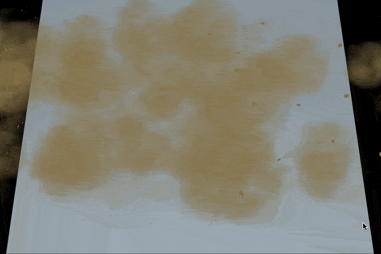

### SmallExplosion
| No. | Project | Creator Version | Back To Top | Mark |
| :---: | :---: | :---: | :---: | :---: |
| 13.20 | [Small Explosion Particle](https://github.com/yeshao2069/CocosCreatorHowToUse/tree/v3.6.x/proj/Particle/Creator3.6.2_3D_ParticleSmallExplosion) | 3.6.2 | [Back To Top](#quick) |  |

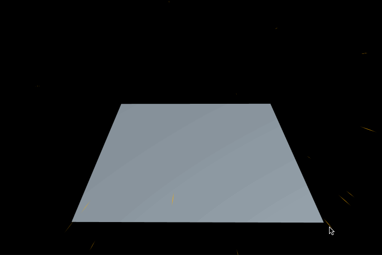

### ElectricalSparks
| No. | Project | Creator Version | Back To Top | Mark |
| :---: | :---: | :---: | :---: | :---: |
| 13.21 | [Electrical Sparks Particle](https://github.com/yeshao2069/CocosCreatorHowToUse/tree/v3.6.x/proj/Particle/Creator3.6.2_3D_ParticleElectricalSparks) | 3.6.2 | [Back To Top](#quick) |  |

### JetFires
| No. | Project | Creator Version | Back To Top | Mark |
| :---: | :---: | :---: | :---: | :---: |
| 13.22 | [Jet Fires Particle](https://github.com/yeshao2069/CocosCreatorHowToUse/tree/v3.6.x/proj/Particle/Creator3.6.2_3D_ParticleJetFires) | 3.6.2 | [Back To Top](#quick) |  |

### ParticleGroundFog
| No. | Project | Creator Version | Back To Top | Mark |
| :---: | :---: | :---: | :---: | :---: |
| 13.23 | [Ground Fog Particle](https://github.com/yeshao2069/CocosCreatorHowToUse/tree/v3.6.x/proj/Particle/Creator3.6.2_3D_ParticleGroundFog) | 3.6.2 | [Back To Top](#quick) |  |

### ParticleEnergyExplosion
| No. | Project | Creator Version | Back To Top | Mark |
| :---: | :---: | :---: | :---: | :---: |
| 13.24 | [Energy Explosion Particle](https://github.com/yeshao2069/CocosCreatorHowToUse/tree/v3.6.x/proj/Particle/Creator3.6.2_3D_ParticleEnergyExplosion) | 3.6.2 | [Back To Top](#quick) |  |

### ZlibUse
| No. | Project | Creator Version | Back To Top | Mark |
| :---: | :---: | :---: | :---: | :---: |
| 14.1 | [zlib Usage](https://github.com/yeshao2069/CocosCreatorHowToUse/tree/v3.6.x/proj/Npm/Creator3.6.0_zlibUse) | 3.6.0 | [Back To Top](#quick) |  |

### ObjectIsInCameraView
| No. | Project | Creator Version | Back To Top | Mark |
| :---: | :---: | :---: | :---: | :---: |
| 15.1 | [Object Is In Camera View](https://github.com/yeshao2069/CocosCreatorHowToUse/tree/v3.6.x/proj/Demo/Creator3.6.0_3D_ObjectIsInCameraView) | 3.6.0 | [Back To Top](#quick) |  |

### UseAnimationFrameEvents
| No. | Project | Creator Version | Back To Top | Mark |
| :---: | :---: | :---: | :---: | :---: |
| 15.2 | [Use Animation Frame Events](https://github.com/yeshao2069/CocosCreatorHowToUse/tree/v3.6.x/proj/Demo/Creator3.6.0_UseAnimationFrameEvents) | 3.6.0 | [Back To Top](#quick) |  |

### GetScriptFunction
| No. | Project | Creator Version | Back To Top | Mark |
| :---: | :---: | :---: | :---: | :---: |
| 15.3 | [Get Script Function](https://github.com/yeshao2069/CocosCreatorHowToUse/tree/v3.6.x/proj/Demo/Creator3.6.0_GetScriptFunction) | 3.6.0 | [Back To Top](#quick) |  |

### GetAnimationClipDataByTime
| No. | Project | Creator Version | Back To Top | Mark |
| :---: | :---: | :---: | :---: | :---: |
| 15.4 | [Get Animation Clip Data By Time](https://github.com/yeshao2069/CocosCreatorHowToUse/tree/v3.6.x/proj/Demo/Creator3.6.0_GetAnimationClipDataByTime) | 3.6.0 | [Back To Top](#quick) |  |

### PressResponseTest
| No. | Project | Creator Version | Back To Top | Mark |
| :---: | :---: | :---: | :---: | :---: |
| 15.5 | [Press Response Test](https://github.com/yeshao2069/CocosCreatorHowToUse/tree/v3.6.x/proj/Demo/Creator3.6.0_PressResponseTest) | 3.6.0 | [Back To Top](#quick) | 无 |

### ObjectAlwaysFollow
| No. | Project | Creator Version | Back To Top | Mark |
| :---: | :---: | :---: | :---: | :---: |
| 15.6 | [Object Always Follow](https://github.com/yeshao2069/CocosCreatorHowToUse/tree/v3.6.x/proj/Demo/Creator3.6.0_3D_ObjectAlwaysFollow) | 3.6.0 | [Back To Top](#quick) |  |

### CircularProgressBar
| No. | Project | Creator Version | Back To Top | Mark |
| :---: | :---: | :---: | :---: | :---: |
| 15.7 | [Circular Progress Bar](https://github.com/yeshao2069/CocosCreatorHowToUse/tree/v3.6.x/proj/Demo/Creator3.6.0_2D_CircularProgressBar) | 3.6.0 | [Back To Top](#quick) |  |

### EllipseMove
| No. | Project | Creator Version | Back To Top | Mark |
| :---: | :---: | :---: | :---: | :---: |
| 15.8 | [Ellipse Move](https://github.com/yeshao2069/CocosCreatorHowToUse/tree/v3.6.x/proj/Demo/Creator3.6.0_2D_EllipseMove) | 3.6.0 | [Back To Top](#quick) |  |

### BezierCurvePathCreator
| No. | Project | Creator Version | Back To Top | Mark |
| :---: | :---: | :---: | :---: | :---: |
| 15.9 | [Bezier Curve Path Creator](https://github.com/yeshao2069/CocosCreatorHowToUse/tree/v3.6.x/proj/Demo/Creator3.6.0_BezierCurvePathCreator) | 3.6.0 | [Back To Top](#quick) |  |

### DynamicLoadMesh
| No. | Project | Creator Version | Back To Top | Mark |
| :---: | :---: | :---: | :---: | :---: |
| 15.10 | [Dynamic Load Mesh](https://github.com/yeshao2069/CocosCreatorHowToUse/tree/v3.6.x/proj/Demo/Creator3.6.0_3D_DynamicLoadMesh) | 3.6.0 | [Back To Top](#quick) |  |

### AbovePointTest
| No. | Project | Creator Version | Back To Top | Mark |
| :---: | :---: | :---: | :---: | :---: |
| 15.11 | [Above Point Test](https://github.com/yeshao2069/CocosCreatorHowToUse/tree/v3.6.x/proj/Demo/Creator3.6.0_2D_AbovePointTest) | 3.6.0 | [Back To Top](#quick) |  |

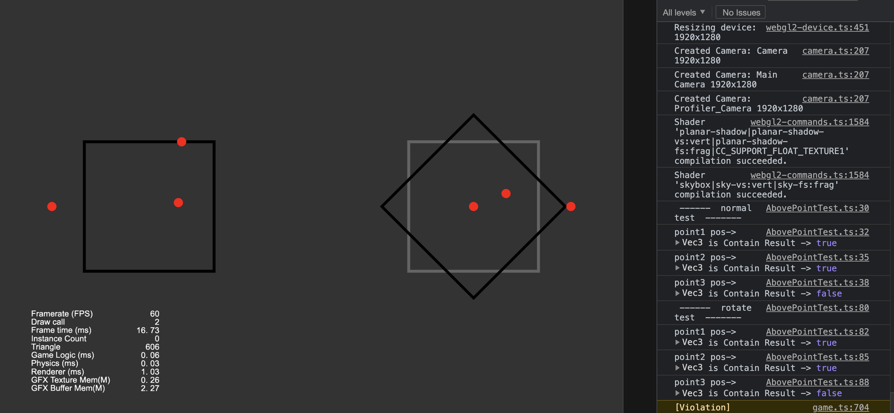

### RoadCurved
| No. | Project | Creator Version | Back To Top | Mark |
| :---: | :---: | :---: | :---: | :---: |
| 15.12 | [Road Curved](https://github.com/yeshao2069/CocosCreatorHowToUse/tree/v3.6.x/proj/Demo/Creator3.6.0_3D_RoadCurved) | 3.6.0 | [Back To Top](#quick) |  |

### ScreenToWorldPoint
| No. | Project | Creator Version | Back To Top | Mark |
| :---: | :---: | :---: | :---: | :---: |
| 15.13 | [Screen To World Point](https://github.com/yeshao2069/CocosCreatorHowToUse/tree/v3.6.x/proj/Demo/Creator3.6.0_ScreenToWorldPoint) | 3.6.0 | [Back To Top](#quick) |  |

### AutoGenerateSpriteframe
| No. | Project | Creator Version | Back To Top | Mark |
| :---: | :---: | :---: | :---: | :---: |
| 15.14 | [Auto Generate Spriteframe](https://github.com/yeshao2069/CocosCreatorHowToUse/tree/v3.6.x/proj/Demo/Creator3.6.0_2D_AutoGenerateSpriteframe) | 3.6.0 | [Back To Top](#quick) |  |

### IrregularButton
| No. | Project | Creator Version | Back To Top | Mark |
| :---: | :---: | :---: | :---: | :---: |
| 15.15 | [Irregular Button](https://github.com/yeshao2069/CocosCreatorHowToUse/tree/v3.6.x/proj/Demo/Creator3.6.0_2D_IrregularButton) | 3.6.0 | [Back To Top](#quick) |  |

### AdaptiveAngleRotation
| No. | Project | Creator Version | Back To Top | Mark |
| :---: | :---: | :---: | :---: | :---: |
| 15.16 | [Adaptive Angle Rotation](https://github.com/yeshao2069/CocosCreatorHowToUse/tree/v3.6.x/proj/Demo/Creator3.6.0_2D_AdaptiveAngleRotation) | 3.6.0 | [Back To Top](#quick) |  |

### AdaptiveRotation
| No. | Project | Creator Version | Back To Top | Mark |
| :---: | :---: | :---: | :---: | :---: |
| 15.17 | [Adaptive Rotation](https://github.com/yeshao2069/CocosCreatorHowToUse/tree/v3.6.x/proj/Demo/Creator3.6.0_2D_AdaptiveRotation) | 3.6.0 | [Back To Top](#quick) |  |

### LabelOnCube
| No. | Project | Creator Version | Back To Top | Mark |
| :---: | :---: | :---: | :---: | :---: |
| 15.18 | [Label On Cube](https://github.com/yeshao2069/CocosCreatorHowToUse/tree/v3.6.x/proj/Demo/Creator3.6.0_3D_LabelOnCube) | 3.6.0 | [Back To Top](#quick) |  |

### ModelAnchor
| No. | Project | Creator Version | Back To Top | Mark |
| :---: | :---: | :---: | :---: | :---: |
| 15.19 | [Model Anchor](https://github.com/yeshao2069/CocosCreatorHowToUse/tree/v3.6.x/proj/Demo/Creator3.6.1_3D_ModelAnchor) | 3.6.1 | [Back To Top](#quick) |  |

### WeChatMiniGameOpenDataContext
| No. | Project | Creator Version | Back To Top | Mark |
| :---: | :---: | :---: | :---: | :---: |
| 16.1 | [WeChat Mini Game Open Data Context](https://github.com/yeshao2069/CocosCreatorHowToUse/tree/v3.6.x/proj/MiniGame/Creator3.6.2_2D_WeChatMiniGameOpenDataContext) | 3.6.2 | [Back To Top](#quick) |  |

