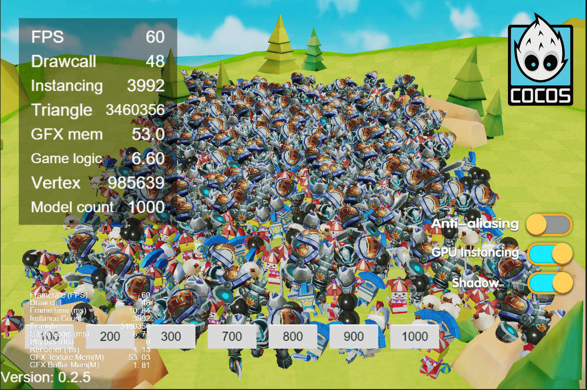
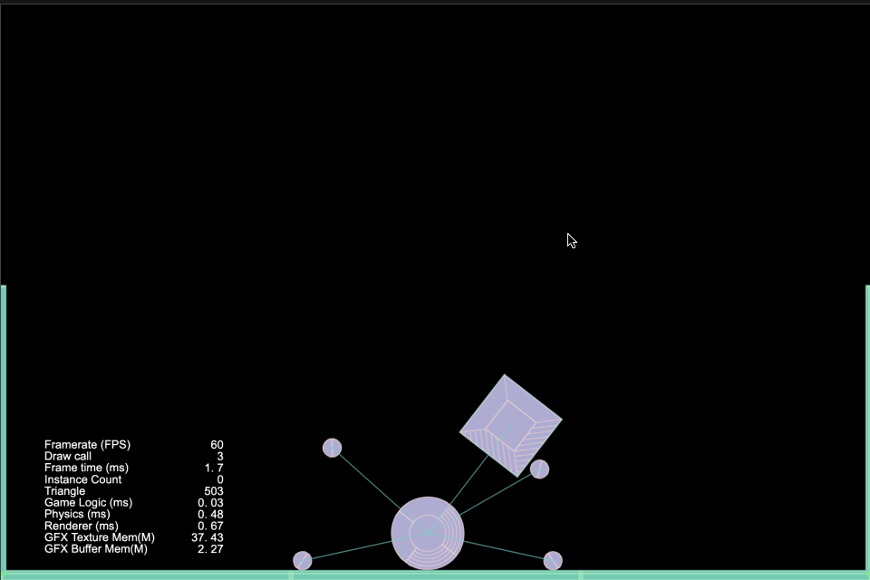
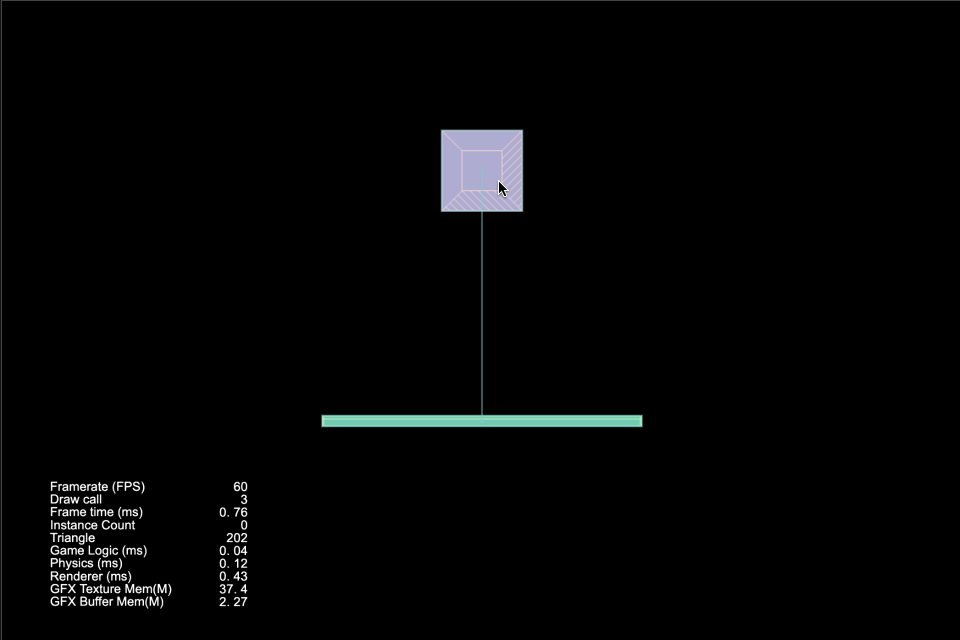
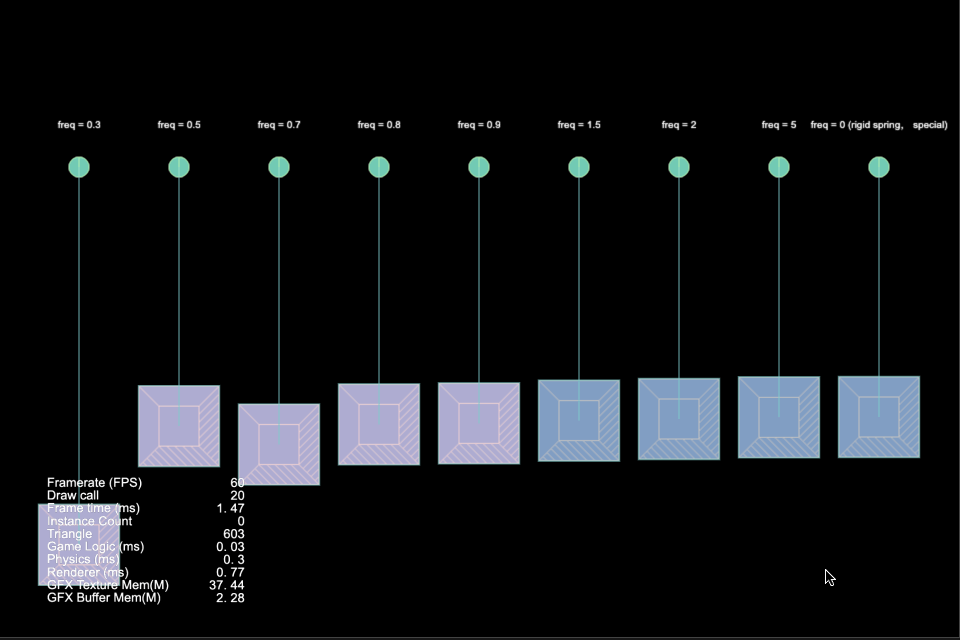
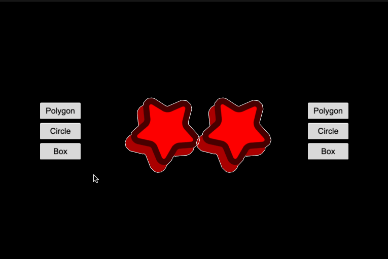
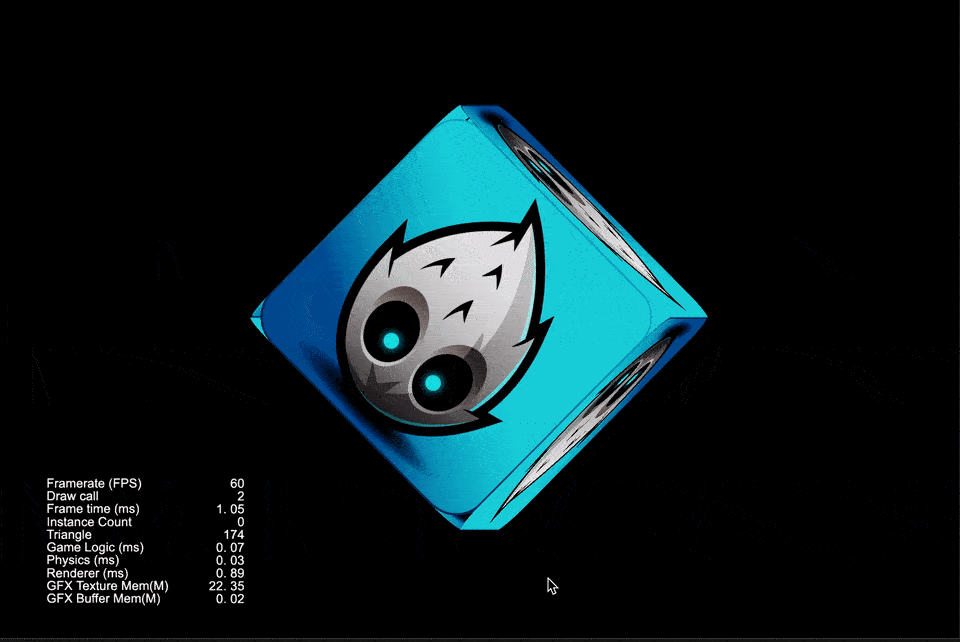
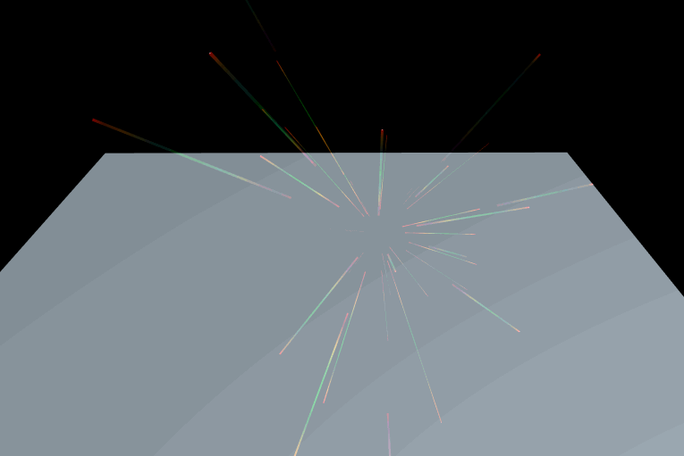

## Cocos Creator How To Use
### Purpose
Cocos Creator How To Use is to simplify the use of some functions that users understand the API.
### Version
Cocos Creator v3.6.x
&nbsp;

### Quick
| 序号 | 分类 | 项目 |
| :---: | :---: | :--- |
| 1 | [UI](https://gitee.com/yeshao2069/cocos-creator-how-to-use/tree/v3.6.x/proj/UI) | [超大文本](#largesystemfonttext)、 [简单按钮](#simplebutton)、 [列表视图示例](#listviewuse)、 [网页视图示例](#webviewuse)、 [富文本示例](#richtextuse)、 [页面视图示例](#pageviewuse)、 [遮罩示例](#maskuse)、 [更新列表信息](#updatelistwithdata)、 [摄像机示例](#camerausesample)、 [弹窗控制器](#popupcontroller) |
| 2 | [Performance](https://gitee.com/yeshao2069/cocos-creator-how-to-use/tree/v3.6.x/proj/Performance) | [GPU Instancing](#gpuinstancing)、 [静态合批](#staticbatch)、 [VB合批](#vbbatch)、 [遮挡查询剔除(原生)](#nativeocclusionquery) |
| 3 | [Audio](https://gitee.com/yeshao2069/cocos-creator-how-to-use/tree/v3.6.x/proj/Audio) | [多个音效同时播放](#playoneshot)、 [添加全局按钮音效](#addglobalbuttonsound)、 [模拟钢琴播放](#pianoplay) |
| 4 | [Video](https://gitee.com/yeshao2069/cocos-creator-how-to-use/tree/v3.6.x/proj/Video) | [视频范例](#videoplayer)、 [视频置于UI之下](#videostayonbottom) |
| 5 | [Animation](https://gitee.com/yeshao2069/cocos-creator-how-to-use/tree/v3.6.x/proj/Animation) | [精灵帧动画](#spriteframeanimation)、 [精灵帧移动动画](#spritemoveanimation)、 [动态创建精灵帧动画](#createanimationclip)、 [水动画](#animationwater)、 [美人鱼动画](#animationfish)、 [淘气包](#msamoy) |
| 6 | [Spine](https://gitee.com/yeshao2069/cocos-creator-how-to-use/tree/v3.6.x/proj/Spine) | [加载Spine动画](#loadspine)、 [Spine挂点](#spineattach)、 [Spine特效](#spinemesh)、 [Spine换肤](#spineskin)、 [Spine挂点碰撞检测](#spinecollider)、 [Spine动作切换](#spineboy)、 [Spine动画指定帧播放](#spinespecifiedframe) |
| 7 | [DragonBones](https://gitee.com/yeshao2069/cocos-creator-how-to-use/tree/v3.6.x/proj/DragonBones) | [替换龙骨动画](#dragonbonesreplaceslot)、 [加载龙骨动画](#loaddragonbones)、 [龙骨动画碰撞检测](#dragonbonescollider)、 [龙骨动画挂点](#dragonbonesattach)、 [切换龙骨动画](#dragonbones)、 [龙骨动画指定帧播放](#dragonbonesspecifiedframe) |
| 8 | [Graphics](https://gitee.com/yeshao2069/cocos-creator-how-to-use/tree/v3.6.x/proj/Graphics) | [画饼状图](#graphicsarc)、 [画正方形](#graphicsrect)、 [画菱形](#graphicslineto)、 [画椭圆形](#graphicsellipse)、 [三点画圆](#graphicsdrawcircle)、 [涂鸦](#doodle)、 [画Sine曲线](#graphicssinewaves)、 [自由画线](#drawline)、 [烟花爆炸](#graphicsfireworksexplosion)、 [画房子](#graphicshouse)、 [环形进度条](#graphicsringprogressbar) |
| 9 | [Physics](https://gitee.com/yeshao2069/cocos-creator-how-to-use/tree/v3.6.x/proj/Physics)、[Physics2](https://gitee.com/yeshao2069/cocos-creator-how-to-use/tree/v3.6.x/proj/Physics2) | [检测碰撞体是否存在](#physicsraycastclosest)、 [射线检测](#physicsraycast)、 [使用物理材质](#physicsmaterial)、 [使用网格碰撞器组件](#physicsmeshcollider)、 [物体旋转跳跃](#physicsrotatejumpwithvelocity)、 [使用触发器-触发事件](#physicstriggerevent)、 [运行时更新碰撞体数据](#physicsruntimeupdate)、 [使用平面碰撞器组件](#physicsplanecollider)、 [物理同步](#physicssync)、 [物理分组掩码](#physicsgroupmask)、 [物理动态运行](#physicsrundynamic)、 [不规则物体碰撞](#physicsconvexcolliders)、 [点对点约束](#physicspointtopointconstraint)、 [碰撞点数据测试](#physicscontactdata)、 [链条约束](#physicshingeconstraint)、 [使用恒力组件](#physicsforceconstant)、 [使用碰撞器-碰撞事件](#physicscollisionevent)、 [胶囊体触发器测试](#physicscapsuletrigger)、 [2D浮力](#buoyancy2d)、 [3D浮力](#buoyancy3d)、 [坠落的小球](#fallingball)、 [基于box2D物体切割](#box2dcuttingobjects)、 [基于box2D重力辐射](#box2dgravityradial)、 [基于box2D不规则碰撞](#box2dmanifold)、 [基于box2D单向平台](#box2donewayplatform)、 [基于box2D物体射线检测](#box2draycast)、 [基于box2D物体射线检测反射](#box2draycastreflection)、 [基于box2D距离关节](#box2ddistancejoint)、 [基于box2D距离关节链](#box2ddistancejointchain)、 [基于box2D固定关节布偶](#box2dfixedjointragdoll)、 [基于box2D链条关节](#box2dhingejoint)、 [基于box2D链条关节曲柄](#box2dhingejointcrank)、 [基于box2D鼠标关节](#box2dmousejoint)、 [基于box2D相对关节人偶](#box2drelativejointhuman)、 [基于box2D相对关节线性偏移](#box2drelativejointlinearoffset)、 [基于box2D滑块关节](#box2dsliderjoint)、 [基于box2D弹簧关节](#box2dspringjointdamp)、 [基于box2D弹簧关节频率](#box2dspringjointfrequency)、 [基于box2D轮轴关节](#box2dwheeljoint)、 [基于box2D动画](#box2danimated)、 [基于box2D线性冲力](#box2dlinearimpulse)、 [基于box2D物体摩擦力](#box2dvaringfriction)、 [基于box2D物体恢复原状](#box2dvaringrestitution)、 [物理点击测试(2D)](#physicalhittest)、 [物理碰撞标签](#physicaltag)、 [物理形状碰撞](#physicalshape)、 [物理碰撞分组](#physicalmask) |
| 10 | [Tween](https://gitee.com/yeshao2069/cocos-creator-how-to-use/tree/v3.6.x/proj/Tween) | [透明度渐变](#tweenopacitychange)、 [旋转](#tweenrotatechange)、 [环形运动](#tweencirclemove)、 [旋转并缩放](#tweenrotateandscaleforever)、 [使用Easing示例](#tweenshowmonster)、 [Tween封装](#tweenccutils) |
| 11 | [Model](https://gitee.com/yeshao2069/cocos-creator-how-to-use/tree/v3.6.x/proj/Model) | [表情动画](#morphhead)、 [跳舞的女人](#dancewoman)、 [使用卡通材质](#toon)、 [动态加载材质](#dynamicloadmaterial)、 [冬来了](#winter)、 [骑士](#knight)、 [动态创建网格](#createmesh)、 [骨骼动画指定帧播放](#skeletalanimationspecifiedframe)、 [骨骼动画挂点](#skeletalanimattach) |
| 12 | [Renderer](https://gitee.com/yeshao2069/cocos-creator-how-to-use/tree/v3.6.x/proj/Renderer) | [2D在3D中渲染](#2drenderingin3d)、 [web截图](#capture) |
| 13 | [Particle](https://gitee.com/yeshao2069/cocos-creator-how-to-use/tree/v3.6.x/proj/Particle) | [火焰](#flamesimulation)、 [粒子拖尾1](#particletrails01)、 [粒子拖尾2](#particletrails02)、 [粒子拖尾3](#particletrails03)、 [粒子拖尾4](#particletrails04)、 [颜色模块](#particlecolor)、 [加速度模块](#particleforce)、 [限速模块](#particlelimitvelocity)、 [主模块](#particlemain)、 [渲染模块](#particlerenderer)、 [旋转模块](#particlerotation)、 [发射器模块](#particleshape)、 [大小模块](#particlesize)、 [贴图动画模块](#particletextureanimation)、 [速度模块](#particlevelocity)、 [2D粒子显隐](#toggleparticle)、 [2D粒子完成后自动移除](#autoremoveparticle)、 [光标粒子](#cursorparticles)、 [沙尘暴](#duststorm)、 [爆炸](#smallexplosion)、 [电火花](#electricalsparks)、 [火焰喷射](#jetfires) |
| 14 | [Npm](https://gitee.com/yeshao2069/cocos-creator-how-to-use/tree/v3.6.x/proj/Npm) | [zlib使用](#zlibuse) |
| 15 | [Demo](https://gitee.com/yeshao2069/cocos-creator-how-to-use/tree/v3.6.x/proj/Demo) | [物体是否在摄像机范围内](#objectisincameraview)、 [使用动画帧事件](#useanimationframeevents)、 [动态获取脚本的方法名](#getscriptfunction)、 [动态获取动画属性数据](#getanimationclipdatabytime)、 [点击响应](#pressresponsetest)、 [物体始终在人物右侧](#objectalwaysfollow)、 [圆形进度条](#circularprogressbar)、 [椭圆轨迹运动](#ellipsemove)、 [贝塞尔曲线路径在线绘制工具](#beziercurvepathcreator)、 [动态加载FBX模型中的Mesh](#dynamicloadmesh)、 [旋转后矩形是否包含点](#abovepointtest)、 [弯曲的道路](#roadcurved)、 [3D位置转化](#screentoworldpoint)、 [动态生成单色精灵](#autogeneratespriteframe)、 [不规则按钮](#irregularbutton)、 [自适应最小角度旋转](#adaptiveanglerotation)、 [自适应最小角度点击旋转](#adaptiverotation)、 [3D模型上的文字](#labeloncube)、 [3D模型锚点](#modelanchor) |

### Sample
### LargeSystemFontText
| 编号 | 项目 | 编辑器版本 | 返回顶部 | 备注 |
| :---: | :---: | :---: | :---: | :---: |
| 1.1 | [超大文本](https://gitee.com/yeshao2069/cocos-creator-how-to-use/tree/v3.6.x/proj/UI/Creator3.6.0_2D_LargeSystemFontText) | 3.6.0 | [返回顶部](#quick) |  |

### SimpleButton
| 编号 | 项目 | 编辑器版本 | 返回顶部 | 备注 |
| :---: | :---: | :---: | :---: | :---: |
| 1.2 | [简单按钮](https://gitee.com/yeshao2069/cocos-creator-how-to-use/tree/v3.6.x/proj/UI/Creator3.6.0_2D_SimpleButton) | 3.6.0 | [返回顶部](#quick) |  |

### ListViewUse
| 编号 | 项目 | 编辑器版本 | 返回顶部 | 备注 |
| :---: | :---: | :---: | :---: | :---: |
| 1.3 | [列表视图示例](https://gitee.com/yeshao2069/cocos-creator-how-to-use/tree/v3.6.x/proj/UI/Creator3.6.0_2D_ListViewUse) | 3.6.0 | [返回顶部](#quick) |  |

### WebViewUse
| 编号 | 项目 | 编辑器版本 | 返回顶部 | 备注 |
| :---: | :---: | :---: | :---: | :---: |
| 1.4 | [网页视图示例](https://gitee.com/yeshao2069/cocos-creator-how-to-use/tree/v3.6.x/proj/UI/Creator3.6.0_2D_WebViewUse) | 3.6.0 | [返回顶部](#quick) |  |

### RichTextUse
| 编号 | 项目 | 编辑器版本 | 返回顶部 | 备注 |
| :---: | :---: | :---: | :---: | :---: |
| 1.5 | [富文本示例](https://gitee.com/yeshao2069/cocos-creator-how-to-use/tree/v3.6.x/proj/UI/Creator3.6.0_2D_RichTextUse) | 3.6.0 | [返回顶部](#quick) |  |

### PageViewUse
| 编号 | 项目 | 编辑器版本 | 返回顶部 | 备注 |
| :---: | :---: | :---: | :---: | :---: |
| 1.6 | [页面视图示例](https://gitee.com/yeshao2069/cocos-creator-how-to-use/tree/v3.6.x/proj/UI/Creator3.6.0_2D_PageViewUse) | 3.6.0 | [返回顶部](#quick) |  |

### MaskUse
| 编号 | 项目 | 编辑器版本 | 返回顶部 | 备注 |
| :---: | :---: | :---: | :---: | :---: |
| 1.7 | [遮罩示例](https://gitee.com/yeshao2069/cocos-creator-how-to-use/tree/v3.6.x/proj/UI/Creator3.6.0_2D_MaskUse) | 3.6.0 | [返回顶部](#quick) |  |

### UpdateListWithData
| 编号 | 项目 | 编辑器版本 | 返回顶部 | 备注 |
| :---: | :---: | :---: | :---: | :---: |
| 1.8 | [更新列表信息](https://gitee.com/yeshao2069/cocos-creator-how-to-use/tree/v3.6.x/proj/UI/Creator3.6.0_2D_UpdateListWithData) | 3.6.0 | [返回顶部](#quick) |  |

### CameraUseSample
| 编号 | 项目 | 编辑器版本 | 返回顶部 | 备注 |
| :---: | :---: | :---: | :---: | :---: |
| 1.9 | [摄像机示例](https://gitee.com/yeshao2069/cocos-creator-how-to-use/tree/v3.6.x/proj/UI/Creator3.6.0_2D_CameraUseSample) | 3.6.0 | [返回顶部](#quick) |  |

### PopupController
| 编号 | 项目 | 编辑器版本 | 返回顶部 | 备注 |
| :---: | :---: | :---: | :---: | :---: |
| 1.10 | [弹窗控制器](https://gitee.com/yeshao2069/cocos-creator-how-to-use/tree/v3.6.x/proj/UI/Creator3.6.1_2D_PopupController) | 3.6.1 | [返回顶部](#quick) |  |

### GpuInstancing
| 编号 | 项目 | 编辑器版本 | 返回顶部 | 备注 |
| :---: | :---: | :---: | :---: | :---: |
| 2.1 | [GPU Instancing](https://gitee.com/yeshao2069/cocos-creator-how-to-use/tree/v3.6.x/proj/Performance/Creator3.6.0_3D_GpuInstancing) | 3.6.0 | [返回顶部](#quick) |  |

### StaticBatch
| 编号 | 项目 | 编辑器版本 | 返回顶部 | 备注 |
| :---: | :---: | :---: | :---: | :---: |
| 2.2 | [静态合批](https://gitee.com/yeshao2069/cocos-creator-how-to-use/tree/v3.6.x/proj/Performance/Creator3.6.0_3D_StaticBatch) | 3.6.0 | [返回顶部](#quick) |  |

 |

### VBBatch
| 编号 | 项目 | 编辑器版本 | 返回顶部 | 备注 |
| :---: | :---: | :---: | :---: | :---: |
| 2.3 | [VB合并](https://gitee.com/yeshao2069/cocos-creator-how-to-use/tree/v3.6.x/proj/Performance/Creator3.6.0_3D_VBBatch) | 3.6.0 | [返回顶部](#quick) |  |

### NativeOcclusionQuery
| 编号 | 项目 | 编辑器版本 | 返回顶部 | 备注 |
| :---: | :---: | :---: | :---: | :---: |
| 2.4 | [遮挡查询剔除(原生)](https://gitee.com/yeshao2069/cocos-creator-how-to-use/tree/v3.6.x/proj/Performance/Creator3.6.0_3D_NativeOcclusionQuery) | 3.6.0 | [返回顶部](#quick) |  |

### PlayOneShot
| 编号 | 项目 | 编辑器版本 | 返回顶部 | 备注 |
| :---: | :---: | :---: | :---: | :---: |
| 3.1 | [多个音效同时播放](https://gitee.com/yeshao2069/cocos-creator-how-to-use/tree/v3.6.x/proj/Audio/Creator3.6.0_PlayOneShot) | 3.6.0 | [返回顶部](#quick) |  |

### AddGlobalButtonSound
| 编号 | 项目 | 编辑器版本 | 返回顶部 | 备注 |
| :---: | :---: | :---: | :---: | :---: |
| 3.2 | [添加全局按钮音效](https://gitee.com/yeshao2069/cocos-creator-how-to-use/tree/v3.6.x/proj/Audio/Creator3.6.0_AddGlobalButtonSound) | 3.6.0 | [返回顶部](#quick) |  |

### PianoPlay
| 编号 | 项目 | 编辑器版本 | 返回顶部 | 备注 |
| :---: | :---: | :---: | :---: | :---: |
| 3.3 | [模拟钢琴播放](https://gitee.com/yeshao2069/cocos-creator-how-to-use/tree/v3.6.x/proj/Audio/Creator3.6.0_PianoPlay) | 3.6.0 | [返回顶部](#quick) |  |

### VideoPlayer
| 编号 | 项目 | 编辑器版本 | 返回顶部 | 备注 |
| :---: | :---: | :---: | :---: | :---: |
| 4.1 | [视频范例](https://gitee.com/yeshao2069/cocos-creator-how-to-use/tree/v3.6.x/proj/Video/Creator3.6.0_VideoPlayer) | 3.6.0 | [返回顶部](#quick) |  |

 |

### VideoStayOnBottom
| 编号 | 项目 | 编辑器版本 | 返回顶部 | 备注 |
| :---: | :---: | :---: | :---: | :---: |
| 4.2 | [视频置于UI之下](https://gitee.com/yeshao2069/cocos-creator-how-to-use/tree/v3.6.x/proj/Video/Creator3.6.0_VideoStayOnBottom) | 3.6.0 | [返回顶部](#quick) |  |

### SpriteFrameAnimation
| 编号 | 项目 | 编辑器版本 | 返回顶部 | 备注 |
| :---: | :---: | :---: | :---: | :---: |
| 5.1 | [精灵帧动画](https://gitee.com/yeshao2069/cocos-creator-how-to-use/tree/v3.6.x/proj/Animation/Creator3.6.0_2D_SpriteFrameAnimation) | 3.6.0 | [返回顶部](#quick) |  |

### SpriteMoveAnimation
| 编号 | 项目 | 编辑器版本 | 返回顶部 | 备注 |
| :---: | :---: | :---: | :---: | :---: |
| 5.2 | [精灵帧移动动画](https://gitee.com/yeshao2069/cocos-creator-how-to-use/tree/v3.6.x/proj/Animation/Creator3.6.0_2D_SpriteMoveAnimation) | 3.6.0 | [返回顶部](#quick) |  |

### CreateAnimationClip
| 编号 | 项目 | 编辑器版本 | 返回顶部 | 备注 |
| :---: | :---: | :---: | :---: | :---: |
| 5.3 | [动态创建精灵帧动画](https://gitee.com/yeshao2069/cocos-creator-how-to-use/tree/v3.6.x/proj/Animation/Creator3.6.0_2D_CreateAnimationClip) | 3.6.0 | [返回顶部](#quick) |  |

 

### AnimationWater
| 编号 | 项目 | 编辑器版本 | 返回顶部 | 备注 |
| :---: | :---: | :---: | :---: | :---: |
| 5.4 | [水动画](https://gitee.com/yeshao2069/cocos-creator-how-to-use/tree/v3.6.x/proj/Animation/Creator3.6.0_2D_AnimationWater) | 3.6.0 | [返回顶部](#quick) |  |

 

### AnimationFish
| 编号 | 项目 | 编辑器版本 | 返回顶部 | 备注 |
| :---: | :---: | :---: | :---: | :---: |
| 5.5 | [美人鱼动画](https://gitee.com/yeshao2069/cocos-creator-how-to-use/tree/v3.6.x/proj/Animation/Creator3.6.0_2D_AnimationFish) | 3.6.0 | [返回顶部](#quick) |  |

 

### MsAmoy
| 编号 | 项目 | 编辑器版本 | 返回顶部 | 备注 |
| :---: | :---: | :---: | :---: | :---: |
| 5.6 | [淘气包](https://gitee.com/yeshao2069/cocos-creator-how-to-use/tree/v3.6.x/proj/Animation/Creator3.6.0_3D_MsAmoy) | 3.6.0 | [返回顶部](#quick) |  |

 

### LoadSpine
| 编号 | 项目 | 编辑器版本 | 返回顶部 | 备注 |
| :---: | :---: | :---: | :---: | :---: |
| 6.1 | [加载Spine动画](https://gitee.com/yeshao2069/cocos-creator-how-to-use/tree/v3.6.x/proj/Spine/Creator3.6.0_2D_LoadSpine) | 3.6.0 | [返回顶部](#quick) |  |

### SpineAttach
| 编号 | 项目 | 编辑器版本 | 返回顶部 | 备注 |
| :---: | :---: | :---: | :---: | :---: |
| 6.2 | [Spine挂点](https://gitee.com/yeshao2069/cocos-creator-how-to-use/tree/v3.6.x/proj/Spine/Creator3.6.0_2D_SpineAttach) | 3.6.0 | [返回顶部](#quick) |  |

### SpineMesh
| 编号 | 项目 | 编辑器版本 | 返回顶部 | 备注 |
| :---: | :---: | :---: | :---: | :---: |
| 6.3 | [Spine特效](https://gitee.com/yeshao2069/cocos-creator-how-to-use/tree/v3.6.x/proj/Spine/Creator3.6.0_2D_SpineMesh) | 3.6.0 | [返回顶部](#quick) |  |

### SpineSkin
| 编号 | 项目 | 编辑器版本 | 返回顶部 | 备注 |
| :---: | :---: | :---: | :---: | :---: |
| 6.4 | [Spine换肤](https://gitee.com/yeshao2069/cocos-creator-how-to-use/tree/v3.6.x/proj/Spine/Creator3.6.0_2D_SpineSkin) | 3.6.0 | [返回顶部](#quick) |  |

### SpineCollider
| 编号 | 项目 | 编辑器版本 | 返回顶部 | 备注 |
| :---: | :---: | :---: | :---: | :---: |
| 6.5 | [Spine挂点碰撞检测](https://gitee.com/yeshao2069/cocos-creator-how-to-use/tree/v3.6.x/proj/Spine/Creator3.6.0_2D_SpineCollider) | 3.6.0 | [返回顶部](#quick) |  |

### SpineBoy
| 编号 | 项目 | 编辑器版本 | 返回顶部 | 备注 |
| :---: | :---: | :---: | :---: | :---: |
| 6.6 | [Spine动作切换](https://gitee.com/yeshao2069/cocos-creator-how-to-use/tree/v3.6.x/proj/Spine/Creator3.6.0_2D_SpineBoy) | 3.6.0 | [返回顶部](#quick) |  |

### SpineSpecifiedFrame
| 编号 | 项目 | 编辑器版本 | 返回顶部 | 备注 |
| :---: | :---: | :---: | :---: | :---: |
| 6.7 | [Spine动画指定帧播放](https://gitee.com/yeshao2069/cocos-creator-how-to-use/tree/v3.6.x/proj/Spine/Creator3.6.0_2D_SpineSpecifiedFrame) | 3.6.0 | [返回顶部](#quick) |  |

### DragonBonesReplaceSlot
| 编号 | 项目 | 编辑器版本 | 返回顶部 | 备注 |
| :---: | :---: | :---: | :---: | :---: |
| 7.1 | [替换龙骨动画](https://gitee.com/yeshao2069/cocos-creator-how-to-use/tree/v3.6.x/proj/DragonBones/Creator3.6.0_2D_DragonBonesReplaceSlot) | 3.6.0 | [返回顶部](#quick) |  |

### LoadDragonBones
| 编号 | 项目 | 编辑器版本 | 返回顶部 | 备注 |
| :---: | :---: | :---: | :---: | :---: |
| 7.2 | [加载龙骨动画](https://gitee.com/yeshao2069/cocos-creator-how-to-use/tree/v3.6.x/proj/DragonBones/Creator3.6.0_2D_LoadDragonBones) | 3.6.0 | [返回顶部](#quick) |  |

### DragonBonesCollider
| 编号 | 项目 | 编辑器版本 | 返回顶部 | 备注 |
| :---: | :---: | :---: | :---: | :---: |
| 7.3 | [龙骨动画碰撞检测](https://gitee.com/yeshao2069/cocos-creator-how-to-use/tree/v3.6.x/proj/DragonBones/Creator3.6.0_2D_DragonBonesCollider) | 3.6.0 | [返回顶部](#quick) |  |

### DragonBonesAttach
| 编号 | 项目 | 编辑器版本 | 返回顶部 | 备注 |
| :---: | :---: | :---: | :---: | :---: |
| 7.4 | [龙骨动画挂点](https://gitee.com/yeshao2069/cocos-creator-how-to-use/tree/v3.6.x/proj/DragonBones/Creator3.6.0_2D_DragonBonesAttach) | 3.6.0 | [返回顶部](#quick) |  |

### DragonBones
| 编号 | 项目 | 编辑器版本 | 返回顶部 | 备注 |
| :---: | :---: | :---: | :---: | :---: |
| 7.5 | [切换龙骨动画](https://gitee.com/yeshao2069/cocos-creator-how-to-use/tree/v3.6.x/proj/DragonBones/Creator3.6.0_2D_DragonBones) | 3.6.0 | [返回顶部](#quick) |  |

### DragonBonesSpecifiedFrame
| 编号 | 项目 | 编辑器版本 | 返回顶部 | 备注 |
| :---: | :---: | :---: | :---: | :---: |
| 7.6 | [龙骨动画指定帧播放](https://gitee.com/yeshao2069/cocos-creator-how-to-use/tree/v3.6.x/proj/DragonBones/Creator3.6.0_2D_DragonBonesSpecifiedFrame) | 3.6.0 | [返回顶部](#quick) |  |

### GraphicsArc
| 编号 | 项目 | 编辑器版本 | 返回顶部 | 备注 |
| :---: | :---: | :---: | :---: | :---: |
| 8.1 | [画饼状图](https://gitee.com/yeshao2069/cocos-creator-how-to-use/tree/v3.6.x/proj/Graphics/Creator3.6.0_2D_GraphicsArc) | 3.6.0 | [返回顶部](#quick) |  |

### GraphicsRect
| 编号 | 项目 | 编辑器版本 | 返回顶部 | 备注 |
| :---: | :---: | :---: | :---: | :---: |
| 8.2 | [画正方形](https://gitee.com/yeshao2069/cocos-creator-how-to-use/tree/v3.6.x/proj/Graphics/Creator3.6.0_2D_GraphicsRect) | 3.6.0 | [返回顶部](#quick) |  |

### GraphicsLineTo
| 编号 | 项目 | 编辑器版本 | 返回顶部 | 备注 |
| :---: | :---: | :---: | :---: | :---: |
| 8.3 | [画菱形](https://gitee.com/yeshao2069/cocos-creator-how-to-use/tree/v3.6.x/proj/Graphics/Creator3.6.0_2D_GraphicsLineTo) | 3.6.0 | [返回顶部](#quick) |  |

### GraphicsEllipse
| 编号 | 项目 | 编辑器版本 | 返回顶部 | 备注 |
| :---: | :---: | :---: | :---: | :---: |
| 8.4 | [画椭圆形](https://gitee.com/yeshao2069/cocos-creator-how-to-use/tree/v3.6.x/proj/Graphics/Creator3.6.0_2D_GraphicsEllipse) | 3.6.0 | [返回顶部](#quick) |  |

### GraphicsDrawCircle
| 编号 | 项目 | 编辑器版本 | 返回顶部 | 备注 |
| :---: | :---: | :---: | :---: | :---: |
| 8.5 | [三点画圆](https://gitee.com/yeshao2069/cocos-creator-how-to-use/tree/v3.6.x/proj/Graphics/Creator3.6.0_2D_GraphicsDrawCircle) | 3.6.0 | [返回顶部](#quick) |  |

### Doodle
| 编号 | 项目 | 编辑器版本 | 返回顶部 | 备注 |
| :---: | :---: | :---: | :---: | :---: |
| 8.6 | [涂鸦](https://gitee.com/yeshao2069/cocos-creator-how-to-use/tree/v3.6.x/proj/Graphics/Creator3.6.0_2D_Doodle) | 3.6.0 | [返回顶部](#quick) |  |

### GraphicsSineWaves
| 编号 | 项目 | 编辑器版本 | 返回顶部 | 备注 |
| :---: | :---: | :---: | :---: | :---: |
| 8.7 | [画Sine曲线](https://gitee.com/yeshao2069/cocos-creator-how-to-use/tree/v3.6.x/proj/Graphics/Creator3.6.0_2D_GraphicsSineWaves) | 3.6.0 | [返回顶部](#quick) |  |

### DrawLine
| 编号 | 项目 | 编辑器版本 | 返回顶部 | 备注 |
| :---: | :---: | :---: | :---: | :---: |
| 8.8 | [自由画线](https://gitee.com/yeshao2069/cocos-creator-how-to-use/tree/v3.6.x/proj/Graphics/Creator3.6.0_2D_DrawLine) | 3.6.0 | [返回顶部](#quick) |  |

### GraphicsFireworksExplosion
| 编号 | 项目 | 编辑器版本 | 返回顶部 | 备注 |
| :---: | :---: | :---: | :---: | :---: |
| 8.9 | [烟花爆炸](https://gitee.com/yeshao2069/cocos-creator-how-to-use/tree/v3.6.x/proj/Graphics/Creator3.6.0_2D_GraphicsFireworksExplosion) | 3.6.0 | [返回顶部](#quick) |  |

### GraphicsHouse
| 编号 | 项目 | 编辑器版本 | 返回顶部 | 备注 |
| :---: | :---: | :---: | :---: | :---: |
| 8.10 | [画房子](https://gitee.com/yeshao2069/cocos-creator-how-to-use/tree/v3.6.x/proj/Graphics/Creator3.6.0_2D_GraphicsHouse) | 3.6.0 | [返回顶部](#quick) |  |

### GraphicsRingProgressbar
| 编号 | 项目 | 编辑器版本 | 返回顶部 | 备注 |
| :---: | :---: | :---: | :---: | :---: |
| 8.11 | [环形进度条](https://gitee.com/yeshao2069/cocos-creator-how-to-use/tree/v3.6.x/proj/Graphics/Creator3.6.0_2D_GraphicsRingProgressbar) | 3.6.0 | [返回顶部](#quick) |  |

### PhysicsRaycastClosest
| 编号 | 项目 | 编辑器版本 | 返回顶部 | 备注 |
| :---: | :---: | :---: | :---: | :---: |
| 9.1 | [检测碰撞体是否存在](https://gitee.com/yeshao2069/cocos-creator-how-to-use/tree/v3.6.x/proj/Physics/Creator3.6.0_3D_PhysicsRaycastClosest) | 3.6.0 | [返回顶部](#quick) |  |

### PhysicsRaycast
| 编号 | 项目 | 编辑器版本 | 返回顶部 | 备注 |
| :---: | :---: | :---: | :---: | :---: |
| 9.2 | [射线检测](https://gitee.com/yeshao2069/cocos-creator-how-to-use/tree/v3.6.x/proj/Physics/Creator3.6.0_3D_PhysicsRaycast) | 3.6.0 | [返回顶部](#quick) |  |

### PhysicsMaterial
| 编号 | 项目 | 编辑器版本 | 返回顶部 | 备注 |
| :---: | :---: | :---: | :---: | :---: |
| 9.3 | [使用物理材质](https://gitee.com/yeshao2069/cocos-creator-how-to-use/tree/v3.6.x/proj/Physics/Creator3.6.0_3D_PhysicsMaterial) | 3.6.0 | [返回顶部](#quick) |  |

### PhysicsMeshCollider
| 编号 | 项目 | 编辑器版本 | 返回顶部 | 备注 |
| :---: | :---: | :---: | :---: | :---: |
| 9.4 | [使用网格碰撞器组件](https://gitee.com/yeshao2069/cocos-creator-how-to-use/tree/v3.6.x/proj/Physics/Creator3.6.0_3D_PhysicsMeshCollider) | 3.6.0 | [返回顶部](#quick) |  |

### PhysicsRotateJumpWithVelocity
| 编号 | 项目 | 编辑器版本 | 返回顶部 | 备注 |
| :---: | :---: | :---: | :---: | :---: |
| 9.5 | [物体旋转跳跃](https://gitee.com/yeshao2069/cocos-creator-how-to-use/tree/v3.6.x/proj/Physics/Creator3.6.0_3D_PhysicsRotateJumpWithVelocity) | 3.6.0 | [返回顶部](#quick) |  |

### PhysicsTriggerEvent
| 编号 | 项目 | 编辑器版本 | 返回顶部 | 备注 |
| :---: | :---: | :---: | :---: | :---: |
| 9.6 | [使用触发器-触发事件](https://gitee.com/yeshao2069/cocos-creator-how-to-use/tree/v3.6.x/proj/Physics/Creator3.6.0_3D_PhysicsTriggerEvent) | 3.6.0 | [返回顶部](#quick) |  |

### PhysicsRuntimeUpdate
| 编号 | 项目 | 编辑器版本 | 返回顶部 | 备注 |
| :---: | :---: | :---: | :---: | :---: |
| 9.7 | [运行时更新碰撞体数据](https://gitee.com/yeshao2069/cocos-creator-how-to-use/tree/v3.6.x/proj/Physics/Creator3.6.0_3D_PhysicsRuntimeUpdate) | 3.6.0 | [返回顶部](#quick) |  |

### PhysicsPlaneCollider
| 编号 | 项目 | 编辑器版本 | 返回顶部 | 备注 |
| :---: | :---: | :---: | :---: | :---: |
| 9.8 | [使用平面碰撞器组件](https://gitee.com/yeshao2069/cocos-creator-how-to-use/tree/v3.6.x/proj/Physics/Creator3.6.0_3D_PhysicsPlaneCollider) | 3.6.0 | [返回顶部](#quick) |  |

### PhysicsSync
| 编号 | 项目 | 编辑器版本 | 返回顶部 | 备注 |
| :---: | :---: | :---: | :---: | :---: |
| 9.9 | [物理同步](https://gitee.com/yeshao2069/cocos-creator-how-to-use/tree/v3.6.x/proj/Physics/Creator3.6.0_3D_PhysicsSync) | 3.6.0 | [返回顶部](#quick) |  |

### PhysicsGroupMask
| 编号 | 项目 | 编辑器版本 | 返回顶部 | 备注 |
| :---: | :---: | :---: | :---: | :---: |
| 9.10 | [物理分组掩码](https://gitee.com/yeshao2069/cocos-creator-how-to-use/tree/v3.6.x/proj/Physics/Creator3.6.0_3D_PhysicsGroupMask) | 3.6.0 | [返回顶部](#quick) |  |

### PhysicsRunDynamic
| 编号 | 项目 | 编辑器版本 | 返回顶部 | 备注 |
| :---: | :---: | :---: | :---: | :---: |
| 9.11 | [物理动态运行](https://gitee.com/yeshao2069/cocos-creator-how-to-use/tree/v3.6.x/proj/Physics/Creator3.6.0_3D_PhysicsRunDynamic) | 3.6.0 | [返回顶部](#quick) |  |

### PhysicsConvexColliders
| 编号 | 项目 | 编辑器版本 | 返回顶部 | 备注 |
| :---: | :---: | :---: | :---: | :---: |
| 9.12 | [不规则物体碰撞](https://gitee.com/yeshao2069/cocos-creator-how-to-use/tree/v3.6.x/proj/Physics/Creator3.6.0_3D_PhysicsConvexColliders) | 3.6.0 | [返回顶部](#quick) |  |

### PhysicsPointToPointConstraint
| 编号 | 项目 | 编辑器版本 | 返回顶部 | 备注 |
| :---: | :---: | :---: | :---: | :---: |
| 9.13 | [点对点约束](https://gitee.com/yeshao2069/cocos-creator-how-to-use/tree/v3.6.x/proj/Physics/Creator3.6.0_3D_PhysicsPointToPointConstraint) | 3.6.0 | [返回顶部](#quick) |  |

### PhysicsContactData
| 编号 | 项目 | 编辑器版本 | 返回顶部 | 备注 |
| :---: | :---: | :---: | :---: | :---: |
| 9.14 | [碰撞点数据测试](https://gitee.com/yeshao2069/cocos-creator-how-to-use/tree/v3.6.x/proj/Physics/Creator3.6.0_3D_PhysicsContactData) | 3.6.0 | [返回顶部](#quick) |  |

### PhysicsHingeConstraint
| 编号 | 项目 | 编辑器版本 | 返回顶部 | 备注 |
| :---: | :---: | :---: | :---: | :---: |
| 9.15 | [链条约束](https://gitee.com/yeshao2069/cocos-creator-how-to-use/tree/v3.6.x/proj/Physics/Creator3.6.0_3D_PhysicsHingeConstraint) | 3.6.0 | [返回顶部](#quick) |  |

### PhysicsForceConstant
| 编号 | 项目 | 编辑器版本 | 返回顶部 | 备注 |
| :---: | :---: | :---: | :---: | :---: |
| 9.16 | [使用恒力组件](https://gitee.com/yeshao2069/cocos-creator-how-to-use/tree/v3.6.x/proj/Physics/Creator3.6.0_3D_PhysicsForceConstant) | 3.6.0 | [返回顶部](#quick) |  |

### PhysicsCollisionEvent
| 编号 | 项目 | 编辑器版本 | 返回顶部 | 备注 |
| :---: | :---: | :---: | :---: | :---: |
| 9.17 | [使用碰撞器-碰撞事件](https://gitee.com/yeshao2069/cocos-creator-how-to-use/tree/v3.6.x/proj/Physics/Creator3.6.0_3D_PhysicsCollisionEvent) | 3.6.0 | [返回顶部](#quick) |  |

### PhysicsCapsuleTrigger
| 编号 | 项目 | 编辑器版本 | 返回顶部 | 备注 |
| :---: | :---: | :---: | :---: | :---: |
| 9.18 | [胶囊体触发器测试](https://gitee.com/yeshao2069/cocos-creator-how-to-use/tree/v3.6.x/proj/Physics/Creator3.6.0_3D_PhysicsCapsuleTrigger) | 3.6.0 | [返回顶部](#quick) |  |

### Buoyancy2D
| 编号 | 项目 | 编辑器版本 | 返回顶部 | 备注 |
| :---: | :---: | :---: | :---: | :---: |
| 9.19 | [2D浮力](https://gitee.com/yeshao2069/cocos-creator-how-to-use/tree/v3.6.x/proj/Physics/Creator3.6.0_2D_Buoyancy) | 3.6.0 | [返回顶部](#quick) |  |

### Buoyancy3D
| 编号 | 项目 | 编辑器版本 | 返回顶部 | 备注 |
| :---: | :---: | :---: | :---: | :---: |
| 9.20 | [3D浮力](https://gitee.com/yeshao2069/cocos-creator-how-to-use/tree/v3.6.x/proj/Physics/Creator3.6.0_3D_Buoyancy) | 3.6.0 | [返回顶部](#quick) |  |

### FallingBall
| 编号 | 项目 | 编辑器版本 | 返回顶部 | 备注 |
| :---: | :---: | :---: | :---: | :---: |
| 9.21 | [坠落的小球](https://gitee.com/yeshao2069/cocos-creator-how-to-use/tree/v3.6.x/proj/Physics/Creator3.6.1_3D_FallingBall) | 3.6.1 | [返回顶部](#quick) |  |

### Box2DCuttingObjects
| 编号 | 项目 | 编辑器版本 | 返回顶部 | 备注 |
| :---: | :---: | :---: | :---: | :---: |
| 9.22 | [基于box2D物体切割](https://gitee.com/yeshao2069/cocos-creator-how-to-use/tree/v3.6.x/proj/Physics/Creator3.6.1_Box2D_CuttingObjects) | 3.6.1 | [返回顶部](#quick) |  |

### Box2DGravityRadial
| 编号 | 项目 | 编辑器版本 | 返回顶部 | 备注 |
| :---: | :---: | :---: | :---: | :---: |
| 9.23 | [基于box2D重力辐射](https://gitee.com/yeshao2069/cocos-creator-how-to-use/tree/v3.6.x/proj/Physics/Creator3.6.1_Box2D_GravityRadial) | 3.6.1 | [返回顶部](#quick) |  |

### Box2DManifold
| 编号 | 项目 | 编辑器版本 | 返回顶部 | 备注 |
| :---: | :---: | :---: | :---: | :---: |
| 9.24 | [基于box2D不规则碰撞](https://gitee.com/yeshao2069/cocos-creator-how-to-use/tree/v3.6.x/proj/Physics/Creator3.6.1_Box2D_Manifold) | 3.6.1 | [返回顶部](#quick) |  |

### Box2DOneWayPlatform
| 编号 | 项目 | 编辑器版本 | 返回顶部 | 备注 |
| :---: | :---: | :---: | :---: | :---: |
| 9.25 | [基于box2D单向平台](https://gitee.com/yeshao2069/cocos-creator-how-to-use/tree/v3.6.x/proj/Physics/Creator3.6.1_Box2D_OneWayPlatform) | 3.6.1 | [返回顶部](#quick) |  |

### Box2DRaycast
| 编号 | 项目 | 编辑器版本 | 返回顶部 | 备注 |
| :---: | :---: | :---: | :---: | :---: |
| 9.26 | [基于box2D物体射线检测](https://gitee.com/yeshao2069/cocos-creator-how-to-use/tree/v3.6.x/proj/Physics/Creator3.6.1_Box2D_Raycast) | 3.6.1 | [返回顶部](#quick) |  |

### Box2DRaycastReflection
| 编号 | 项目 | 编辑器版本 | 返回顶部 | 备注 |
| :---: | :---: | :---: | :---: | :---: |
| 9.27 | [基于box2D物体射线检测反射](https://gitee.com/yeshao2069/cocos-creator-how-to-use/tree/v3.6.x/proj/Physics/Creator3.6.1_Box2D_RaycastReflection) | 3.6.1 | [返回顶部](#quick) |  |

### Box2DDistanceJoint
| 编号 | 项目 | 编辑器版本 | 返回顶部 | 备注 |
| :---: | :---: | :---: | :---: | :---: |
| 9.28 | [基于box2D距离关节](https://gitee.com/yeshao2069/cocos-creator-how-to-use/tree/v3.6.x/proj/Physics/Creator3.6.1_Box2D_DistanceJoint) | 3.6.1 | [返回顶部](#quick) |  |

### Box2DDistanceJointChain
| 编号 | 项目 | 编辑器版本 | 返回顶部 | 备注 |
| :---: | :---: | :---: | :---: | :---: |
| 9.29 | [基于box2D距离关节链](https://gitee.com/yeshao2069/cocos-creator-how-to-use/tree/v3.6.x/proj/Physics/Creator3.6.1_Box2D_DistanceJointChain) | 3.6.1 | [返回顶部](#quick) |  |

### Box2DFixedJointRagdoll
| 编号 | 项目 | 编辑器版本 | 返回顶部 | 备注 |
| :---: | :---: | :---: | :---: | :---: |
| 9.30 | [基于box2D固定关节布偶](https://gitee.com/yeshao2069/cocos-creator-how-to-use/tree/v3.6.x/proj/Physics/Creator3.6.1_Box2D_FixedJointRagdoll) | 3.6.1 | [返回顶部](#quick) |  |

### Box2DHingeJoint
| 编号 | 项目 | 编辑器版本 | 返回顶部 | 备注 |
| :---: | :---: | :---: | :---: | :---: |
| 9.31 | [基于box2D链条关节](https://gitee.com/yeshao2069/cocos-creator-how-to-use/tree/v3.6.x/proj/Physics2/Creator3.6.1_Box2D_HingeJoint) | 3.6.1 | [返回顶部](#quick) |  |

### Box2DHingeJointCrank
| 编号 | 项目 | 编辑器版本 | 返回顶部 | 备注 |
| :---: | :---: | :---: | :---: | :---: |
| 9.32 | [基于box2D链条关节曲柄](https://gitee.com/yeshao2069/cocos-creator-how-to-use/tree/v3.6.x/proj/Physics2/Creator3.6.1_Box2D_HingeJointCrank) | 3.6.1 | [返回顶部](#quick) |  |

### Box2DMouseJoint
| 编号 | 项目 | 编辑器版本 | 返回顶部 | 备注 |
| :---: | :---: | :---: | :---: | :---: |
| 9.33 | [基于box2D鼠标关节](https://gitee.com/yeshao2069/cocos-creator-how-to-use/tree/v3.6.x/proj/Physics2/Creator3.6.1_Box2D_MouseJoint) | 3.6.1 | [返回顶部](#quick) |  |

### Box2DRelativeJointHuman
| 编号 | 项目 | 编辑器版本 | 返回顶部 | 备注 |
| :---: | :---: | :---: | :---: | :---: |
| 9.34 | [基于box2D相对关节人偶](https://gitee.com/yeshao2069/cocos-creator-how-to-use/tree/v3.6.x/proj/Physics2/Creator3.6.1_Box2D_RelativeJointHuman) | 3.6.1 | [返回顶部](#quick) |  |

### Box2DRelativeJointLinearOffset
| 编号 | 项目 | 编辑器版本 | 返回顶部 | 备注 |
| :---: | :---: | :---: | :---: | :---: |
| 9.35 | [基于box2D相对关节线性偏移](https://gitee.com/yeshao2069/cocos-creator-how-to-use/tree/v3.6.x/proj/Physics2/Creator3.6.1_Box2D_RelativeJointLinearOffset) | 3.6.1 | [返回顶部](#quick) |  |

### Box2DSliderJoint
| 编号 | 项目 | 编辑器版本 | 返回顶部 | 备注 |
| :---: | :---: | :---: | :---: | :---: |
| 9.36 | [基于box2D滑块关节](https://gitee.com/yeshao2069/cocos-creator-how-to-use/tree/v3.6.x/proj/Physics2/Creator3.6.1_Box2D_SliderJoint) | 3.6.1 | [返回顶部](#quick) |  |

### Box2DSpringJointDamp
| 编号 | 项目 | 编辑器版本 | 返回顶部 | 备注 |
| :---: | :---: | :---: | :---: | :---: |
| 9.37 | [基于box2D弹簧关节](https://gitee.com/yeshao2069/cocos-creator-how-to-use/tree/v3.6.x/proj/Physics2/Creator3.6.1_Box2D_SpringJointDamp) | 3.6.1 | [返回顶部](#quick) |  |

### Box2DSpringJointFrequency
| 编号 | 项目 | 编辑器版本 | 返回顶部 | 备注 |
| :---: | :---: | :---: | :---: | :---: |
| 9.38 | [基于box2D弹簧关节频率](https://gitee.com/yeshao2069/cocos-creator-how-to-use/tree/v3.6.x/proj/Physics2/Creator3.6.1_Box2D_SpringJointFrequency) | 3.6.1 | [返回顶部](#quick) |  |

### Box2DWheelJoint
| 编号 | 项目 | 编辑器版本 | 返回顶部 | 备注 |
| :---: | :---: | :---: | :---: | :---: |
| 9.39 | [基于box2D轮轴关节](https://gitee.com/yeshao2069/cocos-creator-how-to-use/tree/v3.6.x/proj/Physics2/Creator3.6.1_Box2D_WheelJoint) | 3.6.1 | [返回顶部](#quick) |  |

### Box2DAnimated
| 编号 | 项目 | 编辑器版本 | 返回顶部 | 备注 |
| :---: | :---: | :---: | :---: | :---: |
| 9.40 | [基于box2D动画](https://gitee.com/yeshao2069/cocos-creator-how-to-use/tree/v3.6.x/proj/Physics2/Creator3.6.1_Box2D_Animated) | 3.6.1 | [返回顶部](#quick) |  |

### Box2DLinearImpulse
| 编号 | 项目 | 编辑器版本 | 返回顶部 | 备注 |
| :---: | :---: | :---: | :---: | :---: |
| 9.41 | [基于box2D线性冲力](https://gitee.com/yeshao2069/cocos-creator-how-to-use/tree/v3.6.x/proj/Physics2/Creator3.6.1_Box2D_LinearImpulse) | 3.6.1 | [返回顶部](#quick) |  |

### Box2DVaringFriction
| 编号 | 项目 | 编辑器版本 | 返回顶部 | 备注 |
| :---: | :---: | :---: | :---: | :---: |
| 9.42 | [基于box2D物体摩擦力](https://gitee.com/yeshao2069/cocos-creator-how-to-use/tree/v3.6.x/proj/Physics2/Creator3.6.1_Box2D_VaringFriction) | 3.6.1 | [返回顶部](#quick) |  |

### Box2DVaringRestitution
| 编号 | 项目 | 编辑器版本 | 返回顶部 | 备注 |
| :---: | :---: | :---: | :---: | :---: |
| 9.43 | [基于box2D物体恢复原状](https://gitee.com/yeshao2069/cocos-creator-how-to-use/tree/v3.6.x/proj/Physics2/Creator3.6.1_Box2D_VaringRestitution) | 3.6.1 | [返回顶部](#quick) |  |

### PhysicalHitTest
| 编号 | 项目 | 编辑器版本 | 返回顶部 | 备注 |
| :---: | :---: | :---: | :---: | :---: |
| 9.44 | [物理点击测试(2D)](https://gitee.com/yeshao2069/cocos-creator-how-to-use/tree/v3.6.x/proj/Physics2/Creator3.6.2_2D_PhysicalHitTest) | 3.6.2 | [返回顶部](#quick) |  |

### PhysicalTag
| 编号 | 项目 | 编辑器版本 | 返回顶部 | 备注 |
| :---: | :---: | :---: | :---: | :---: |
| 9.45 | [物理碰撞标签](https://gitee.com/yeshao2069/cocos-creator-how-to-use/tree/v3.6.x/proj/Physics2/Creator3.6.2_2D_PhysicalTag) | 3.6.2 | [返回顶部](#quick) |  |

### PhysicalShape
| 编号 | 项目 | 编辑器版本 | 返回顶部 | 备注 |
| :---: | :---: | :---: | :---: | :---: |
| 9.46 | [物理形状碰撞](https://gitee.com/yeshao2069/cocos-creator-how-to-use/tree/v3.6.x/proj/Physics2/Creator3.6.2_2D_PhysicalShape) | 3.6.2 | [返回顶部](#quick) |  |

### PhysicalMask
| 编号 | 项目 | 编辑器版本 | 返回顶部 | 备注 |
| :---: | :---: | :---: | :---: | :---: |
| 9.47 | [物理碰撞分组](https://gitee.com/yeshao2069/cocos-creator-how-to-use/tree/v3.6.x/proj/Physics2/Creator3.6.2_2D_PhysicalMask) | 3.6.2 | [返回顶部](#quick) |  |

### TweenOpacityChange
| 编号 | 项目 | 编辑器版本 | 返回顶部 | 备注 |
| :---: | :---: | :---: | :---: | :---: |
| 10.1 | [透明度渐变](https://gitee.com/yeshao2069/cocos-creator-how-to-use/tree/v3.6.x/proj/Tween/Creator3.6.0_2D_TweenOpacityChange) | 3.6.0 | [返回顶部](#quick) |  |

 |

### TweenRotateChange
| 编号 | 项目 | 编辑器版本 | 返回顶部 | 备注 |
| :---: | :---: | :---: | :---: | :---: |
| 10.2 | [旋转](https://gitee.com/yeshao2069/cocos-creator-how-to-use/tree/v3.6.x/proj/Tween/Creator3.6.0_3D_TweenRotateChange) | 3.6.0 | [返回顶部](#quick) |  |

### TweenCircleMove
| 编号 | 项目 | 编辑器版本 | 返回顶部 | 备注 |
| :---: | :---: | :---: | :---: | :---: |
| 10.3 | [环形运动](https://gitee.com/yeshao2069/cocos-creator-how-to-use/tree/v3.6.x/proj/Tween/Creator3.6.0_2D_TweenCircleMove) | 3.6.0 | [返回顶部](#quick) |  |

### TweenRotateAndScaleForever
| 编号 | 项目 | 编辑器版本 | 返回顶部 | 备注 |
| :---: | :---: | :---: | :---: | :---: |
| 10.4 | [旋转并缩放](https://gitee.com/yeshao2069/cocos-creator-how-to-use/tree/v3.6.x/proj/Tween/Creator3.6.0_2D_TweenRotateAndScaleForever) | 3.6.0 | [返回顶部](#quick) |  |

### TweenShowMonster
| 编号 | 项目 | 编辑器版本 | 返回顶部 | 备注 |
| :---: | :---: | :---: | :---: | :---: |
| 10.5 | [使用Easing示例](https://gitee.com/yeshao2069/cocos-creator-how-to-use/tree/v3.6.x/proj/Tween/Creator3.6.0_2D_TweenShowMonster) | 3.6.0 | [返回顶部](#quick) |  |

### TweenCCUtils
| 编号 | 项目 | 编辑器版本 | 返回顶部 | 备注 |
| :---: | :---: | :---: | :---: | :---: |
| 10.6 | [Tween封装](https://gitee.com/yeshao2069/cocos-creator-how-to-use/tree/v3.6.x/proj/Tween/Creator3.6.0_2D_TweenCCUtils) | 3.6.0 | [返回顶部](#quick) |  |

### MorphHead
| 编号 | 项目 | 编辑器版本 | 返回顶部 | 备注 |
| :---: | :---: | :---: | :---: | :---: |
| 11.1 | [表情动画](https://gitee.com/yeshao2069/cocos-creator-how-to-use/tree/v3.6.x/proj/Model/Creator3.6.0_3D_MorphHead) | 3.6.0 | [返回顶部](#quick) |  |

### DanceWoman
| 编号 | 项目 | 编辑器版本 | 返回顶部 | 备注 |
| :---: | :---: | :---: | :---: | :---: |
| 11.2 | [跳舞的女人](https://gitee.com/yeshao2069/cocos-creator-how-to-use/tree/v3.6.x/proj/Model/Creator3.6.0_3D_DanceWoman) | 3.6.0 | [返回顶部](#quick) |  |

### Toon
| 编号 | 项目 | 编辑器版本 | 返回顶部 | 备注 |
| :---: | :---: | :---: | :---: | :---: |
| 11.3 | [使用卡通材质](https://gitee.com/yeshao2069/cocos-creator-how-to-use/tree/v3.6.x/proj/Model/Creator3.6.0_3D_Toon) | 3.6.0 | [返回顶部](#quick) |  |

### DynamicLoadMaterial
| 编号 | 项目 | 编辑器版本 | 返回顶部 | 备注 |
| :---: | :---: | :---: | :---: | :---: |
| 11.4 | [动态加载材质](https://gitee.com/yeshao2069/cocos-creator-how-to-use/tree/v3.6.x/proj/Model/Creator3.6.0_3D_DynamicLoadMaterial) | 3.6.0 | [返回顶部](#quick) |  |

### Winter
| 编号 | 项目 | 编辑器版本 | 返回顶部 | 备注 |
| :---: | :---: | :---: | :---: | :---: |
| 11.5 | [冬来了](https://gitee.com/yeshao2069/cocos-creator-how-to-use/tree/v3.6.x/proj/Model/Creator3.6.0_3D_Winter) | 3.6.0 | [返回顶部](#quick) |  |

### Knight
| 编号 | 项目 | 编辑器版本 | 返回顶部 | 备注 |
| :---: | :---: | :---: | :---: | :---: |
| 11.6 | [骑士](https://gitee.com/yeshao2069/cocos-creator-how-to-use/tree/v3.6.x/proj/Model/Creator3.6.0_3D_Knight) | 3.6.0 | [返回顶部](#quick) |  |

### CreateMesh
| 编号 | 项目 | 编辑器版本 | 返回顶部 | 备注 |
| :---: | :---: | :---: | :---: | :---: |
| 11.7 | [动态创建网格](https://gitee.com/yeshao2069/cocos-creator-how-to-use/tree/v3.6.x/proj/Model/Creator3.6.0_3D_CreateMesh) | 3.6.0 | [返回顶部](#quick) |  |

### SkeletalAnimationSpecifiedFrame
| 编号 | 项目 | 编辑器版本 | 返回顶部 | 备注 |
| :---: | :---: | :---: | :---: | :---: |
| 11.8 | [骨骼动画指定帧播放](https://gitee.com/yeshao2069/cocos-creator-how-to-use/tree/v3.6.x/proj/Model/Creator3.6.0_3D_SkeletalAnimationSpecifiedFrame) | 3.6.0 | [返回顶部](#quick) |  |

### SkeletalAnimAttach
| 编号 | 项目 | 编辑器版本 | 返回顶部 | 备注 |
| :---: | :---: | :---: | :---: | :---: |
| 11.9 | [骨骼动画挂点](https://gitee.com/yeshao2069/cocos-creator-how-to-use/tree/v3.6.x/proj/Model/Creator3.6.0_3D_SkeletalAnimAttach) | 3.6.0 | [返回顶部](#quick) |  |

### 2dRenderingIn3d
| 编号 | 项目 | 编辑器版本 | 返回顶部 | 备注 |
| :---: | :---: | :---: | :---: | :---: |
| 12.1 | [2D在3D中渲染](https://gitee.com/yeshao2069/cocos-creator-how-to-use/tree/v3.6.x/proj/Renderer/Creator3.6.0_2dRenderingIn3d) | 3.6.0 | [返回顶部](#quick) |  |

### Capture
| 编号 | 项目 | 编辑器版本 | 返回顶部 | 备注 |
| :---: | :---: | :---: | :---: | :---: |
| 12.2 | [Web截图](https://gitee.com/yeshao2069/cocos-creator-how-to-use/tree/v3.6.x/proj/Renderer/Creator3.6.0_Capture) | 3.6.0 | [返回顶部](#quick) |  |

### FlameSimulation
| 编号 | 项目 | 编辑器版本 | 返回顶部 | 备注 |
| :---: | :---: | :---: | :---: | :---: |
| 13.1 | [火焰](https://gitee.com/yeshao2069/cocos-creator-how-to-use/tree/v3.6.x/proj/Particle/Creator3.6.0_3D_FlameSimulation) | 3.6.0 | [返回顶部](#quick) |  |

### ParticleTrails01
| 编号 | 项目 | 编辑器版本 | 返回顶部 | 备注 |
| :---: | :---: | :---: | :---: | :---: |
| 13.2 | [粒子拖尾1](https://gitee.com/yeshao2069/cocos-creator-how-to-use/tree/v3.6.x/proj/Particle/Creator3.6.0_3D_ParticleTrails01) | 3.6.0 | [返回顶部](#quick) |  略 |

### ParticleTrails02
| 编号 | 项目 | 编辑器版本 | 返回顶部 | 备注 |
| :---: | :---: | :---: | :---: | :---: |
| 13.3 | [粒子拖尾2](https://gitee.com/yeshao2069/cocos-creator-how-to-use/tree/v3.6.x/proj/Particle/Creator3.6.0_3D_ParticleTrails02) | 3.6.0 | [返回顶部](#quick) |  略 |

### ParticleTrails03
| 编号 | 项目 | 编辑器版本 | 返回顶部 | 备注 |
| :---: | :---: | :---: | :---: | :---: |
| 13.4 | [粒子拖尾3](https://gitee.com/yeshao2069/cocos-creator-how-to-use/tree/v3.6.x/proj/Particle/Creator3.6.0_3D_ParticleTrails03) | 3.6.0 | [返回顶部](#quick) |  略 |

### ParticleTrails04
| 编号 | 项目 | 编辑器版本 | 返回顶部 | 备注 |
| :---: | :---: | :---: | :---: | :---: |
| 13.5 | [粒子拖尾4](https://gitee.com/yeshao2069/cocos-creator-how-to-use/tree/v3.6.x/proj/Particle/Creator3.6.0_3D_ParticleTrails04) | 3.6.0 | [返回顶部](#quick) |  略 |

### ParticleColor
| 编号 | 项目 | 编辑器版本 | 返回顶部 | 备注 |
| :---: | :---: | :---: | :---: | :---: |
| 13.6 | [颜色模块](https://gitee.com/yeshao2069/cocos-creator-how-to-use/tree/v3.6.x/proj/Particle/Creator3.6.0_3D_ParticleColor) | 3.6.0 | [返回顶部](#quick) |  略 |

### ParticleForce
| 编号 | 项目 | 编辑器版本 | 返回顶部 | 备注 |
| :---: | :---: | :---: | :---: | :---: |
| 13.7 | [加速度模块](https://gitee.com/yeshao2069/cocos-creator-how-to-use/tree/v3.6.x/proj/Particle/Creator3.6.0_3D_ParticleForce) | 3.6.0 | [返回顶部](#quick) |  略 |

### ParticleLimitVelocity
| 编号 | 项目 | 编辑器版本 | 返回顶部 | 备注 |
| :---: | :---: | :---: | :---: | :---: |
| 13.8 | [限速模块](https://gitee.com/yeshao2069/cocos-creator-how-to-use/tree/v3.6.x/proj/Particle/Creator3.6.0_3D_ParticleLimitVelocity) | [返回顶部](#quick) |  3.6.0 | 略 |

### ParticleMain
| 编号 | 项目 | 编辑器版本 | 返回顶部 | 备注 |
| :---: | :---: | :---: | :---: | :---: |
| 13.9 | [主模块](https://gitee.com/yeshao2069/cocos-creator-how-to-use/tree/v3.6.x/proj/Particle/Creator3.6.0_3D_ParticleMain) | 3.6.0 | [返回顶部](#quick) |  略 |

### ParticleRenderer
| 编号 | 项目 | 编辑器版本 | 返回顶部 | 备注 |
| :---: | :---: | :---: | :---: | :---: |
| 13.10 | [渲染模块](https://gitee.com/yeshao2069/cocos-creator-how-to-use/tree/v3.6.x/proj/Particle/Creator3.6.0_3D_ParticleRenderer) | 3.6.0 | [返回顶部](#quick) |  略 |

### ParticleRotation
| 编号 | 项目 | 编辑器版本 | 返回顶部 | 备注 |
| :---: | :---: | :---: | :---: | :---: |
| 13.11 | [旋转模块](https://gitee.com/yeshao2069/cocos-creator-how-to-use/tree/v3.6.x/proj/Particle/Creator3.6.0_3D_ParticleRotation) | 3.6.0 | [返回顶部](#quick) |  略 |

### ParticleShape
| 编号 | 项目 | 编辑器版本 | 返回顶部 | 备注 |
| :---: | :---: | :---: | :---: | :---: |
| 13.12 | [发射器模块](https://gitee.com/yeshao2069/cocos-creator-how-to-use/tree/v3.6.x/proj/Particle/Creator3.6.0_3D_ParticleShape) | 3.6.0 | [返回顶部](#quick) |  略 |

### ParticleSize
| 编号 | 项目 | 编辑器版本 | 返回顶部 | 备注 |
| :---: | :---: | :---: | :---: | :---: |
| 13.13 | [大小模块](https://gitee.com/yeshao2069/cocos-creator-how-to-use/tree/v3.6.x/proj/Particle/Creator3.6.0_3D_ParticleSize) | 3.6.0 | [返回顶部](#quick) |  略 |

### ParticleTextureAnimation
| 编号 | 项目 | 编辑器版本 | 返回顶部 | 备注 |
| :---: | :---: | :---: | :---: | :---: |
| 13.14 | [贴图动画模块](https://gitee.com/yeshao2069/cocos-creator-how-to-use/tree/v3.6.x/proj/Particle/Creator3.6.0_3D_ParticleTextureAnimation) | [返回顶部](#quick) |  3.6.0 | 略 |

### ParticleVelocity
| 编号 | 项目 | 编辑器版本 | 返回顶部 | 备注 |
| :---: | :---: | :---: | :---: | :---: |
| 13.15 | [速度模块](https://gitee.com/yeshao2069/cocos-creator-how-to-use/tree/v3.6.x/proj/Particle/Creator3.6.0_3D_ParticleVelocity) | 3.6.0 | [返回顶部](#quick) |  略 |

### ToggleParticle
| 编号 | 项目 | 编辑器版本 | 返回顶部 | 备注 |
| :---: | :---: | :---: | :---: | :---: |
| 13.16 | [2D粒子显隐](https://gitee.com/yeshao2069/cocos-creator-how-to-use/tree/v3.6.x/proj/Particle/Creator3.6.0_2D_ToggleParticle) | 3.6.0 | [返回顶部](#quick) |  |

### AutoRemoveParticle
| 编号 | 项目 | 编辑器版本 | 返回顶部 | 备注 |
| :---: | :---: | :---: | :---: | :---: |
| 13.17 | [2D粒子完成后自动移除](https://gitee.com/yeshao2069/cocos-creator-how-to-use/tree/v3.6.x/proj/Particle/Creator3.6.0_2D_AutoRemoveParticle) | 3.6.0 | [返回顶部](#quick) |  |

### CursorParticles
| 编号 | 项目 | 编辑器版本 | 返回顶部 | 备注 |
| :---: | :---: | :---: | :---: | :---: |
| 13.18 | [光标粒子](https://gitee.com/yeshao2069/cocos-creator-how-to-use/tree/v3.6.x/proj/Particle/Creator3.6.0_2D_CursorParticles) | 3.6.0 | [返回顶部](#quick) |  |

### DustStorm
| 编号 | 项目 | 编辑器版本 | 返回顶部 | 备注 |
| :---: | :---: | :---: | :---: | :---: |
| 13.19 | [沙尘暴](https://gitee.com/yeshao2069/cocos-creator-how-to-use/tree/v3.6.x/proj/Particle/Creator3.6.2_3D_ParticleDustStorm) | 3.6.2 | [返回顶部](#quick) |  |

### SmallExplosion
| 编号 | 项目 | 编辑器版本 | 返回顶部 | 备注 |
| :---: | :---: | :---: | :---: | :---: |
| 13.20 | [爆炸](https://gitee.com/yeshao2069/cocos-creator-how-to-use/tree/v3.6.x/proj/Particle/Creator3.6.2_3D_ParticleSmallExplosion) | 3.6.2 | [返回顶部](#quick) |  |

### ElectricalSparks
| 编号 | 项目 | 编辑器版本 | 返回顶部 | 备注 |
| :---: | :---: | :---: | :---: | :---: |
| 13.21 | [电火花](https://gitee.com/yeshao2069/cocos-creator-how-to-use/tree/v3.6.x/proj/Particle/Creator3.6.2_3D_ParticleElectricalSparks) | 3.6.2 | [返回顶部](#quick) |  |

### JetFires
| 编号 | 项目 | 编辑器版本 | 返回顶部 | 备注 |
| :---: | :---: | :---: | :---: | :---: |
| 13.22 | [火焰喷射](https://gitee.com/yeshao2069/cocos-creator-how-to-use/tree/v3.6.x/proj/Particle/Creator3.6.2_3D_ParticleJetFires) | 3.6.2 | [返回顶部](#quick) |  |

### ZlibUse
| 编号 | 项目 | 编辑器版本 | 返回顶部 | 备注 |
| :---: | :---: | :---: | :---: | :---: |
| 14.1 | [zlib使用](https://gitee.com/yeshao2069/cocos-creator-how-to-use/tree/v3.6.x/proj/Npm/Creator3.6.0_zlibUse) | 3.6.0 | [返回顶部](#quick) |  |

### ObjectIsInCameraView
| 编号 | 项目 | 编辑器版本 | 返回顶部 | 备注 |
| :---: | :---: | :---: | :---: | :---: |
| 15.1 | [物体是否在摄像机范围内](https://gitee.com/yeshao2069/cocos-creator-how-to-use/tree/v3.6.x/proj/Demo/Creator3.6.0_3D_ObjectIsInCameraView) | 3.6.0 | [返回顶部](#quick) |  |

### UseAnimationFrameEvents
| 编号 | 项目 | 编辑器版本 | 返回顶部 | 备注 |
| :---: | :---: | :---: | :---: | :---: |
| 15.2 | [使用动画帧事件](https://gitee.com/yeshao2069/cocos-creator-how-to-use/tree/v3.6.x/proj/Demo/Creator3.6.0_UseAnimationFrameEvents) | 3.6.0 | [返回顶部](#quick) |  |

### GetScriptFunction
| 编号 | 项目 | 编辑器版本 | 返回顶部 | 备注 |
| :---: | :---: | :---: | :---: | :---: |
| 15.3 | [动态获取脚本的方法名](https://gitee.com/yeshao2069/cocos-creator-how-to-use/tree/v3.6.x/proj/Demo/Creator3.6.0_GetScriptFunction) | 3.6.0 | [返回顶部](#quick) |  |

### GetAnimationClipDataByTime
| 编号 | 项目 | 编辑器版本 | 返回顶部 | 备注 |
| :---: | :---: | :---: | :---: | :---: |
| 15.4 | [动态获取动画属性数据](https://gitee.com/yeshao2069/cocos-creator-how-to-use/tree/v3.6.x/proj/Demo/Creator3.6.0_GetAnimationClipDataByTime) | 3.6.0 | [返回顶部](#quick) |  |

### PressResponseTest
| 编号 | 项目 | 编辑器版本 | 返回顶部 | 备注 |
| :---: | :---: | :---: | :---: | :---: |
| 15.5 | [点击响应](https://gitee.com/yeshao2069/cocos-creator-how-to-use/tree/v3.6.x/proj/Demo/Creator3.6.0_PressResponseTest) | 3.6.0 | [返回顶部](#quick) | 无 |

### ObjectAlwaysFollow
| 编号 | 项目 | 编辑器版本 | 返回顶部 | 备注 |
| :---: | :---: | :---: | :---: | :---: |
| 15.6 | [物体始终在人物右侧](https://gitee.com/yeshao2069/cocos-creator-how-to-use/tree/v3.6.x/proj/Demo/Creator3.6.0_3D_ObjectAlwaysFollow) | 3.6.0 | [返回顶部](#quick) |  |

### CircularProgressBar
| 编号 | 项目 | 编辑器版本 | 返回顶部 | 备注 |
| :---: | :---: | :---: | :---: | :---: |
| 15.7 | [圆形进度条](https://gitee.com/yeshao2069/cocos-creator-how-to-use/tree/v3.6.x/proj/Demo/Creator3.6.0_2D_CircularProgressBar) | 3.6.0 | [返回顶部](#quick) |  |

### EllipseMove
| 编号 | 项目 | 编辑器版本 | 返回顶部 | 备注 |
| :---: | :---: | :---: | :---: | :---: |
| 15.8 | [椭圆轨迹运动](https://gitee.com/yeshao2069/cocos-creator-how-to-use/tree/v3.6.x/proj/Demo/Creator3.6.0_2D_EllipseMove) | 3.6.0 | [返回顶部](#quick) |  |

### BezierCurvePathCreator
| 编号 | 项目 | 编辑器版本 | 返回顶部 | 备注 |
| :---: | :---: | :---: | :---: | :---: |
| 15.9 | [贝塞尔曲线路径在线绘制工具](https://gitee.com/yeshao2069/cocos-creator-how-to-use/tree/v3.6.x/proj/Demo/Creator3.6.0_BezierCurvePathCreator) | 3.6.0 | [返回顶部](#quick) |  |

### DynamicLoadMesh
| 编号 | 项目 | 编辑器版本 | 返回顶部 | 备注 |
| :---: | :---: | :---: | :---: | :---: |
| 15.10 | [动态加载FBX模型中的Mesh](https://gitee.com/yeshao2069/cocos-creator-how-to-use/tree/v3.6.x/proj/Demo/Creator3.6.0_3D_DynamicLoadMesh) | 3.6.0 | [返回顶部](#quick) |  |

### AbovePointTest
| 编号 | 项目 | 编辑器版本 | 返回顶部 | 备注 |
| :---: | :---: | :---: | :---: | :---: |
| 15.11 | [旋转后矩形是否包含点](https://gitee.com/yeshao2069/cocos-creator-how-to-use/tree/v3.6.x/proj/Demo/Creator3.6.0_2D_AbovePointTest) | 3.6.0 | [返回顶部](#quick) |  |

### RoadCurved
| 编号 | 项目 | 编辑器版本 | 返回顶部 | 备注 |
| :---: | :---: | :---: | :---: | :---: |
| 15.12 | [弯曲的道路](https://gitee.com/yeshao2069/cocos-creator-how-to-use/tree/v3.6.x/proj/Demo/Creator3.6.0_3D_RoadCurved) | 3.6.0 | [返回顶部](#quick) |  |

### ScreenToWorldPoint
| 编号 | 项目 | 编辑器版本 | 返回顶部 | 备注 |
| :---: | :---: | :---: | :---: | :---: |
| 15.13 | [3D位置转化](https://gitee.com/yeshao2069/cocos-creator-how-to-use/tree/v3.6.x/proj/Demo/Creator3.6.0_ScreenToWorldPoint) | 3.6.0 | [返回顶部](#quick) |  |

### AutoGenerateSpriteframe
| 编号 | 项目 | 编辑器版本 | 返回顶部 | 备注 |
| :---: | :---: | :---: | :---: | :---: |
| 15.14 | [动态生成单色精灵](https://gitee.com/yeshao2069/cocos-creator-how-to-use/tree/v3.6.x/proj/Demo/Creator3.6.0_2D_AutoGenerateSpriteframe) | 3.6.0 | [返回顶部](#quick) |  |

### IrregularButton
| 编号 | 项目 | 编辑器版本 | 返回顶部 | 备注 |
| :---: | :---: | :---: | :---: | :---: |
| 15.15 | [不规则按钮](https://gitee.com/yeshao2069/cocos-creator-how-to-use/tree/v3.6.x/proj/Demo/Creator3.6.0_2D_IrregularButton) | 3.6.0 | [返回顶部](#quick) |  |

### AdaptiveAngleRotation
| 编号 | 项目 | 编辑器版本 | 返回顶部 | 备注 |
| :---: | :---: | :---: | :---: | :---: |
| 15.16 | [自适应最小角度旋转](https://gitee.com/yeshao2069/cocos-creator-how-to-use/tree/v3.6.x/proj/Demo/Creator3.6.0_2D_AdaptiveAngleRotation) | 3.6.0 | [返回顶部](#quick) |  |

### AdaptiveRotation
| 编号 | 项目 | 编辑器版本 | 返回顶部 | 备注 |
| :---: | :---: | :---: | :---: | :---: |
| 15.17 | [自适应最小角度点击旋转](https://gitee.com/yeshao2069/cocos-creator-how-to-use/tree/v3.6.x/proj/Demo/Creator3.6.0_2D_AdaptiveRotation) | 3.6.0 | [返回顶部](#quick) |  |

### LabelOnCube
| 编号 | 项目 | 编辑器版本 | 返回顶部 | 备注 |
| :---: | :---: | :---: | :---: | :---: |
| 15.18 | [3D模型上的文字](https://gitee.com/yeshao2069/cocos-creator-how-to-use/tree/v3.6.x/proj/Demo/Creator3.6.0_3D_LabelOnCube) | 3.6.0 | [返回顶部](#quick) |  |

### ModelAnchor
| 编号 | 项目 | 编辑器版本 | 返回顶部 | 备注 |
| :---: | :---: | :---: | :---: | :---: |
| 15.19 | [3D模型锚点](https://gitee.com/yeshao2069/cocos-creator-how-to-use/tree/v3.6.x/proj/Demo/Creator3.6.1_3D_ModelAnchor) | 3.6.1 | [返回顶部](#quick) |  |

- ·*· 代表有问题