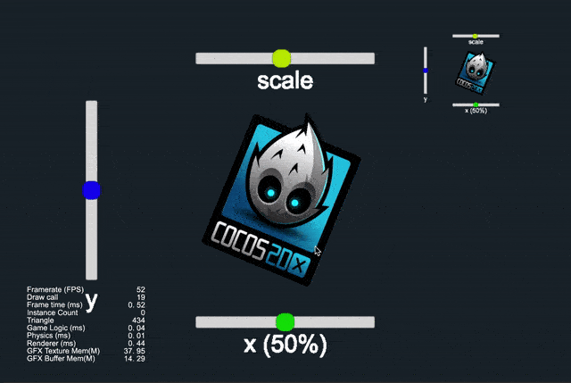
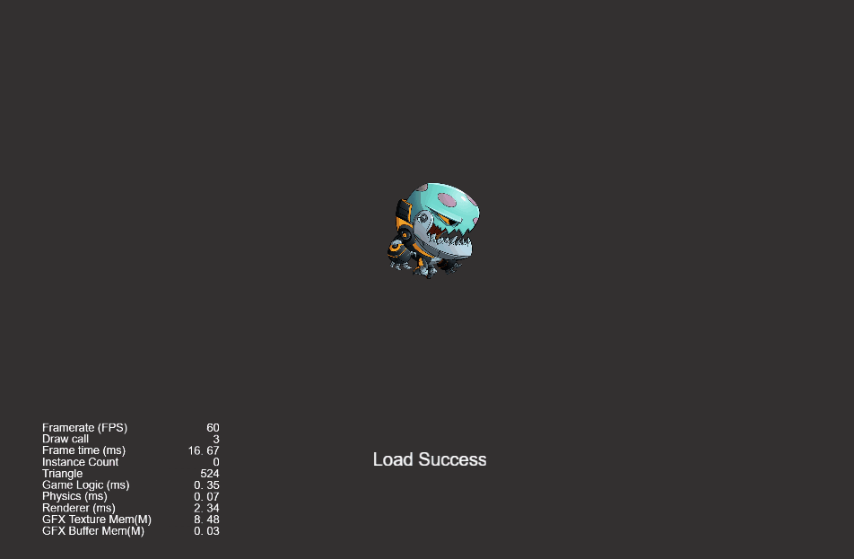
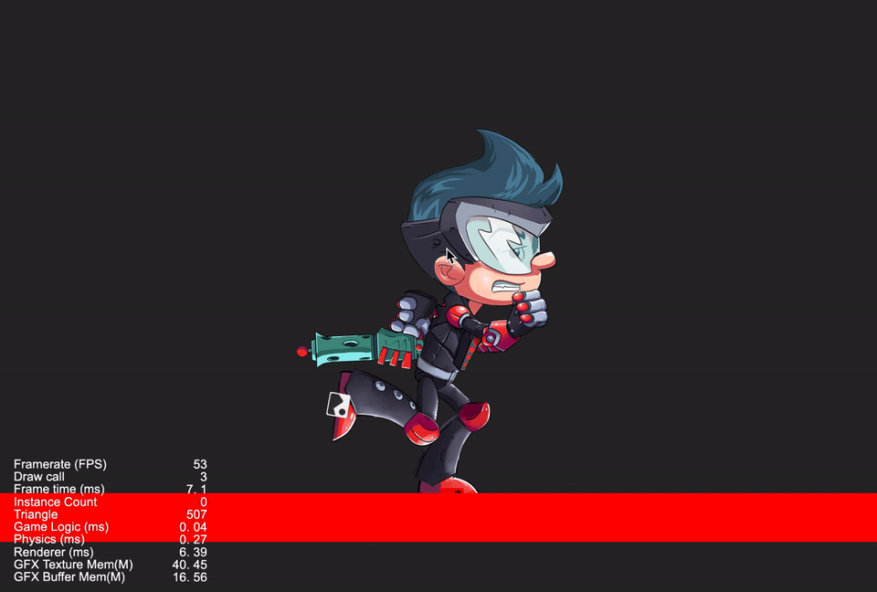
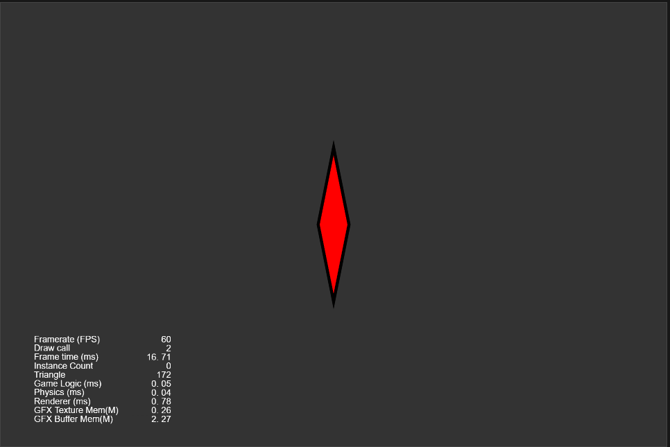
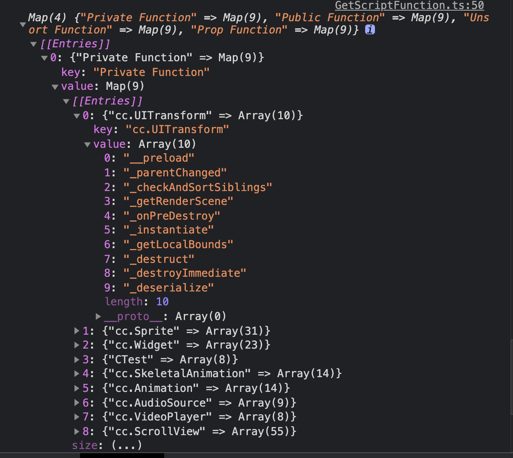

## Cocos Creator How To Use
### Write by yeshao2069.
### Cocos Creator How To Use is to simplify the use of some functions that users understand the API.
### Cocos Creator v3.0.x
&nbsp;

## Quick
| A | B | C | D | E |
| :---: | :---: | :---: | :---: | :---: | 
| [1. 用户界面 UI](#ui) |  | [3. 音频 Audio](#audio) | [4. 视频 Video](#video) | [5. 帧动画 Animation](#animation)|
| [6. Spine动画](#spine) | [7. 龙骨动画 DragonBone](#dragonbone) | [8. 绘图 Graphics](#graphics) | [9. 物理 Physics](#physics) | [10. 缓动 Tween](#tween) |
| [11. 渲染 Render](#render) | [12. 模型 Model](#model) | [13. 粒子 Particle](#particle) | [14. 需求案例 DemandCase](#demandcase) | |
&nbsp;

---
### UI
| 编号 | 子编号 | 类目 | 子项 | 备注 | 演示 |
| :---: | :---: | :---: |:---: |:---: |:---: |
| 1  |   | [UI示例](https://gitee.com/yeshao2069/cocos-creator-how-to-use/tree/v3.0.x/UI) |   | [返回顶部](#quick)  |
|   | 1.1 | Label | [超大文本](https://gitee.com/yeshao2069/cocos-creator-how-to-use/tree/v3.0.x/UI/Creator3.0.0_2D_LargeSystemFontText)  | 官方DEMO  | 

  |
|   | 1.2 | Button | [简单按钮](https://gitee.com/yeshao2069/cocos-creator-how-to-use/tree/v3.0.x/UI/Creator3.0.0_2D_SimpleButton)  | 官方DEMO  | 

  |
|   | 1.3 | ListView | [列表视图示例](https://gitee.com/yeshao2069/cocos-creator-how-to-use/tree/v3.0.x/UI/Creator3.0.0_2D_ListViewUse)  | 官方DEMO  | 

  |
|   | 1.4 | WebView | [网页视图示例](https://gitee.com/yeshao2069/cocos-creator-how-to-use/tree/v3.0.x/UI/Creator3.0.0_2D_WebViewUse)  | 官方DEMO  | 

  |
|   | 1.5 | RichText | [富文本示例](https://gitee.com/yeshao2069/cocos-creator-how-to-use/tree/v3.0.x/UI/Creator3.0.0_2D_RichTextUse)  | 官方DEMO  | 

  |
|   | 1.6 | PageView | [页面视图示例](https://gitee.com/yeshao2069/cocos-creator-how-to-use/tree/v3.0.x/UI/Creator3.0.0_2D_PageViewUse)  | 官方DEMO  | 

  |
|   | 1.7 | Mask | [遮罩示例](https://gitee.com/yeshao2069/cocos-creator-how-to-use/tree/v3.0.x/UI/Creator3.0.0_2D_MaskUse)  | 官方DEMO  | 

  |
|   | 1.8 | UI | [更新列表信息](https://gitee.com/yeshao2069/cocos-creator-how-to-use/tree/v3.0.x/UI/Creator3.0.0_2D_UpdateListWithData)  | 官方DEMO  | 

  |
|   | 1.9 | Camera | [摄像机示例](https://gitee.com/yeshao2069/cocos-creator-how-to-use/tree/v3.0.x/UI/Creator3.0.0_2D_CameraUseSample)  |  | 

  |

---
### Audio
| 编号 | 子编号 | 类目 | 子项 | 备注 |  演示 |
| :---: | :---: | :---: |:---: |:---: |:---: |
| 3  |   | [音频示例](https://gitee.com/yeshao2069/cocos-creator-how-to-use/tree/v3.0.x/Audio) |   | [返回顶部](#quick)  |
|   | 3.1 | 音频示例 | [多个音效同时播放](https://gitee.com/yeshao2069/cocos-creator-how-to-use/tree/v3.0.x/Audio/Creator3.0.0_PlayOneShot)  |   |   |
|   | 3.2 | 音频示例 | [添加全局按钮音效](https://gitee.com/yeshao2069/cocos-creator-how-to-use/tree/v3.0.x/Audio/Creator3.0.0_AddGlobalButtonSound)  |   |   |
|   | 3.3 | 音频示例 | [模拟钢琴播放](https://gitee.com/yeshao2069/cocos-creator-how-to-use/tree/v3.0.x/Audio/Creator3.0.0_PianoPlay)  | 官方DEMO  |  

 | 

---
### Video
| 编号 | 子编号 | 类目 | 子项 | 备注 |  演示 |
| :---: | :---: | :---: |:---: |:---: |:---: |
| 4  |   | [视频示例](https://gitee.com/yeshao2069/cocos-creator-how-to-use/tree/v3.0.x/Video) |   | [返回顶部](#quick)  |
|   | 4.1 | 视频示例 | [视频使用](https://gitee.com/yeshao2069/cocos-creator-how-to-use/tree/v3.0.x/Video/Creator3.0.0_VideoPlayer)  | 官方DEMO  | 

  |
|   | 4.2 | 视频示例 | [视频置于UI之下](https://gitee.com/yeshao2069/cocos-creator-how-to-use/tree/v3.0.x/Video/Creator3.0.0_VideoStayOnBottom)  | 官方DEMO  | 

  |

---
### Animation
| 编号 | 子编号 | 类目 | 子项 | 备注 | 演示 |
| :---: | :---: | :---: |:---: |:---: |:---: |
| 5  |   | [帧动画](https://gitee.com/yeshao2069/cocos-creator-how-to-use/tree/v3.0.x/Animation) |   | [返回顶部](#quick)  |   |
|   | 5.1 | 帧动画 | [精灵帧动画](https://gitee.com/yeshao2069/cocos-creator-how-to-use/tree/v3.0.x/Animation/Creator3.0.0_2D_SpriteFrameAnimation)  | 官方DEMO | 

 |
|   | 5.2 | 帧动画 | [精灵帧移动动画](https://gitee.com/yeshao2069/cocos-creator-how-to-use/tree/v3.0.x/Animation/Creator3.0.0_2D_SpriteMoveAnimation)  | 官方DEMO | 

 |
|   | 5.3 | 帧动画 | [精灵帧动画动态创建](https://gitee.com/yeshao2069/cocos-creator-how-to-use/tree/v3.0.x/Animation/Creator3.0.0_2D_CreateAnimationClip)  | 官方DEMO | 
 
 |

---
### Spine
| 编号 | 子编号 | 类目 | 子项 | 备注 | 演示 |
| :---: | :---: | :---: |:---: |:---: |:---: |
| 6  |   | [Spine](https://gitee.com/yeshao2069/cocos-creator-how-to-use/tree/v3.0.x/Spine) |   | [返回顶部](#quick)  |   |
|   | 6.1 | Spine | [加载Spine动画](https://gitee.com/yeshao2069/cocos-creator-how-to-use/tree/v3.0.x/Spine/Creator3.0.0_2D_LoadSpine)  | 官方DEMO | 

  |
|   | 6.2 | Spine | [Spine挂点](https://gitee.com/yeshao2069/cocos-creator-how-to-use/tree/v3.0.x/Spine/Creator3.0.0_2D_SpineAttach)  | 官方DEMO | 

  |
|   | 6.3 | Spine | [Spine特效](https://gitee.com/yeshao2069/cocos-creator-how-to-use/tree/v3.0.x/Spine/Creator3.0.0_2D_SpineMesh)  | 官方DEMO | 

 |
|   | 6.4 | Spine | [Spine换肤](https://gitee.com/yeshao2069/cocos-creator-how-to-use/tree/v3.0.x/Spine/Creator3.0.0_2D_SpineSkin)  | 官方DEMO | 

 |
|   | 6.5 | Spine | [Spine碰撞检测](https://gitee.com/yeshao2069/cocos-creator-how-to-use/tree/v3.0.x/Spine/Creator3.0.0_2D_SpineCollider)  | 官方DEMO | 

 |
|   | 6.6 | Spine | [Spine动作切换](https://gitee.com/yeshao2069/cocos-creator-how-to-use/tree/v3.0.x/Spine/Creator3.0.0_2D_SpineBoy)  | 官方DEMO | 

 |

---
### DragonBone
| 编号 | 子编号 | 类目 | 子项 | 备注 | 演示 |
| :---: | :---: | :---: |:---: |:---: |:---: |
| 7  |   | [龙骨动画](https://gitee.com/yeshao2069/cocos-creator-how-to-use/tree/v3.0.x/DragonBones) |   | [返回顶部](#quick)  |   |
|   | 7.1 | 龙骨动画 | [替换龙骨动画(slot插槽)](https://gitee.com/yeshao2069/cocos-creator-how-to-use/tree/v3.0.x/DragonBones/Creator3.0.0_2D_DragonBonesReplaceSlot)  | 官方DEMO | 

 |
|   | 7.2 | 龙骨动画 | [加载龙骨](https://gitee.com/yeshao2069/cocos-creator-how-to-use/tree/v3.0.x/DragonBones/Creator3.0.0_2D_LoadDragonBones)  | 官方DEMO | 

 |
|   | 7.3 | 龙骨动画 | [龙骨碰撞检测](https://gitee.com/yeshao2069/cocos-creator-how-to-use/tree/v3.0.x/DragonBones/Creator3.0.0_2D_DragonBonesCollider)  | 官方DEMO | 

 |
|   | 7.4 | 龙骨动画 | [龙骨动画挂点](https://gitee.com/yeshao2069/cocos-creator-how-to-use/tree/v3.0.x/DragonBones/Creator3.0.0_2D_DragonBonesAttach)  | 官方DEMO | 

 |
|   | 7.5 | 龙骨动画 | [切换龙骨动画](https://gitee.com/yeshao2069/cocos-creator-how-to-use/tree/v3.0.x/DragonBones/Creator3.0.0_2D_DragonBones)  | 官方DEMO | 

 |

---
### Graphics
| 编号 | 子编号 | 类目 | 子项 | 备注 | 演示 |
| :---: | :---: | :---: |:---: |:---: |:---: |
| 8  |   | [Graphics](https://gitee.com/yeshao2069/cocos-creator-how-to-use/tree/v3.0.x/Graphics) |   | [返回顶部](#quick)  |   |
|   | 8.1 | Graphics | [画饼状图](https://gitee.com/yeshao2069/cocos-creator-how-to-use/tree/v3.0.x/Graphics/Creator3.0.0_2D_GraphicsArc)  | 官方DEMO | 

 |
|   | 8.2 | Graphics | [画正方形](https://gitee.com/yeshao2069/cocos-creator-how-to-use/tree/v3.0.x/Graphics/Creator3.0.0_2D_GraphicsRect)  | 官方DEMO | 

 |
|   | 8.3 | Graphics | [画菱形](https://gitee.com/yeshao2069/cocos-creator-how-to-use/tree/v3.0.x/Graphics/Creator3.0.0_2D_GraphicsLineTo)  | 官方DEMO | 

 |
|   | 8.4 | Graphics | [画椭圆形](https://gitee.com/yeshao2069/cocos-creator-how-to-use/tree/v3.0.x/Graphics/Creator3.0.0_2D_GraphicsEllipse)  | 官方DEMO | 

 |
|   | 8.5 | Graphics | [三点画圆](https://gitee.com/yeshao2069/cocos-creator-how-to-use/tree/v3.0.x/Graphics/Creator3.0.0_2D_GraphicsFindCircleAndDraw)  |  | 

 |
|   | 8.6 | Graphics | [涂鸦](https://gitee.com/yeshao2069/cocos-creator-how-to-use/tree/v3.0.x/Graphics/Creator3.0.0_2D_Doodle)  | 官方DEMO | 

 |
|   | 8.7 | Graphics | [画Sine曲线](https://gitee.com/yeshao2069/cocos-creator-how-to-use/tree/v3.0.x/Graphics/Creator3.0.0_2D_SineWaves)  | 官方DEMO | 

 |
|   | 8.8 | Graphics | [自由画线](https://gitee.com/yeshao2069/cocos-creator-how-to-use/tree/v3.0.x/Graphics/Creator3.0.0_2D_DrawLine)  | 官方DEMO | 

 |
|   | 8.9 | Graphics | [烟花爆炸](https://gitee.com/yeshao2069/cocos-creator-how-to-use/tree/v3.0.x/Graphics/Creator3.0.0_2D_GraphicsFireworksExplosion)  |  | 

 |

---
### Physics
| 编号 | 子编号 | 类目 | 子项 | 备注 | 演示 |
| :---: | :---: | :---: |:---: |:---: |:---: |
| 9  |   | [物理示例](https://gitee.com/yeshao2069/cocos-creator-how-to-use/tree/v3.0.x/Physics) |   | [返回顶部](#quick)  |   |
|   | 9.1 | 物理示例 | [检测碰撞体是否存在](https://gitee.com/yeshao2069/cocos-creator-how-to-use/tree/v3.0.x/Physics/Creator3.0.0_3D_PhysicsRaycastClosest)  |   | 

  |
|   | 9.2 | 物理示例 | [射线检测](https://gitee.com/yeshao2069/cocos-creator-how-to-use/tree/v3.0.x/Physics/Creator3.0.0_3D_PhysicsRaycast)  | 官方DEMO | 

 |
|   | 9.3 | 物理示例 | [使用物理材质](https://gitee.com/yeshao2069/cocos-creator-how-to-use/tree/v3.0.x/Physics/Creator3.0.0_3D_PhysicsMaterial)  | 官方DEMO | 

 |
|   | 9.4 | 物理示例 | [使用网格碰撞器组件](https://gitee.com/yeshao2069/cocos-creator-how-to-use/tree/v3.0.x/Physics/Creator3.0.0_3D_PhysicsMeshCollider)  | 官方DEMO | 

 |
|   | 9.5 | 物理示例 | [物体旋转跳跃](https://gitee.com/yeshao2069/cocos-creator-how-to-use/tree/v3.0.x/Physics/Creator3.0.0_3D_PhysicsRotateAndJumpWithVelocity)  | 官方DEMO | 

 |
|   | 9.6 | 物理示例 | [使用触发器-触发事件](https://gitee.com/yeshao2069/cocos-creator-how-to-use/tree/v3.0.x/Physics/Creator3.0.0_3D_PhysicsTriggerEvent)  | 官方DEMO | 

 |
|   | 9.7 | 物理示例 | [运行时更新碰撞体数据](https://gitee.com/yeshao2069/cocos-creator-how-to-use/tree/v3.0.x/Physics/Creator3.0.0_3D_PhysicsRuntimeUpdate)  | 官方DEMO | 

 |
|   | 9.8 | 物理示例 | [使用平面碰撞器组件](https://gitee.com/yeshao2069/cocos-creator-how-to-use/tree/v3.0.x/Physics/Creator3.0.0_3D_PhysicsPlaneCollider)  | 官方DEMO | 

 |
|   | 9.9 | 物理示例 | [物理同步](https://gitee.com/yeshao2069/cocos-creator-how-to-use/tree/v3.0.x/Physics/Creator3.0.0_3D_PhysicsSync)  | 官方DEMO | 
 |
|   | 9.10 | 物理示例 | [物理分组掩码](https://gitee.com/yeshao2069/cocos-creator-how-to-use/tree/v3.0.x/Physics/Creator3.0.0_3D_PhysicsGroupMask)  | 官方DEMO | 

 |
|   | 9.11 | 物理示例 | [物理动态运行](https://gitee.com/yeshao2069/cocos-creator-how-to-use/tree/v3.0.x/Physics/Creator3.0.0_3D_PhysicsRunDynamic)  | 官方DEMO | 

 |
|   | 9.12 | 物理示例 | [不规则物体碰撞](https://gitee.com/yeshao2069/cocos-creator-how-to-use/tree/v3.0.x/Physics/Creator3.0.0_3D_PhysicsConvexColliders)  | 官方DEMO | 

 |
|   | 9.13 | 物理示例 | [点对点约束](https://gitee.com/yeshao2069/cocos-creator-how-to-use/tree/v3.0.x/Physics/Creator3.0.0_3D_PhysicsPointToPointConstraint)  | 官方DEMO | 

 |
|   | 9.14 | 物理示例 | [碰撞点数据](https://gitee.com/yeshao2069/cocos-creator-how-to-use/tree/v3.0.x/Physics/Creator3.0.0_3D_PhysicsContactData)  | 官方DEMO | 

 |
|   | 9.15 | 物理示例 | [链条约束](https://gitee.com/yeshao2069/cocos-creator-how-to-use/tree/v3.0.x/Physics/Creator3.0.0_3D_PhysicsHingeConstraint)  | 官方DEMO | 

 |
|   | 9.16 | 物理示例 | [使用恒力组件](https://gitee.com/yeshao2069/cocos-creator-how-to-use/tree/v3.0.x/Physics/Creator3.0.0_3D_PhysicsForceConstant)  | 官方DEMO | 

 |
|   | 9.17 | 物理示例 | [使用碰撞器-碰撞事件](https://gitee.com/yeshao2069/cocos-creator-how-to-use/tree/v3.0.x/Physics/Creator3.0.0_3D_PhysicsCollisionEvent)  | 官方DEMO | 

 |
|   | 9.18 | 物理示例 | [胶囊体触发器](https://gitee.com/yeshao2069/cocos-creator-how-to-use/tree/v3.0.x/Physics/Creator3.0.0_3D_PhysicsCapsuleTrigger)  | 官方DEMO | 

 |

---
### Tween
| 编号 | 子编号 | 类目 | 子项 | 备注 | 演示 |
| :---: | :---: | :---: |:---: |:---: |:---: |
| 10  |   | [Tween](https://gitee.com/yeshao2069/cocos-creator-how-to-use/tree/v3.0.x/Tween) |   | [返回顶部](#quick)  |   |
|   | 10.1 | Tween | [透明度渐变](https://gitee.com/yeshao2069/cocos-creator-how-to-use/tree/v3.0.x/Tween/Creator3.0.0_2D_TweenOpacityChange)  |  | 

 |
|   | 10.2 | Tween | [旋转并缩放 (Tween)](https://gitee.com/yeshao2069/cocos-creator-how-to-use/tree/v3.0.x/Tween/Creator3.0.0_2D_TweenRotateAndScaleForever)  |  | 

 |
|   | 10.3 | Tween | [环形运动](https://gitee.com/yeshao2069/cocos-creator-how-to-use/tree/v3.0.x/Tween/Creator3.0.0_2D_TweenCircleMove)  |   | 

 |
|   | 10.4 | Tween | [旋转 (Tween)](https://gitee.com/yeshao2069/cocos-creator-how-to-use/tree/v3.0.x/Tween/Creator3.0.0_2D_TweenRotateChange)  |  | 

 |
|   | 10.5 | Tween | [Tween使用Easing](https://gitee.com/yeshao2069/cocos-creator-how-to-use/tree/v3.0.x/Tween/Creator3.0.0_2D_TweenShowMonster)  | 官方DEMO | 

 |
|   | 10.6 | Tween | [Tween封装](https://gitee.com/yeshao2069/cocos-creator-how-to-use/tree/v3.0.x/Tween/Creator3.0.0_2D_TweenCCUtils)  |  |   |

---
### Model
| 编号 | 子编号 | 类目 | 子项 | 备注 | 演示 |
| :---: | :---: | :---: |:---: |:---: |:---: |
| 11  |   | [Model](https://gitee.com/yeshao2069/cocos-creator-how-to-use/tree/v3.0.x/Model) |   | [返回顶部](#quick)  |   |
|   | 11.1 | Model | [表情动画](https://gitee.com/yeshao2069/cocos-creator-how-to-use/tree/v3.0.x/Model/Creator3.0.0_3D_MorphHead)  | 官方DEMO | 

 |
|   | 11.2 | Model | [跳舞的女人](https://gitee.com/yeshao2069/cocos-creator-how-to-use/tree/v3.0.x/Model/Creator3.0.0_3D_DanceWoman)  | 官方DEMO | 

 |
|   | 11.3 | Model | [使用卡通材质](https://gitee.com/yeshao2069/cocos-creator-how-to-use/tree/v3.0.x/Model/Creator3.0.0_3D_Toon)  | 官方DEMO  | 

 |
|   | 11.4 | Model | [动态加载材质](https://gitee.com/yeshao2069/cocos-creator-how-to-use/tree/v3.0.x/Model/Creator3.0.0_3D_DynamicLoadMaterial)  | 官方DEMO  | 

  |
|   | 11.5 | Model | [冬来了](https://gitee.com/yeshao2069/cocos-creator-how-to-use/tree/v3.0.x/Model/Creator3.0.0_3D_Winter)  | 官方DEMO  | 

  |
|   | 11.6 | Model | [骑士](https://gitee.com/yeshao2069/cocos-creator-how-to-use/tree/v3.0.x/Model/Creator3.0.0_3D_Knight)  | 官方DEMO  | 

  |

---
### Renderer
| 编号 | 子编号 | 类目 | 子项 | 备注 | 演示 |
| :---: | :---: | :---: |:---: |:---: |:---: |
| 12  |   | [Renderer](https://gitee.com/yeshao2069/cocos-creator-how-to-use/tree/v3.0.x/Renderer) |   | [返回顶部](#quick)  |
|   | 12.1 | Renderer | [2D的物体渲染在3D场景中](https://gitee.com/yeshao2069/cocos-creator-how-to-use/tree/v3.0.x/Renderer/Creator3.0.0_2dRenderingIn3d)  | 官方DEMO | 

 |

---
### Particle
| 编号 | 子编号 | 类目 | 子项 | 备注 | 演示 |
| :---: | :---: | :---: |:---: |:---: |:---: |
| 13  |   | [粒子示例](https://gitee.com/yeshao2069/cocos-creator-how-to-use/tree/v3.0.x/Particle) |   | [返回顶部](#quick)  |   |
|   | 13.1 | 粒子示例 | [火焰效果](https://gitee.com/yeshao2069/cocos-creator-how-to-use/tree/v3.0.x/Particle/Creator3.0.0_3D_FlameSimulation)  |  | 

 |
|   | 13.2 | 粒子示例 | [粒子拖尾模块1](https://gitee.com/yeshao2069/cocos-creator-how-to-use/tree/v3.0.x/Particle/Creator3.0.0_3D_ParticleTrails01)  | 官方DEMO  | 

 |
|   | 13.3 | 粒子示例 | [粒子拖尾模块2](https://gitee.com/yeshao2069/cocos-creator-how-to-use/tree/v3.0.x/Particle/Creator3.0.0_3D_ParticleTrails02)  | 官方DEMO  | 

 |
|   | 13.4 | 粒子示例 | [粒子拖尾模块3](https://gitee.com/yeshao2069/cocos-creator-how-to-use/tree/v3.0.x/Particle/Creator3.0.0_3D_ParticleTrails03)  | 官方DEMO  | 

 |
|   | 13.5 | 粒子示例 | [粒子拖尾模块4](https://gitee.com/yeshao2069/cocos-creator-how-to-use/tree/v3.0.x/Particle/Creator3.0.0_3D_ParticleTrails04)  | 官方DEMO  | 

 |
|   | 13.6 | 粒子示例 | [粒子颜色模块](https://gitee.com/yeshao2069/cocos-creator-how-to-use/tree/v3.0.x/Particle/Creator3.0.0_3D_ParticleColor)  | 官方DEMO  | 

 |
|   | 13.7 | 粒子示例 | [粒子加速度模块](https://gitee.com/yeshao2069/cocos-creator-how-to-use/tree/v3.0.x/Particle/Creator3.0.0_3D_ParticleForce)  | 官方DEMO  | 

 |
|   | 13.8 | 粒子示例 | [粒子限速模块](https://gitee.com/yeshao2069/cocos-creator-how-to-use/tree/v3.0.x/Particle/Creator3.0.0_3D_ParticleLimitVelocity)  | 官方DEMO  | 

 |
|   | 13.9 | 粒子示例 | [粒子主模块](https://gitee.com/yeshao2069/cocos-creator-how-to-use/tree/v3.0.x/Particle/Creator3.0.0_3D_ParticleMain)  | 官方DEMO  | 

 |
|   | 13.10 | 粒子示例 | [粒子渲染模块](https://gitee.com/yeshao2069/cocos-creator-how-to-use/tree/v3.0.x/Particle/Creator3.0.0_3D_ParticleRenderer)  | 官方DEMO  | 

 |
|   | 13.11 | 粒子示例 | [粒子旋转模块](https://gitee.com/yeshao2069/cocos-creator-how-to-use/tree/v3.0.x/Particle/Creator3.0.0_3D_ParticleRotation)  | 官方DEMO  | 

 |
|   | 13.12 | 粒子示例 | [粒子发射器模块](https://gitee.com/yeshao2069/cocos-creator-how-to-use/tree/v3.0.x/Particle/Creator3.0.0_3D_ParticleShapeModule)  | 官方DEMO  | 

 |
|   | 13.13 | 粒子示例 | [粒子大小模块](https://gitee.com/yeshao2069/cocos-creator-how-to-use/tree/v3.0.x/Particle/Creator3.0.0_3D_ParticleSize)  | 官方DEMO  | 

 |
|   | 13.14 | 粒子示例 | [粒子贴图动画模块](https://gitee.com/yeshao2069/cocos-creator-how-to-use/tree/v3.0.x/Particle/Creator3.0.0_3D_ParticleTextureAnimation)  | 官方DEMO  | 

 |
|   | 13.15 | 粒子示例 | [粒子速度模块](https://gitee.com/yeshao2069/cocos-creator-how-to-use/tree/v3.0.x/Particle/Creator3.0.0_3D_ParticleVelocity)  | 官方DEMO  | 

 |
|   | 13.16 | 粒子示例 | [2D粒子显隐](https://gitee.com/yeshao2069/cocos-creator-how-to-use/tree/v3.0.x/Particle/Creator3.0.0_2D_ToggleParticle)  | 官方DEMO  | 

 |
|   | 13.17 | 粒子示例 | [2D粒子完成后自动移除](https://gitee.com/yeshao2069/cocos-creator-how-to-use/tree/v3.0.x/Particle/Creator3.0.0_2D_ParticleAutoRemove)  | 官方DEMO  | 

 |

---
### DemandCase
| 编号 | 子编号 | 类目 | 子项 | 备注 | 演示 |
| :---: | :---: | :---: |:---: |:---: |:---: |
| 14 |   | [需求案例](https://gitee.com/yeshao2069/cocos-creator-how-to-use/tree/v3.0.x/Demo) |   | [返回顶部](#quick)  |   |
|   | 14.1 | 需求案例 | [物体是否在摄像机范围内](https://gitee.com/yeshao2069/cocos-creator-how-to-use/tree/v3.0.x/Demo/Creator3.0.0_3D_ObjectIsInCameraView)  |  |

 |
|   | 14.2 | 需求案例 | [使用动画帧事件](https://gitee.com/yeshao2069/cocos-creator-how-to-use/tree/v3.0.x/Demo/Creator3.0.0_UseAnimationFrameEvents)  |  | 

 |
|   | 14.3 | 需求案例 | [动态获取脚本的方法名](https://gitee.com/yeshao2069/cocos-creator-how-to-use/tree/v3.0.x/Demo/Creator3.0.0_GetScriptFunction)  |  | 

 |
|   | 14.4 | 需求案例 | [动态获取动画属性数据](https://gitee.com/yeshao2069/cocos-creator-how-to-use/tree/v3.0.x/Demo/Creator3.0.0_GetAnimationClipDataByTime)  |  |  

 |
|   | 14.5 | 需求案例 | [点击响应](https://gitee.com/yeshao2069/cocos-creator-how-to-use/tree/v3.0.x/Demo/Creator3.0.0_2D_PressResponse)  |   |   |
|   | 14.6 | 需求案例 | [物体始终在人物右侧](https://gitee.com/yeshao2069/cocos-creator-how-to-use/tree/v3.0.x/Demo/Creator3.0.0_3D_ObjectAlwaysFollow)  |   | 

 |
|   | 14.7 | 需求案例 | [圆形进度条](https://gitee.com/yeshao2069/cocos-creator-how-to-use/tree/v3.0.x/Demo/Creator3.0.0_2D_CircularProgressBar)  |  | 

 |
|   | 14.8 | 需求案例 | [椭圆轨迹运动](https://gitee.com/yeshao2069/cocos-creator-how-to-use/tree/v3.0.x/Demo/Creator3.0.0_2D_EllipseMove)  |  | 

 |
|   | 14.9 | 需求案例 | [贝塞尔曲线路径在线绘制工具](https://gitee.com/yeshao2069/cocos-creator-how-to-use/tree/v3.0.x/Demo/Creator3.0.0_BezierCurvePathCreator)  |  | 

 |
|   | 14.10 | 需求案例 | [动态加载FBX模型中的Mesh](https://gitee.com/yeshao2069/cocos-creator-how-to-use/tree/v3.0.x/Demo/Creator3.0.0_3D_DynamicLoadMesh)  |  | 

 |
|   | 14.11 | 需求案例 | [旋转后矩形是否包含点](https://gitee.com/yeshao2069/cocos-creator-how-to-use/tree/v3.0.x/Demo/Creator3.0.0_2D_AbovePoint)  |  | 

 |
|   | 14.12 | 需求案例 | [弯曲的道路](https://gitee.com/yeshao2069/cocos-creator-how-to-use/tree/v3.0.x/Demo/RoadCurved)  |  | 

 |
|   | 14.13 | 需求案例 | [3D位置转化](https://gitee.com/yeshao2069/cocos-creator-how-to-use/tree/v3.0.x/Demo/Creator3.0.0_ScreenToWorldPoint)  | 官方DEMO | 

 |
|   | 14.14 | 需求案例 | [动态生成单色精灵](https://gitee.com/yeshao2069/cocos-creator-how-to-use/tree/v3.0.x/Demo/Creator3.0.0_2D_AutoGenerateSpriteframe)  |  | 

 |
|   | 14.15 | 需求案例 | [不规则按钮](https://gitee.com/yeshao2069/cocos-creator-how-to-use/tree/v3.0.x/Demo/Creator3.0.0_2D_IrregularButton)  |  | 

 |
|   | 14.16 | 需求案例 | [自适应最小角度点击旋转](https://gitee.com/yeshao2069/cocos-creator-how-to-use/tree/v3.0.x/Demo/Creator3.0.0_2D_AdaptiveRotation)  |  | 

 |
|   | 14.17 | 需求案例 | [自适应最小角度旋转](https://gitee.com/yeshao2069/cocos-creator-how-to-use/tree/v3.0.x/Demo/Creator3.0.0_2D_AdaptiveAngleRotation)  |  | 

 |

### Mark
Cocos Creator How To Use 3.0.x 版本列举效果 102 种，会同步更新到 [Cocos Creator How To Use 3.4.x](https://gitee.com/yeshao2069/cocos-creator-how-to-use/tree/v3.4.x) 版本，后续 Cocos Creator How To Use 3.0.x 将不会同步新的效果，请移步到 3.4.x 版本查看最新效果。