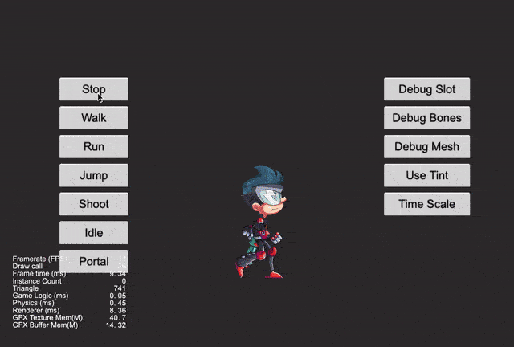

## Cocos Creator How To Use

### Spine
| 编号 | 类目 | 子项 | 演示 |
| :---: |:---: |:---: |:---: |
| 1 | Spine动画 | [加载Spine](https://gitee.com/yeshao2069/cocos-creator-how-to-use/tree/v3.0.x/Spine/Creator3.0.0_2D_LoadSpine)  | 

  |
| 2 | Spine动画 | [Spine挂点](https://gitee.com/yeshao2069/cocos-creator-how-to-use/tree/v3.0.x/Spine/Creator3.0.0_2D_SpineAttach)  | 

  |
| 3 | Spine动画 | [Spine特效](https://gitee.com/yeshao2069/cocos-creator-how-to-use/tree/v3.0.x/Spine/Creator3.0.0_2D_SpineMesh)  | 

 |
| 4 | Spine动画 | [Spine换肤](https://gitee.com/yeshao2069/cocos-creator-how-to-use/tree/v3.0.x/Spine/Creator3.0.0_2D_SpineSkin)  | 

 |
| 5 | Spine动画 | [Spine碰撞检测](https://gitee.com/yeshao2069/cocos-creator-how-to-use/tree/v3.0.x/Spine/Creator3.0.0_2D_SpineCollider)  | 

 |
| 6 | Spine动画 | [Spine动作切换](https://gitee.com/yeshao2069/cocos-creator-how-to-use/tree/v3.0.x/Spine/Creator3.0.0_2D_SpineBoy)  | 

 |