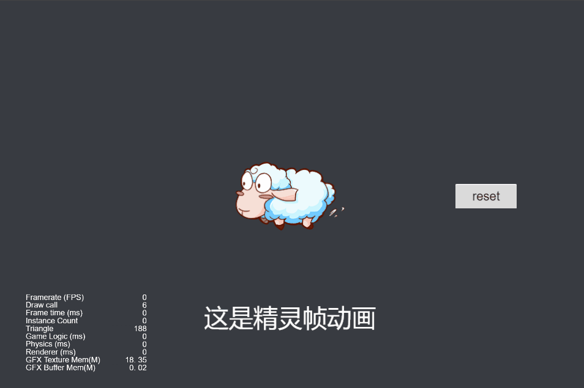
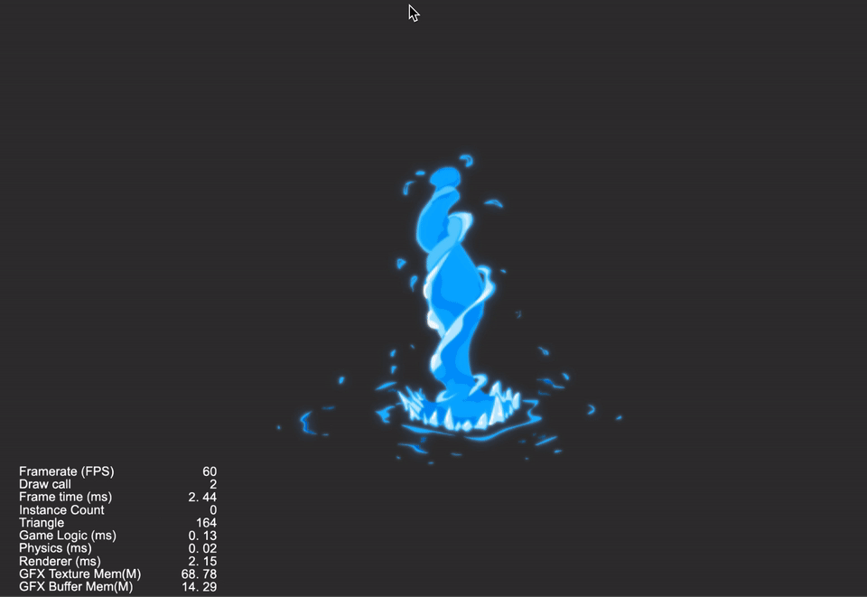
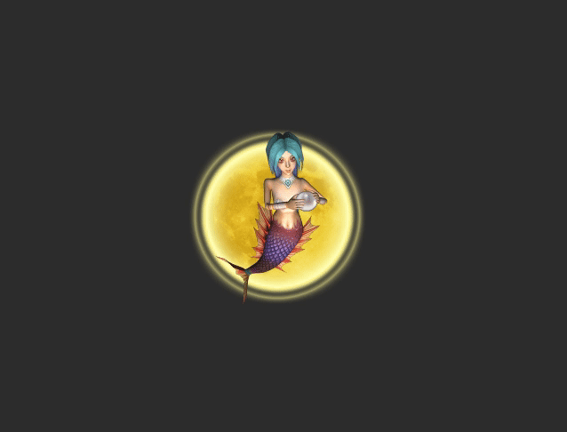
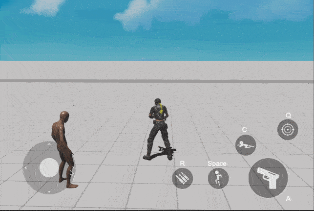

### Animation
| No. | Type | Project | Preview |
| :---: | :---: | :---: | :---: |
| 1 | 2D | [SpriteFrame Animation](https://github.com/yeshao2069/CocosCreatorHowToUse/tree/v3.6.x/proj/Animation/Creator3.6.0_2D_SpriteFrameAnimation)  | 

 |
| 2 | 2D | [SpriteFrame Move Animation](https://github.com/yeshao2069/CocosCreatorHowToUse/tree/v3.6.x/proj/Animation/Creator3.6.0_2D_SpriteMoveAnimation)  | 

 |
| 3 | 2D | [Dynamic Create AnimationClip](https://github.com/yeshao2069/CocosCreatorHowToUse/tree/v3.6.x/proj/Animation/Creator3.6.0_2D_CreateAnimationClip)  | 
 
 |
| 4 | 2D | [SpriteFrame Animation Water](https://github.com/yeshao2069/CocosCreatorHowToUse/tree/v3.6.x/proj/Animation/Creator3.6.0_2D_AnimationWater)  | 
 
 |
| 5 | 2D | [SpriteFrame Animation Fish](https://github.com/yeshao2069/CocosCreatorHowToUse/tree/v3.6.x/proj/Animation/Creator3.6.0_2D_AnimationFish)  | 
 
 |
| 6 | 3D | [Ms. Amoy](https://github.com/yeshao2069/CocosCreatorHowToUse/tree/v3.6.x/proj/Animation/Creator3.6.0_3D_MsAmoy) | 
 
 |