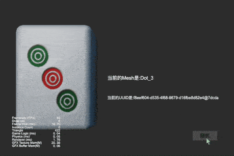

### Introduction

project created based on CocosCreator version 3.6.0 **动态加载FBX模型中的Mesh** 

### Preview

### 实现思路
1. FBX 的资源是存放在 resources 中
2. 通过获取 Prefab, 获取模型中所有的mesh的uuid
3. 使用 assetManager.loadAny(uuid, (err: any, mesh: Mesh) => {}); 的方式加载 mesh