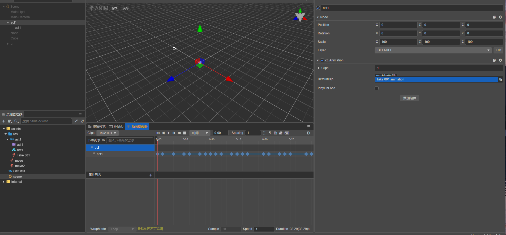
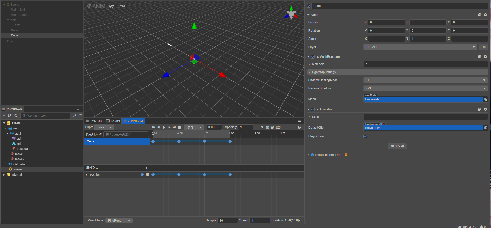
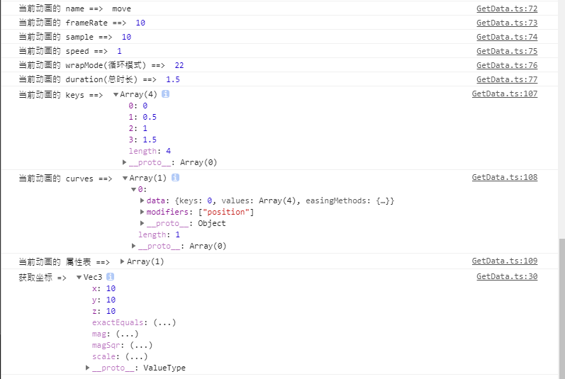

### 简介
基于 CocosCreator 3.7.0 版本创建的 **动态获取动画属性数据** 工程

### 效果预览
1. 当 a/b模式时



2. 当单节点模式时



3. 当多节点模式时


### 使用

getAnimationDataByTime 接口适用节点结构简单的场景

```
const data = this.getAnimationDataByTime(this.act1, 0, true);
if (data) {
    // 获取pos
    console.log("获取坐标 => ", data.get('position'));
}
```

getAnimationDataByTimeExpand 可以实用节点结构稍微复杂的场景

```
const data3 = this.getAnimationDataByTimeExpand(this.act3, 1, 'c1');
if (data2) {
    // 获取pos
    // @ts-ignore
    console.log("获取坐标 => ", data3['position']);
}
```