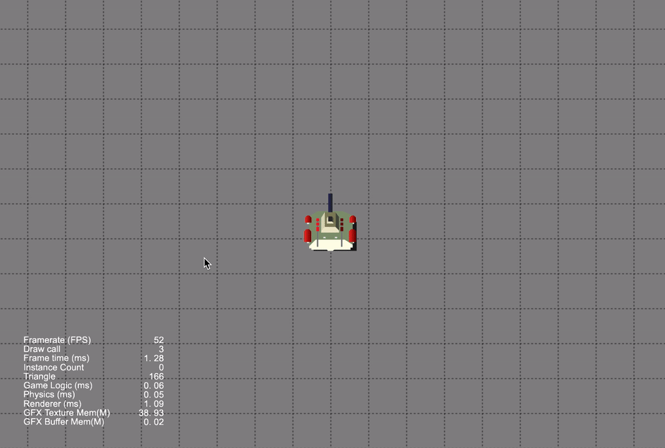

### Demo
| No. | Type | Project | Preview |
| :---: | :---: | :---: | :---: |
| 1 | 3D | [Object Is In Camera View](https://github.com/yeshao2069/CocosCreatorHowToUse/tree/v3.6.x/proj/Demo/Creator3.6.0_3D_ObjectIsInCameraView) |

 |
| 2 | 3D | [Use Animation Frame Events](https://github.com/yeshao2069/CocosCreatorHowToUse/tree/v3.6.x/proj/Demo/Creator3.6.0_UseAnimationFrameEvents) | 

 |
| 3 | 2D/3D | [Get Script Function](https://github.com/yeshao2069/CocosCreatorHowToUse/tree/v3.6.x/proj/Demo/Creator3.6.0_GetScriptFunction) | 

 |
| 4 | 3D | [Get Animation Clip Data By Time](https://github.com/yeshao2069/CocosCreatorHowToUse/tree/v3.6.x/proj/Demo/Creator3.6.0_GetAnimationClipDataByTime) |  

 |
| 5 | 2D | [Press Response Test](https://github.com/yeshao2069/CocosCreatorHowToUse/tree/v3.6.x/proj/Demo/Creator3.6.0_PressResponse)  |   |
| 6 | 3D | [Object Always Follow](https://github.com/yeshao2069/CocosCreatorHowToUse/tree/v3.6.x/proj/Demo/Creator3.6.0_3D_ObjectAlwaysFollow)  | 

 |
| 7 | 2D | [Circular Progress Bar](https://github.com/yeshao2069/CocosCreatorHowToUse/tree/v3.6.x/proj/Demo/Creator3.6.0_2D_CircularProgressBar) | 

 |
| 8 | 2D | [Ellipse Move](https://github.com/yeshao2069/CocosCreatorHowToUse/tree/v3.6.x/proj/Demo/Creator3.6.0_2D_EllipseMove) | 

 |
| 9 | 2D | [Bezier Curve Path Creator](https://github.com/yeshao2069/CocosCreatorHowToUse/tree/v3.6.x/proj/Demo/Creator3.6.0_BezierCurvePathCreator) | 

 |
| 10 | 3D | [Dynamic Load Mesh](https://github.com/yeshao2069/CocosCreatorHowToUse/tree/v3.6.x/proj/Demo/Creator3.6.0_3D_DynamicLoadMesh) | 

 |
| 11 | 2D | [Above Point Test](https://github.com/yeshao2069/CocosCreatorHowToUse/tree/v3.6.x/proj/Demo/Creator3.6.0_2D_AbovePointTest) | 

 |
| 12 | 3D | [Road Curved](https://github.com/yeshao2069/CocosCreatorHowToUse/tree/v3.6.x/proj/Demo/Creator3.6.0_3D_RoadCurved)  | 

 |
| 13 | 3D | [Screen To World Point](https://github.com/yeshao2069/CocosCreatorHowToUse/tree/v3.6.x/proj/Demo/Creator3.6.0_ScreenToWorldPoint) | 

 |
| 14 | 2D | [Auto Generate Spriteframe](https://github.com/yeshao2069/CocosCreatorHowToUse/tree/v3.6.x/proj/Demo/Creator3.6.0_2D_AutoGenerateSpriteframe) | 

 |
| 15 | 2D | [Irregular Button](https://github.com/yeshao2069/CocosCreatorHowToUse/tree/v3.6.x/proj/Demo/Creator3.6.0_2D_IrregularButton)  | 

 |
| 16 | 2D | [Adaptive Angle Rotation](https://github.com/yeshao2069/CocosCreatorHowToUse/tree/v3.6.x/proj/Demo/Creator3.6.0_2D_AdaptiveAngleRotation)  | 

 |
| 17 | 2D | [Adaptive Rotation](https://github.com/yeshao2069/CocosCreatorHowToUse/tree/v3.6.x/proj/Demo/Creator3.6.0_2D_AdaptiveRotation)  | 

 |
| 18 | 3D | [Label On Cube](https://github.com/yeshao2069/CocosCreatorHowToUse/tree/v3.6.x/proj/Demo/Creator3.6.0_3D_LabelOnCube)  | 

 |
| 19 | 3D | [Model Anchor](https://github.com/yeshao2069/CocosCreatorHowToUse/tree/v3.6.x/proj/Demo/Creator3.6.1_3D_ModelAnchor)  | 

 |