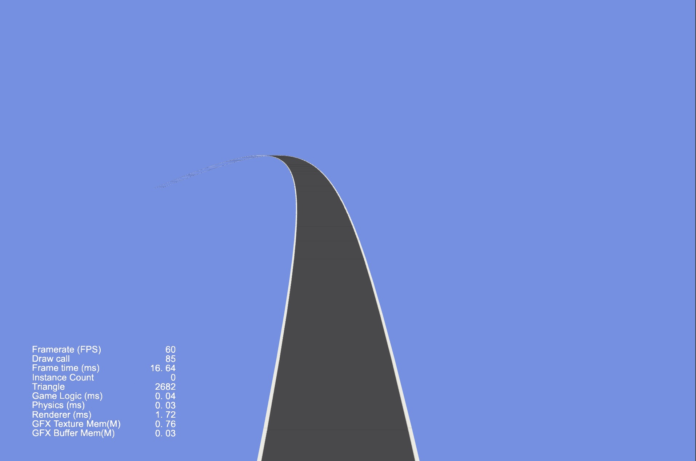

### Demo
| 序号 | 类型 | 项目 | 演示 |
| :---: | :---: | :---: | :---: |
| 1 | 3D | [物体是否在摄像机范围内](https://github.com/yeshao2069/CocosCreatorHowToUse/tree/v3.6.x/proj/Demo/Creator3.6.0_3D_ObjectIsInCameraView) |

 |
| 2 | 3D | [使用动画帧事件](https://github.com/yeshao2069/CocosCreatorHowToUse/tree/v3.6.x/proj/Demo/Creator3.6.0_UseAnimationFrameEvents) | 

 |
| 3 | 2D/3D | [动态获取脚本的方法名](https://github.com/yeshao2069/CocosCreatorHowToUse/tree/v3.6.x/proj/Demo/Creator3.6.0_GetScriptFunction) | 

 |
| 4 | 3D | [动态获取动画属性数据](https://github.com/yeshao2069/CocosCreatorHowToUse/tree/v3.6.x/proj/Demo/Creator3.6.0_GetAnimationClipDataByTime) |  

 |
| 5 | 2D | [点击响应](https://github.com/yeshao2069/CocosCreatorHowToUse/tree/v3.6.x/proj/Demo/Creator3.6.0_PressResponse)  |   |
| 6 | 3D | [物体始终在人物右侧](https://github.com/yeshao2069/CocosCreatorHowToUse/tree/v3.6.x/proj/Demo/Creator3.6.0_3D_ObjectAlwaysFollow)  | 

 |
| 7 | 2D | [圆形进度条](https://github.com/yeshao2069/CocosCreatorHowToUse/tree/v3.6.x/proj/Demo/Creator3.6.0_2D_CircularProgressBar) | 

 |
| 8 | 2D | [椭圆轨迹运动](https://github.com/yeshao2069/CocosCreatorHowToUse/tree/v3.6.x/proj/Demo/Creator3.6.0_2D_EllipseMove) | 

 |
| 9 | 2D | [贝塞尔曲线路径在线绘制工具](https://github.com/yeshao2069/CocosCreatorHowToUse/tree/v3.6.x/proj/Demo/Creator3.6.0_BezierCurvePathCreator) | 

 |
| 10 | 3D | [动态加载FBX模型中的Mesh](https://github.com/yeshao2069/CocosCreatorHowToUse/tree/v3.6.x/proj/Demo/Creator3.6.0_3D_DynamicLoadMesh) | 

 |
| 11 | 2D | [旋转后矩形是否包含点](https://github.com/yeshao2069/CocosCreatorHowToUse/tree/v3.6.x/proj/Demo/Creator3.6.0_2D_AbovePointTest) | 

 |
| 12 | 3D | [3D弯曲的道路](https://github.com/yeshao2069/CocosCreatorHowToUse/tree/v3.6.x/proj/Demo/Creator3.6.0_3D_RoadCurved)  | 

 |
| 13 | 3D | [3D位置转化](https://github.com/yeshao2069/CocosCreatorHowToUse/tree/v3.6.x/proj/Demo/Creator3.6.0_ScreenToWorldPoint) | 

 |
| 14 | 2D | [动态生成单色精灵](https://github.com/yeshao2069/CocosCreatorHowToUse/tree/v3.6.x/proj/Demo/Creator3.6.0_2D_AutoGenerateSpriteframe) | 

 |
| 15 | 2D | [不规则按钮](https://github.com/yeshao2069/CocosCreatorHowToUse/tree/v3.6.x/proj/Demo/Creator3.6.0_2D_IrregularButton)  | 

 |
| 16 | 2D | [自适应最小角度旋转](https://github.com/yeshao2069/CocosCreatorHowToUse/tree/v3.6.x/proj/Demo/Creator3.6.0_2D_AdaptiveAngleRotation)  | 

 |
| 17 | 2D | [自适应最小角度点击旋转](https://github.com/yeshao2069/CocosCreatorHowToUse/tree/v3.6.x/proj/Demo/Creator3.6.0_2D_AdaptiveRotation)  | 

 |
| 18 | 3D | [3D模型上的文字](https://github.com/yeshao2069/CocosCreatorHowToUse/tree/v3.6.x/proj/Demo/Creator3.6.0_3D_LabelOnCube)  | 

 |
| 19 | 3D | [3D模型锚点](https://github.com/yeshao2069/CocosCreatorHowToUse/tree/v3.6.x/proj/Demo/Creator3.6.1_3D_ModelAnchor)  | 

 |