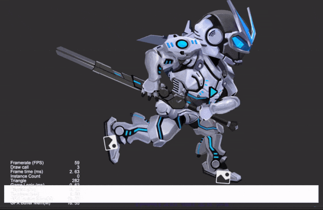

### Introduction

project created based on CocosCreator version 3.6.0 **龙骨动画碰撞检测** 

### Preview

### Related Links
[Gitee](https://gitee.com/mirrors_cocos-creator/test-cases-3d/tree/v3.0/assets/cases/dragonbones) | [Github](https://github.com/cocos-creator/test-cases-3d/tree/v3.0/assets/cases/dragonbones)

### 注意
- 需要在项目设置中定义碰撞矩阵
- 需要修改当前的 2D 物理引擎为内置物理引擎