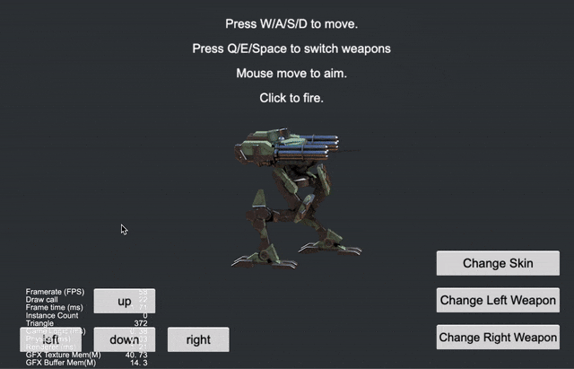

### DragonBones
| No. | Type | Project | Preview |
| :---: | :---: | :---: | :---: |
| 1 | 2D | [DragonBones Replace Slot](https://github.com/yeshao2069/CocosCreatorHowToUse/tree/v3.6.x/proj/DragonBones/Creator3.6.0_2D_DragonBonesReplaceSlot) | 

 |
| 2 | 2D | [Load DragonBones](https://github.com/yeshao2069/CocosCreatorHowToUse/tree/v3.6.x/proj/DragonBones/Creator3.6.0_2D_LoadDragonBones) | 

 |
| 3 | 2D | [DragonBones Collider](https://github.com/yeshao2069/CocosCreatorHowToUse/tree/v3.6.x/proj/DragonBones/Creator3.6.0_2D_DragonBonesCollider) | 

 |
| 4 | 2D | [DragonBones Attach](https://github.com/yeshao2069/CocosCreatorHowToUse/tree/v3.6.x/proj/DragonBones/Creator3.6.0_2D_DragonBonesAttach) | 

 |
| 5 | 2D | [DragonBones](https://github.com/yeshao2069/CocosCreatorHowToUse/tree/v3.6.x/proj/DragonBones/Creator3.6.0_2D_DragonBones) | 

 |
| 6 | 2D | [DragonBones Specified Frame](https://github.com/yeshao2069/CocosCreatorHowToUse/tree/v3.6.x/proj/DragonBones/Creator3.6.0_2D_DragonBonesSpecifiedFrame) | 

 |