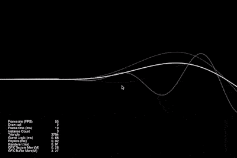

## Cocos Creator How To Use

### Graphics
| 编号 | 分类 | 项目 | 编辑器版本 | 演示 |
| :---: | :---: | :---: | :---: | :---: |
| 1 | Graphics | [画饼状图](https://github.com/yeshao2069/CocosCreatorHowToUse/tree/v3.5.x/proj/Graphics/Creator3.5.0_2D_GraphicsArc) | 3.5.0 | 

 |
| 2 | Graphics | [画正方形](https://github.com/yeshao2069/CocosCreatorHowToUse/tree/v3.5.x/proj/Graphics/Creator3.5.0_2D_GraphicsRect) | 3.5.0 | 

 |
| 3 | Graphics | [画菱形](https://github.com/yeshao2069/CocosCreatorHowToUse/tree/v3.5.x/proj/Graphics/Creator3.5.0_2D_GraphicsLineTo) | 3.5.0 | 

 |
| 4 | Graphics | [画椭圆形](https://github.com/yeshao2069/CocosCreatorHowToUse/tree/v3.5.x/proj/Graphics/Creator3.5.0_2D_GraphicsEllipse) | 3.5.0 | 

 |
| 5 | Graphics | [三点画圆](https://github.com/yeshao2069/CocosCreatorHowToUse/tree/v3.5.x/proj/Graphics/Creator3.5.0_2D_GraphicsDrawCircle) | 3.5.0 | 

 |
| 6 | Graphics | [涂鸦](https://github.com/yeshao2069/CocosCreatorHowToUse/tree/v3.5.x/proj/Graphics/Creator3.5.0_2D_Doodle) | 3.5.0 | 

 |
| 7 | Graphics | [画Sine曲线](https://github.com/yeshao2069/CocosCreatorHowToUse/tree/v3.5.x/proj/Graphics/Creator3.5.0_2D_GraphicsSineWaves) | 3.5.0 | 

 |
| 8 | Graphics | [自由画线](https://github.com/yeshao2069/CocosCreatorHowToUse/tree/v3.5.x/proj/Graphics/Creator3.5.0_2D_DrawLine) | 3.5.0 | 

 |
| 9 | Graphics | [烟花爆炸](https://github.com/yeshao2069/CocosCreatorHowToUse/tree/v3.5.x/proj/Graphics/Creator3.5.0_2D_GraphicsFireworksExplosion) | 3.5.0 | 

 |
| 10 | Graphics | [画房子](https://github.com/yeshao2069/CocosCreatorHowToUse/tree/v3.5.x/proj/Graphics/Creator3.5.0_2D_GraphicsHouse) | 3.5.0 | 

 |
| 11 | Graphics | [环形进度条](https://github.com/yeshao2069/CocosCreatorHowToUse/tree/v3.5.x/proj/Graphics/Creator3.5.1_2D_GraphicsRingProgressbar) | 3.5.1 | 

 |