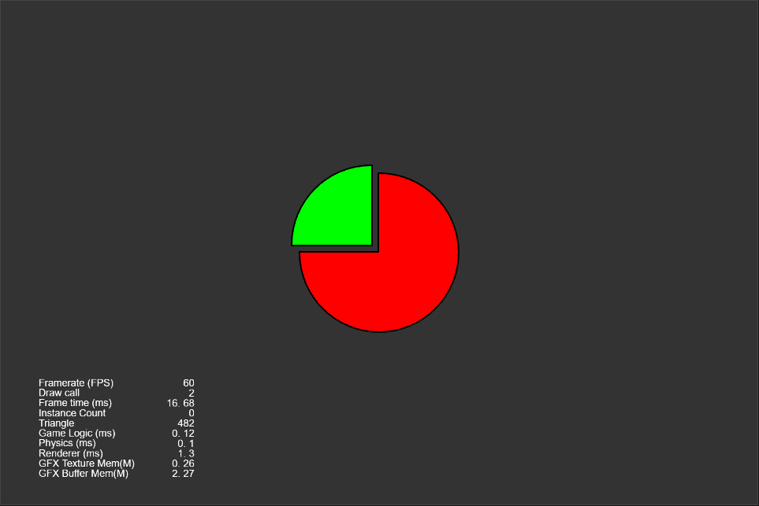
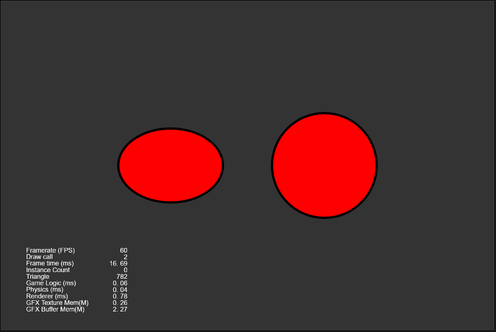
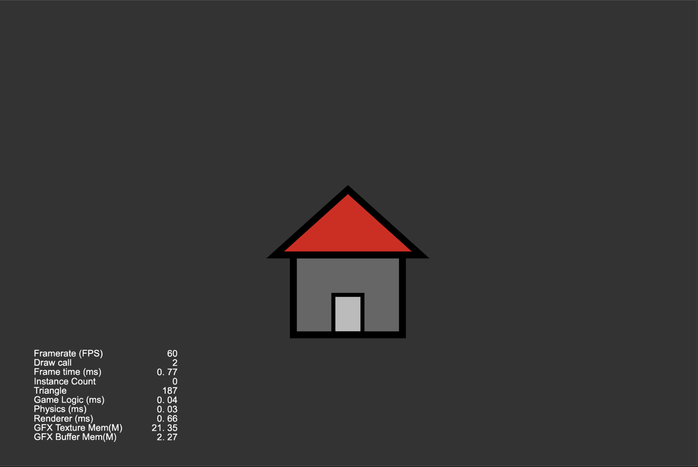

### Graphics
| No. | Type | Project | Preview |
| :---: | :---: | :---: | :---: |
| 1 | 2D | [画饼状图](https://github.com/yeshao2069/CocosCreatorHowToUse/tree/v3.6.x/proj/Graphics/Creator3.6.0_2D_GraphicsArc) | 

 |
| 2 | 2D | [画正方形](https://github.com/yeshao2069/CocosCreatorHowToUse/tree/v3.6.x/proj/Graphics/Creator3.6.0_2D_GraphicsRect) | 

 |
| 3 | 2D | [画菱形](https://github.com/yeshao2069/CocosCreatorHowToUse/tree/v3.6.x/proj/Graphics/Creator3.6.0_2D_GraphicsLineTo) | 

 |
| 4 | 2D | [画椭圆形](https://github.com/yeshao2069/CocosCreatorHowToUse/tree/v3.6.x/proj/Graphics/Creator3.6.0_2D_GraphicsEllipse) | 

 |
| 5 | 2D | [三点画圆](https://github.com/yeshao2069/CocosCreatorHowToUse/tree/v3.6.x/proj/Graphics/Creator3.6.0_2D_GraphicsDrawCircle) | 

 |
| 6 | 2D | [涂鸦](https://github.com/yeshao2069/CocosCreatorHowToUse/tree/v3.6.x/proj/Graphics/Creator3.6.0_2D_Doodle) | 

 |
| 7 | 2D | [画Sine曲线](https://github.com/yeshao2069/CocosCreatorHowToUse/tree/v3.6.x/proj/Graphics/Creator3.6.0_2D_GraphicsSineWaves) | 

 |
| 8 | 2D | [自由画线](https://github.com/yeshao2069/CocosCreatorHowToUse/tree/v3.6.x/proj/Graphics/Creator3.6.0_2D_DrawLine) | 

 |
| 9 | 2D | [烟花爆炸](https://github.com/yeshao2069/CocosCreatorHowToUse/tree/v3.6.x/proj/Graphics/Creator3.6.0_2D_GraphicsFireworksExplosion) | 

 |
| 10 | 2D | [画房子](https://github.com/yeshao2069/CocosCreatorHowToUse/tree/v3.6.x/proj/Graphics/Creator3.6.0_2D_GraphicsHouse) | 

 |
| 11 | 2D | [环形进度条](https://github.com/yeshao2069/CocosCreatorHowToUse/tree/v3.6.x/proj/Graphics/Creator3.6.0_2D_GraphicsRingProgressbar) | 

 |