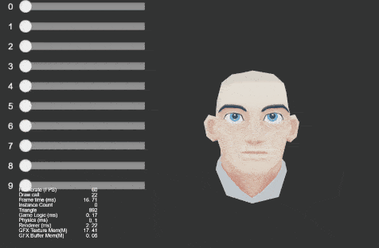

### Model
| No. | Type | Project | Preview |
| :---: | :---: | :---: | :---: |
| 1 | 3D | [Morph Head](https://github.com/yeshao2069/CocosCreatorHowToUse/tree/v3.6.x/proj/Model/Creator3.6.0_3D_MorphHead)  | 

 |
| 2 | 3D | [Model Dancing Woman](https://github.com/yeshao2069/CocosCreatorHowToUse/tree/v3.6.x/proj/Model/Creator3.6.0_3D_DanceWoman)  | 

 |
| 3 | 3D | [Model Toon](https://github.com/yeshao2069/CocosCreatorHowToUse/tree/v3.6.x/proj/Model/Creator3.6.0_3D_Toon)  | 

 |
| 4 | 3D | [Model Dynamic Load Material](https://github.com/yeshao2069/CocosCreatorHowToUse/tree/v3.6.x/proj/Model/Creator3.6.0_3D_DynamicLoadMaterial)  | 

  |
| 5 | 3D | [Model Winter](https://github.com/yeshao2069/CocosCreatorHowToUse/tree/v3.6.x/proj/Model/Creator3.6.0_3D_Winter) | 

  |
| 6 | 3D | [Model Knight](https://github.com/yeshao2069/CocosCreatorHowToUse/tree/v3.6.x/proj/Model/Creator3.6.0_3D_Knight)  | 

  |
| 7 | 3D | [Model Create Mesh](https://github.com/yeshao2069/CocosCreatorHowToUse/tree/v3.6.x/proj/Model/Creator3.6.0_3D_CreateMesh)  | 

  |
| 8 | 3D | [Skeletal Animation Specified Frame](https://github.com/yeshao2069/CocosCreatorHowToUse/tree/v3.6.x/proj/Model/Creator3.6.0_3D_SkeletalAnimationSpecifiedFrame) | 

 |
| 9 | 3D | [Skeletal Animation Attach](https://github.com/yeshao2069/CocosCreatorHowToUse/tree/v3.6.x/proj/Model/Creator3.6.0_3D_SkeletalAnimAttach) | 3.6.0 | 

 |