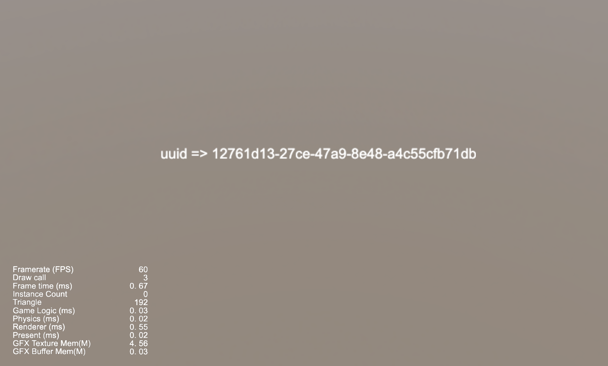

### 简介
基于 CocosCreator 3.7.1 版本创建的 **NPM-uuid使用** 工程

### 效果预览

### 相关链接    
https://www.npmjs.com/package/uuid

### 使用方式    
1. 在项目工程下，使用 `npm install uuid` 安装 uuid NPM 库

2. 在 uuid 的包内（node_modules/uuid/package.json）中，新增字段 `"type": "module",`

3. 像用户脚本中，使用 `import { v4 as uuidv4 } from 'uuid';` 引入