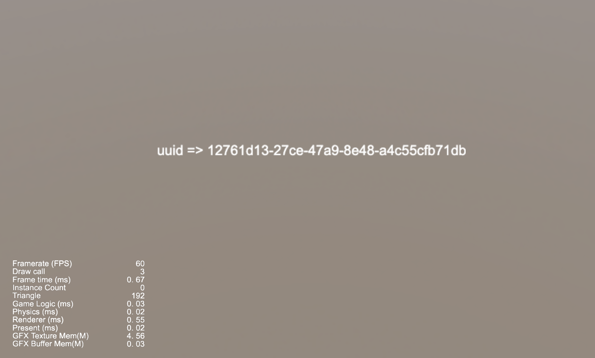
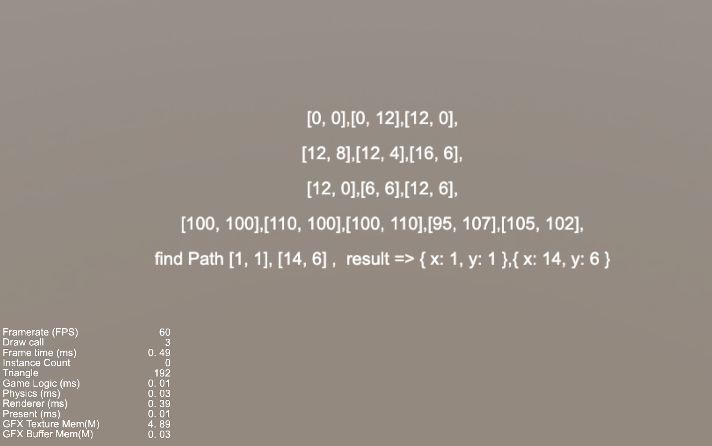

### Npm
| No. | Type | Project | Preview |
| :---: | :---: | :---: | :---: |
| 1 | 2D | [zlib Usage](https://github.com/yeshao2069/CocosCreatorHowToUse/tree/v3.7.x/proj/Npm/Creator3.7.0_zlibUse) | 

 |
| 2 | 2D | [uuid Usage](https://github.com/yeshao2069/CocosCreatorHowToUse/tree/v3.7.x/proj/Npm/Creator3.7.1_uuidUse) | 

 |
| 3 | 2D | [nav2d Usage](https://github.com/yeshao2069/CocosCreatorHowToUse/tree/v3.7.x/proj/Npm/Creator3.7.1_nav2dUse) | 

 |