### Particle
| No. | Type | Project | Preview |
| :---: | :---: | :---: | :---: |
| 1 | 3D | [Particle Flame Simulation](https://github.com/yeshao2069/CocosCreatorHowToUse/tree/v3.6.x/proj/Particle/Creator3.6.0_3D_FlameSimulation) | 
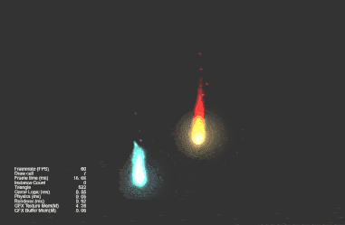
 |
| 2 | 3D | [Particle Trails One](https://github.com/yeshao2069/CocosCreatorHowToUse/tree/v3.6.x/proj/Particle/Creator3.6.0_3D_ParticleTrails01) | 
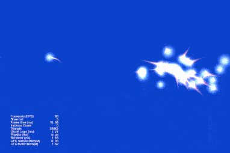
 |
| 3 | 3D | [Particle Trails Two](https://github.com/yeshao2069/CocosCreatorHowToUse/tree/v3.6.x/proj/Particle/Creator3.6.0_3D_ParticleTrails02) | 
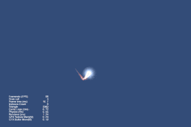
 |
| 4 | 3D | [Particle Trails Three](https://github.com/yeshao2069/CocosCreatorHowToUse/tree/v3.6.x/proj/Particle/Creator3.6.0_3D_ParticleTrails03) | 
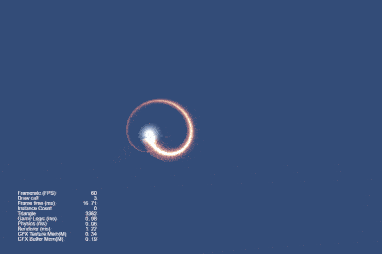
 |
| 5 | 3D | [Particle Trails Four](https://github.com/yeshao2069/CocosCreatorHowToUse/tree/v3.6.x/proj/Particle/Creator3.6.0_3D_ParticleTrails04) | 
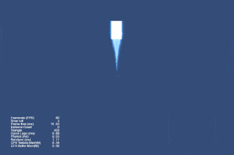
 |
| 6 | 3D | [Particle Color Module](https://github.com/yeshao2069/CocosCreatorHowToUse/tree/v3.6.x/proj/Particle/Creator3.6.0_3D_ParticleColor) | 
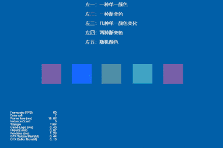
 |
| 7 | 3D | [Particle Force Module](https://github.com/yeshao2069/CocosCreatorHowToUse/tree/v3.6.x/proj/Particle/Creator3.6.0_3D_ParticleForce) | 
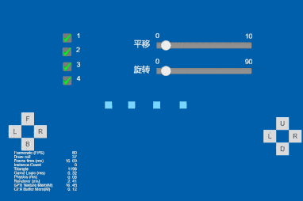
 |
| 8 | 3D | [Particle Limit Velocity Module](https://github.com/yeshao2069/CocosCreatorHowToUse/tree/v3.6.x/proj/Particle/Creator3.6.0_3D_ParticleLimitVelocity) | 
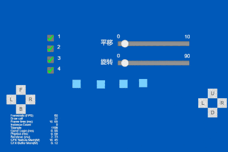
 |
| 9 | 3D | [Particle Main Module](https://github.com/yeshao2069/CocosCreatorHowToUse/tree/v3.6.x/proj/Particle/Creator3.6.0_3D_ParticleMain) | 
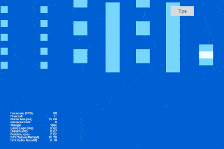
 |
| 10 | 3D | [Particle Renderer Module](https://github.com/yeshao2069/CocosCreatorHowToUse/tree/v3.6.x/proj/Particle/Creator3.6.0_3D_ParticleRenderer) | 
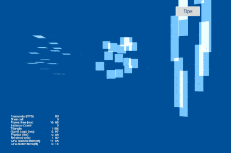
 |
| 11 | 3D | [Particle Rotation Module](https://github.com/yeshao2069/CocosCreatorHowToUse/tree/v3.6.x/proj/Particle/Creator3.6.0_3D_ParticleRotation) | 
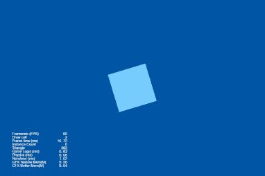
 |
| 12 | 3D | [Particle Shape Module](https://github.com/yeshao2069/CocosCreatorHowToUse/tree/v3.6.x/proj/Particle/Creator3.6.0_3D_ParticleShape) | 
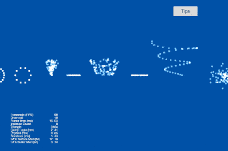
 |
| 13 | 3D | [Particle Size Module](https://github.com/yeshao2069/CocosCreatorHowToUse/tree/v3.6.x/proj/Particle/Creator3.6.0_3D_ParticleSize) | 

 |
| 14 | 3D | [Particle Texture Animation Module](https://github.com/yeshao2069/CocosCreatorHowToUse/tree/v3.6.x/proj/Particle/Creator3.6.0_3D_ParticleTextureAnimation) | 
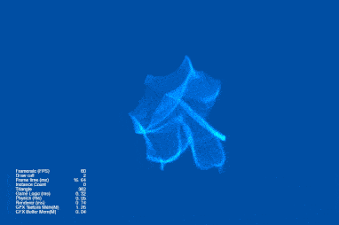
 |
| 15 | 3D | [Particle Velocity Module](https://github.com/yeshao2069/CocosCreatorHowToUse/tree/v3.6.x/proj/Particle/Creator3.6.0_3D_ParticleVelocity) | 
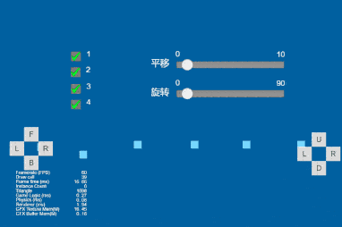
 |
| 16 | 2D | [Particle 2D Toggle](https://github.com/yeshao2069/CocosCreatorHowToUse/tree/v3.6.x/proj/Particle/Creator3.6.0_2D_ToggleParticle) | 
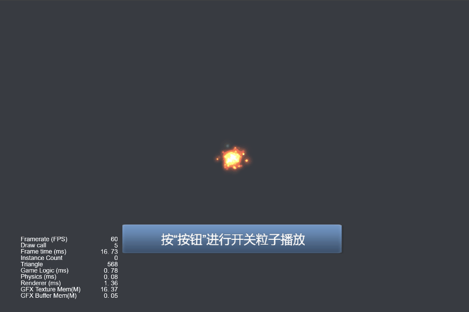
 |
| 17 | 2D | [Particle 2D Auto Remove](https://github.com/yeshao2069/CocosCreatorHowToUse/tree/v3.6.x/proj/Particle/Creator3.6.0_2D_AutoRemoveParticle) | 
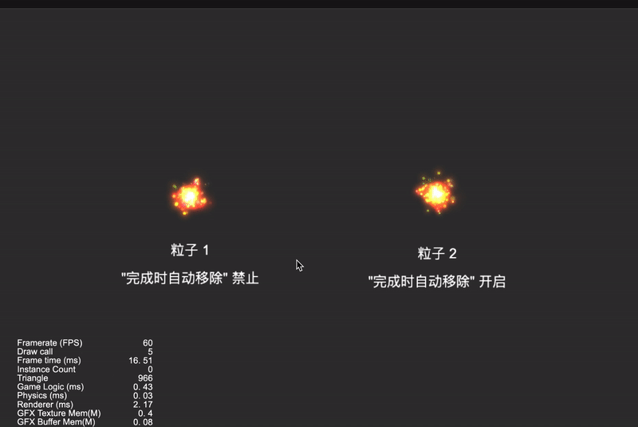
 |
| 18 | 3D | [Cursor Particles](https://github.com/yeshao2069/CocosCreatorHowToUse/tree/v3.6.x/proj/Particle/Creator3.6.0_2D_CursorParticles) | 
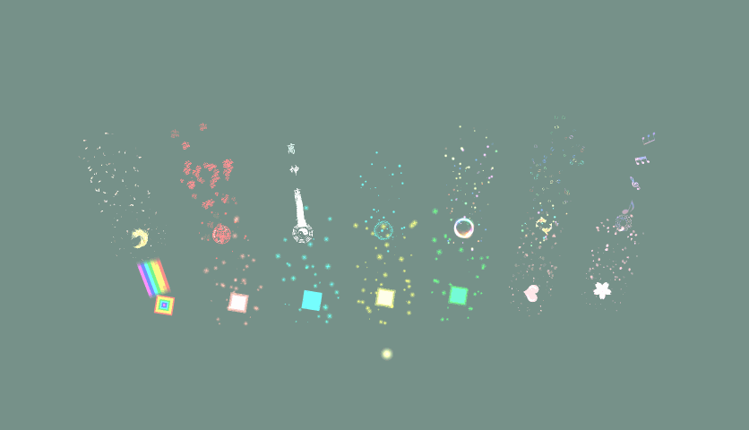
 |
| 19 | 3D | [Dust Storm Particle](https://github.com/yeshao2069/CocosCreatorHowToUse/tree/v3.6.x/proj/Particle/Creator3.6.2_3D_ParticleDustStorm) | 
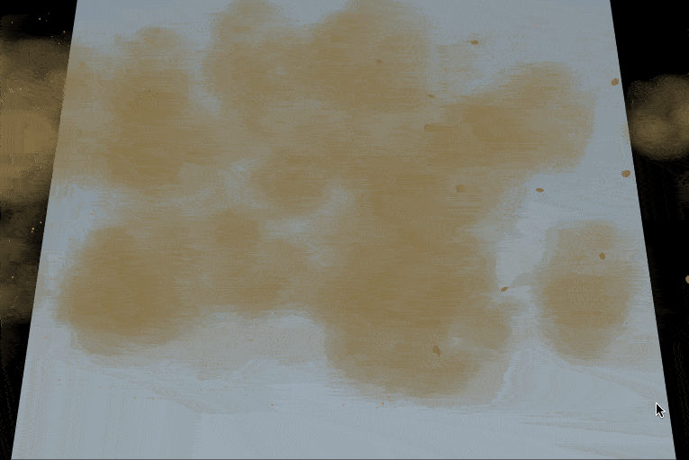
 |
| 20 | 3D | [Small Explosion Particle](https://github.com/yeshao2069/CocosCreatorHowToUse/tree/v3.6.x/proj/Particle/Creator3.6.2_3D_ParticleSmallExplosion) | 
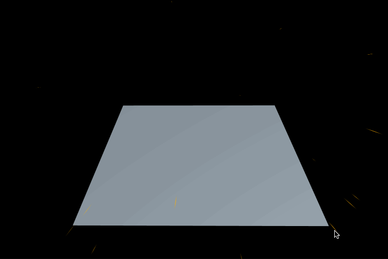
 |
| 21 | 3D | [Electrical Sparks Particle](https://github.com/yeshao2069/CocosCreatorHowToUse/tree/v3.6.x/proj/Particle/Creator3.6.2_3D_ParticleElectricalSparks) | 
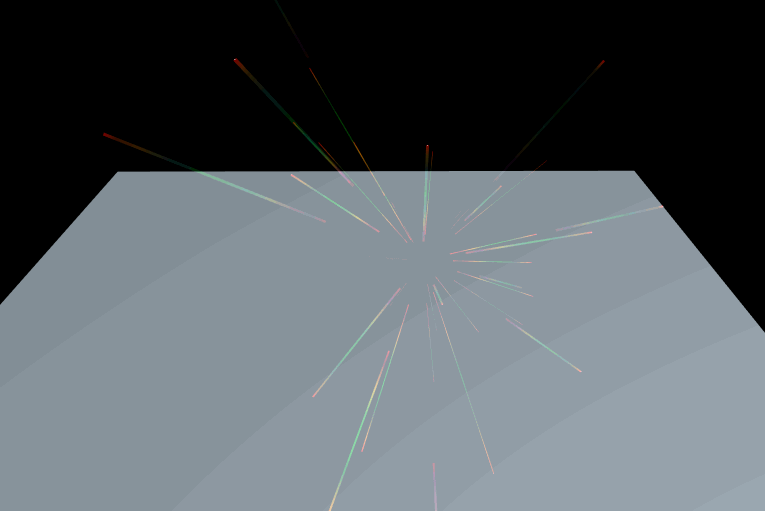
 |
| 22 | 3D | [Jet Fires Particle](https://github.com/yeshao2069/CocosCreatorHowToUse/tree/v3.6.x/proj/Particle/Creator3.6.2_3D_ParticleJetFires) | 

 |
| 23 | 3D | [Ground Fog Particle](https://github.com/yeshao2069/CocosCreatorHowToUse/tree/v3.6.x/proj/Particle/Creator3.6.2_3D_ParticleGroundFog) | 
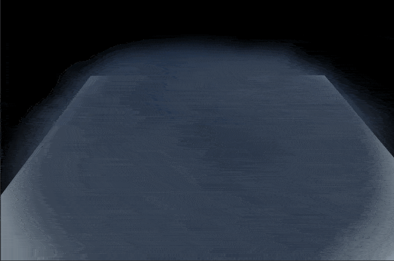
 |
| 24 | 3D | [Energy Explosion Particle](https://github.com/yeshao2069/CocosCreatorHowToUse/tree/v3.6.x/proj/Particle/Creator3.6.2_3D_ParticleEnergyExplosion) | 
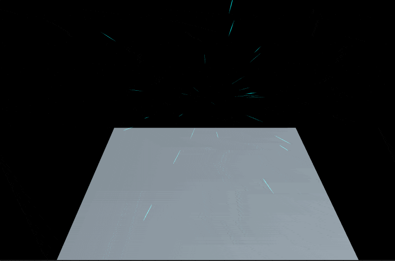
 |