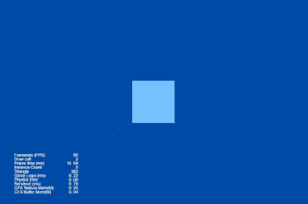
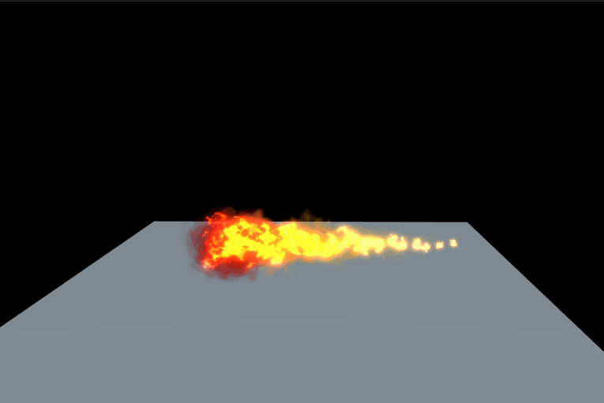

### Particle
| 编号 | 类型 | 项目 | 演示 |
| :---: | :---: | :---: | :---: |
| 1 | 3D | [火焰](https://github.com/yeshao2069/CocosCreatorHowToUse/tree/v3.6.x/proj/Particle/Creator3.6.0_3D_FlameSimulation) | 

 |
| 2 | 3D | [粒子拖尾1](https://github.com/yeshao2069/CocosCreatorHowToUse/tree/v3.6.x/proj/Particle/Creator3.6.0_3D_ParticleTrails01) | 

 |
| 3 | 3D | [粒子拖尾2](https://github.com/yeshao2069/CocosCreatorHowToUse/tree/v3.6.x/proj/Particle/Creator3.6.0_3D_ParticleTrails02) | 

 |
| 4 | 3D | [粒子拖尾3](https://github.com/yeshao2069/CocosCreatorHowToUse/tree/v3.6.x/proj/Particle/Creator3.6.0_3D_ParticleTrails03) | 

 |
| 5 | 3D | [粒子拖尾4](https://github.com/yeshao2069/CocosCreatorHowToUse/tree/v3.6.x/proj/Particle/Creator3.6.0_3D_ParticleTrails04) | 

 |
| 6 | 3D | [颜色模块](https://github.com/yeshao2069/CocosCreatorHowToUse/tree/v3.6.x/proj/Particle/Creator3.6.0_3D_ParticleColor) | 

 |
| 7 | 3D | [加速度模块](https://github.com/yeshao2069/CocosCreatorHowToUse/tree/v3.6.x/proj/Particle/Creator3.6.0_3D_ParticleForce) | 

 |
| 8 | 3D | [限速模块](https://github.com/yeshao2069/CocosCreatorHowToUse/tree/v3.6.x/proj/Particle/Creator3.6.0_3D_ParticleLimitVelocity) | 

 |
| 9 | 3D | [主模块](https://github.com/yeshao2069/CocosCreatorHowToUse/tree/v3.6.x/proj/Particle/Creator3.6.0_3D_ParticleMain) | 

 |
| 10 | 3D | [渲染模块](https://github.com/yeshao2069/CocosCreatorHowToUse/tree/v3.6.x/proj/Particle/Creator3.6.0_3D_ParticleRenderer) | 

 |
| 11 | 3D | [旋转模块](https://github.com/yeshao2069/CocosCreatorHowToUse/tree/v3.6.x/proj/Particle/Creator3.6.0_3D_ParticleRotation) | 

 |
| 12 | 3D | [发射器模块](https://github.com/yeshao2069/CocosCreatorHowToUse/tree/v3.6.x/proj/Particle/Creator3.6.0_3D_ParticleShape) | 

 |
| 13 | 3D | [大小模块](https://github.com/yeshao2069/CocosCreatorHowToUse/tree/v3.6.x/proj/Particle/Creator3.6.0_3D_ParticleSize) | 

 |
| 14 | 3D | [贴图动画模块](https://github.com/yeshao2069/CocosCreatorHowToUse/tree/v3.6.x/proj/Particle/Creator3.6.0_3D_ParticleTextureAnimation) | 

 |
| 15 | 3D | [速度模块](https://github.com/yeshao2069/CocosCreatorHowToUse/tree/v3.6.x/proj/Particle/Creator3.6.0_3D_ParticleVelocity) | 

 |
| 16 | 2D | [2D粒子显隐](https://github.com/yeshao2069/CocosCreatorHowToUse/tree/v3.6.x/proj/Particle/Creator3.6.0_2D_ToggleParticle) | 

 |
| 17 | 2D | [2D粒子完成后自动移除](https://github.com/yeshao2069/CocosCreatorHowToUse/tree/v3.6.x/proj/Particle/Creator3.6.0_2D_AutoRemoveParticle) | 

 |
| 18 | 3D | [光标粒子](https://github.com/yeshao2069/CocosCreatorHowToUse/tree/v3.6.x/proj/Particle/Creator3.6.0_2D_CursorParticles) | 

 |
| 19 | 3D | [沙尘暴](https://github.com/yeshao2069/CocosCreatorHowToUse/tree/v3.6.x/proj/Particle/Creator3.6.2_3D_ParticleDustStorm) | 

 |
| 20 | 3D | [爆炸](https://github.com/yeshao2069/CocosCreatorHowToUse/tree/v3.6.x/proj/Particle/Creator3.6.2_3D_ParticleSmallExplosion) | 

 |
| 21 | 3D | [电火花](https://github.com/yeshao2069/CocosCreatorHowToUse/tree/v3.6.x/proj/Particle/Creator3.6.2_3D_ParticleElectricalSparks) | 

 |
| 22 | 3D | [火焰喷射](https://github.com/yeshao2069/CocosCreatorHowToUse/tree/v3.6.x/proj/Particle/Creator3.6.2_3D_ParticleJetFires) | 

 |
| 23 | 3D | [地表雾](https://github.com/yeshao2069/CocosCreatorHowToUse/tree/v3.6.x/proj/Particle/Creator3.6.2_3D_ParticleGroundFog) | 

 |
| 24 | 3D | [能量爆炸](https://github.com/yeshao2069/CocosCreatorHowToUse/tree/v3.6.x/proj/Particle/Creator3.6.2_3D_ParticleEnergyExplosion) | 

 |