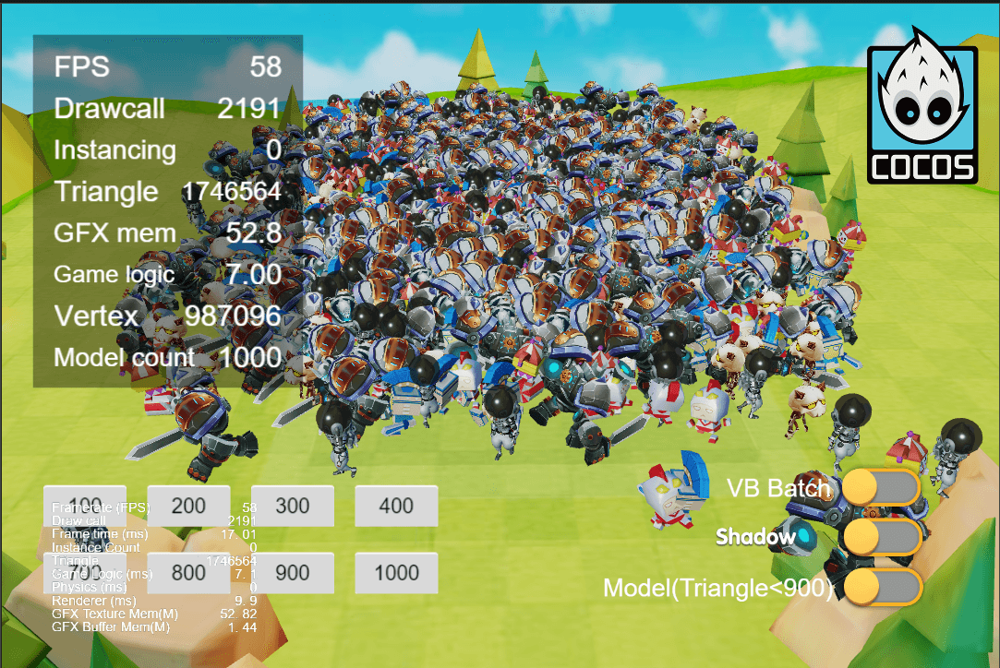
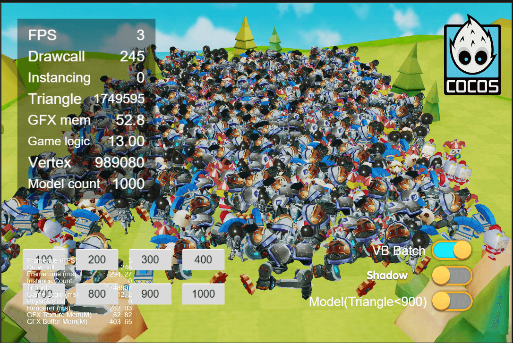

## Cocos Creator How To Use

### 简介

基于 CocosCreator 3.5.0 版本创建的 **VB合并** 工程

### 效果预览
未开启 VB 合并 , 模型未剔除面数 >= 900的模型

开启 VB 合并 , 模型未剔除面数 >= 900的模型 (负优化)

未开启 VB 合并 , 模型剔除面数 >= 900的模型

开启 VB 合并 , 模型剔除面数 >= 900的模型 (负优化)
