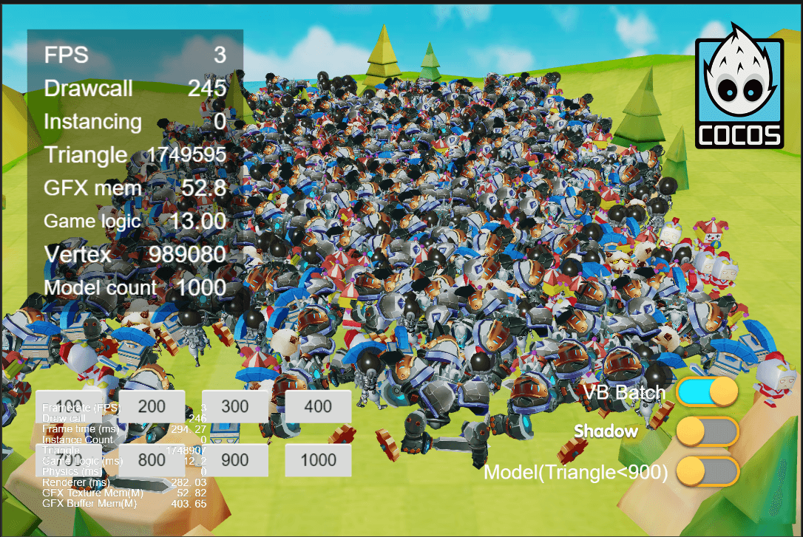
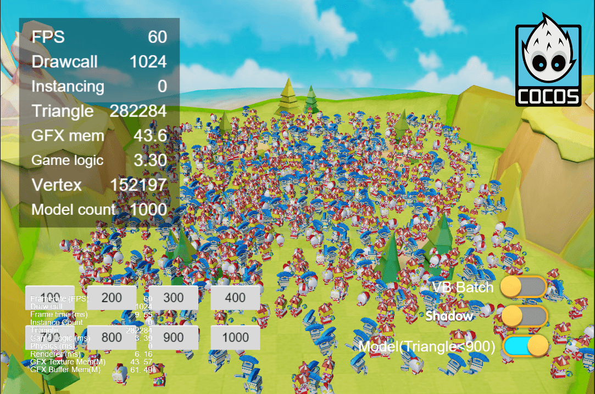
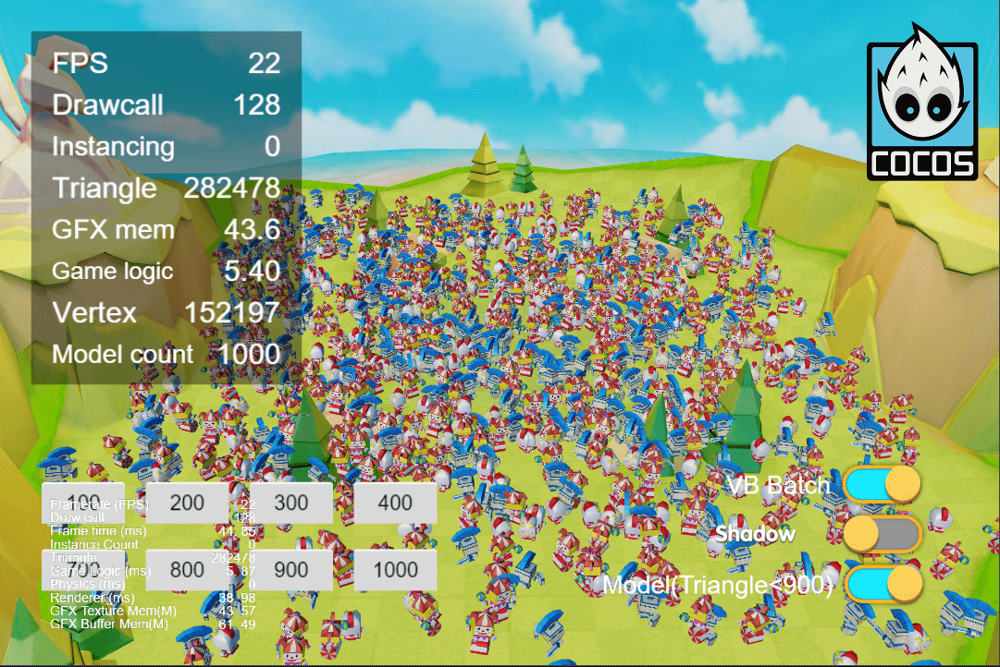

### Introduction
**VB Batch** project created based on CocosCreator version 3.6.0

### Preview
Without VB Batch, Model triangular surface >= 900

With VB Batch , Model triangular surface  >= 900

Without VB Batch, Model triangular surface >= 900

With VB Batch , Model triangular surface >= 900
