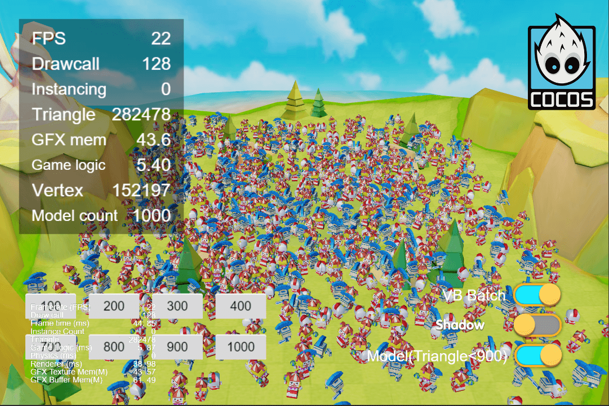

## Cocos Creator How To Use

### Performance
| 序号 | 类目 | 子项 | 演示 |
| :---: | :---: | :---: | :---: |
| 1 | Performance | [GPU Instancing](https://gitee.com/yeshao2069/cocos-creator-how-to-use/tree/v3.5.x/proj/Performance/Creator3.5.0_3D_GpuInstancing)  | 

 |
| 2 | Performance | [静态合批](https://gitee.com/yeshao2069/cocos-creator-how-to-use/tree/v3.5.x/proj/Performance/Creator3.5.0_3D_StaticBatch)  | 

 |
| 3 | Performance | [VB合并](https://gitee.com/yeshao2069/cocos-creator-how-to-use/tree/v3.5.x/proj/Performance/Creator3.5.0_3D_VBBatch)  | 

 |
| 4 | Performance | [遮挡查询剔除(原生)](https://gitee.com/yeshao2069/cocos-creator-how-to-use/tree/v3.5.x/proj/Performance/Creator3.5.0_3D_NativeOcclusionQuery)  | 

  |