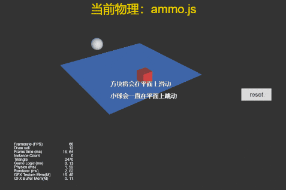
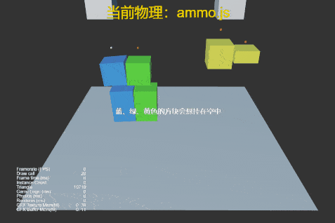
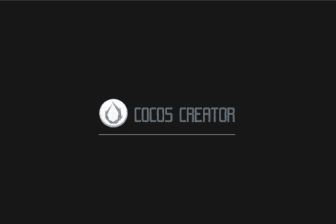
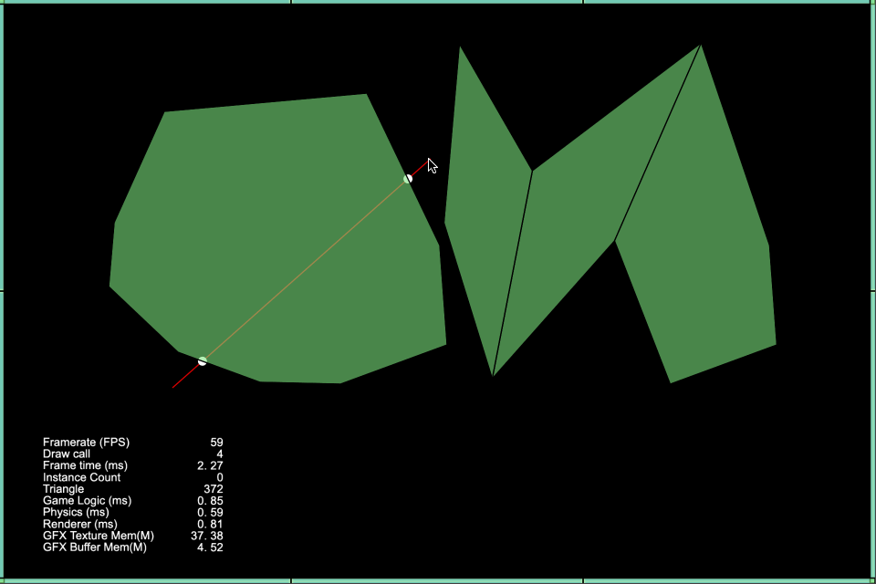
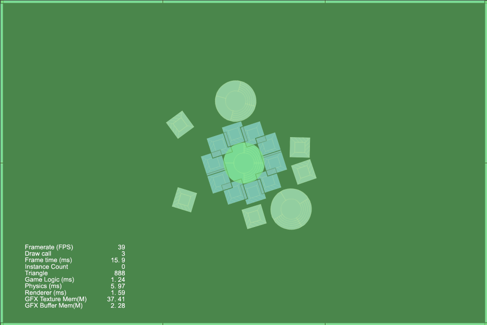
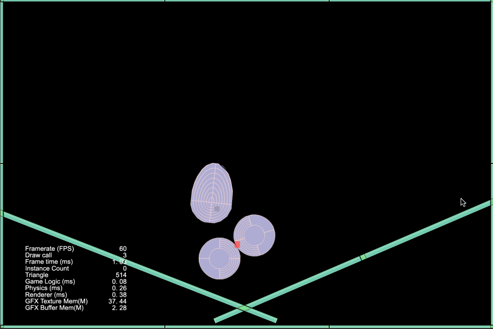

### Physics
| 序号 | 类型 | 项目 | 演示 |
| :---: | :---: | :---: | :---: |
| 1 | 3D | [检测碰撞体是否存在](https://github.com/yeshao2069/CocosCreatorHowToUse/tree/v3.6.x/proj/Physics/Creator3.6.0_3D_PhysicsRaycastClosest) | 

  |
| 2 | 3D | [射线检测](https://github.com/yeshao2069/CocosCreatorHowToUse/tree/v3.6.x/proj/Physics/Creator3.6.0_3D_PhysicsRaycast) | 

 |
| 3 | 3D | [使用物理材质](https://github.com/yeshao2069/CocosCreatorHowToUse/tree/v3.6.x/proj/Physics/Creator3.6.0_3D_PhysicsMaterial) | 

 |
| 4 | 3D | [使用网格碰撞器组件](https://github.com/yeshao2069/CocosCreatorHowToUse/tree/v3.6.x/proj/Physics/Creator3.6.0_3D_PhysicsMeshCollider) | 

 |
| 5 | 3D | [物体旋转跳跃](https://github.com/yeshao2069/CocosCreatorHowToUse/tree/v3.6.x/proj/Physics/Creator3.6.0_3D_PhysicsRotateJumpWithVelocity) | 

 |
| 6 | 3D | [使用触发器-触发事件](https://github.com/yeshao2069/CocosCreatorHowToUse/tree/v3.6.x/proj/Physics/Creator3.6.0_3D_PhysicsTriggerEvent) | 

 |
| 7 | 3D | [运行时更新碰撞体数据](https://github.com/yeshao2069/CocosCreatorHowToUse/tree/v3.6.x/proj/Physics/Creator3.6.0_3D_PhysicsRuntimeUpdate) | 

 |
| 8 | 3D | [使用平面碰撞器组件](https://github.com/yeshao2069/CocosCreatorHowToUse/tree/v3.6.x/proj/Physics/Creator3.6.0_3D_PhysicsPlaneCollider) | 

 |
| 9 | 3D | [物理同步](https://github.com/yeshao2069/CocosCreatorHowToUse/tree/v3.6.x/proj/Physics/Creator3.6.0_3D_PhysicsSync) | 

 |
| 10 | 3D | [物理分组掩码](https://github.com/yeshao2069/CocosCreatorHowToUse/tree/v3.6.x/proj/Physics/Creator3.6.0_3D_PhysicsGroupMask) | 

 |
| 11 | 3D | [物理动态运行](https://github.com/yeshao2069/CocosCreatorHowToUse/tree/v3.6.x/proj/Physics/Creator3.6.0_3D_PhysicsRunDynamic) | 

 |
| 12 | 3D | [不规则物体碰撞](https://github.com/yeshao2069/CocosCreatorHowToUse/tree/v3.6.x/proj/Physics/Creator3.6.0_3D_PhysicsConvexColliders) | 

 |
| 13 | 3D | [点对点约束](https://github.com/yeshao2069/CocosCreatorHowToUse/tree/v3.6.x/proj/Physics/Creator3.6.0_3D_PhysicsPointToPointConstraint) | 

 |
| 14 | 3D | [碰撞点数据测试](https://github.com/yeshao2069/CocosCreatorHowToUse/tree/v3.6.x/proj/Physics/Creator3.6.0_3D_PhysicsContactData) | 

 |
| 15 | 3D | [链条约束](https://github.com/yeshao2069/CocosCreatorHowToUse/tree/v3.6.x/proj/Physics/Creator3.6.0_3D_PhysicsHingeConstraint) | 

 |
| 16 | 3D | [使用恒力组件](https://github.com/yeshao2069/CocosCreatorHowToUse/tree/v3.6.x/proj/Physics/Creator3.6.0_3D_PhysicsForceConstant) | 

 |
| 17 | 3D | [使用碰撞器-碰撞事件](https://github.com/yeshao2069/CocosCreatorHowToUse/tree/v3.6.x/proj/Physics/Creator3.6.0_3D_PhysicsCollisionEvent) | 

 |
| 18 | 3D | [胶囊体触发器测试](https://github.com/yeshao2069/CocosCreatorHowToUse/tree/v3.6.x/proj/Physics/Creator3.6.0_3D_PhysicsCapsuleTrigger) | 

 |
| 19 | 2D | [2D浮力](https://github.com/yeshao2069/CocosCreatorHowToUse/tree/v3.6.x/proj/Physics/Creator3.6.0_2D_Buoyancy) | 

 |
| 20 | 3D | [3D浮力](https://github.com/yeshao2069/CocosCreatorHowToUse/tree/v3.6.x/proj/Physics/Creator3.6.0_3D_Buoyancy) | 

 |
| 21 | 3D | [坠落的小球](https://github.com/yeshao2069/CocosCreatorHowToUse/tree/v3.6.x/proj/Physics/Creator3.6.1_3D_FallingBall) | 

 |
| 22 | 2D | [基于box2D物体切割](https://github.com/yeshao2069/CocosCreatorHowToUse/tree/v3.6.x/proj/Physics/Creator3.6.1_Box2D_CuttingObjects) | 

 |
| 23 | 2D | [基于box2D重力辐射](https://github.com/yeshao2069/CocosCreatorHowToUse/tree/v3.6.x/proj/Physics/Creator3.6.1_Box2D_GravityRadial) | 

 |
| 24 | 2D | [基于box2D不规则碰撞](https://github.com/yeshao2069/CocosCreatorHowToUse/tree/v3.6.x/proj/Physics/Creator3.6.1_Box2D_Manifold) | 

 |
| 25 | 2D | [基于box2D单向平台](https://github.com/yeshao2069/CocosCreatorHowToUse/tree/v3.6.x/proj/Physics/Creator3.6.1_Box2D_OneWayPlatform) | 

 |
| 26 | 2D | [基于box2D物体射线检测](https://github.com/yeshao2069/CocosCreatorHowToUse/tree/v3.6.x/proj/Physics/Creator3.6.1_Box2D_Raycast) | 

 |
| 27 | 2D | [基于box2D物体射线检测反射](https://github.com/yeshao2069/CocosCreatorHowToUse/tree/v3.6.x/proj/Physics/Creator3.6.1_Box2D_RaycastReflection) | 

 |
| 28 | 2D | [基于box2D距离关节](https://github.com/yeshao2069/CocosCreatorHowToUse/tree/v3.6.x/proj/Physics/Creator3.6.1_Box2D_DistanceJoint) | 

 |
| 29 | 2D | [基于box2D距离关节链](https://github.com/yeshao2069/CocosCreatorHowToUse/tree/v3.6.x/proj/Physics/Creator3.6.1_Box2D_DistanceJointChain) | 

 |
| 30 | 2D | [基于box2D固定关节布偶](https://github.com/yeshao2069/CocosCreatorHowToUse/tree/v3.6.x/proj/Physics/Creator3.6.1_Box2D_FixedJointRagdoll) | 

 |