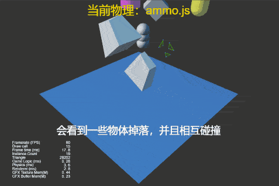
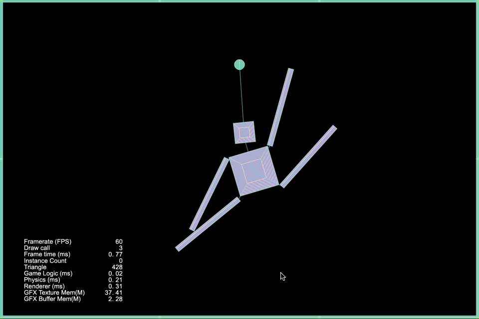

### Physics
| No. | Type | Project | Preview |
| :---: | :---: | :---: | :---: |
| 1 | 3D | [Physics Raycast Closest](https://github.com/yeshao2069/CocosCreatorHowToUse/tree/v3.6.x/proj/Physics/Creator3.6.0_3D_PhysicsRaycastClosest) | 

  |
| 2 | 3D | [Physics Raycast](https://github.com/yeshao2069/CocosCreatorHowToUse/tree/v3.6.x/proj/Physics/Creator3.6.0_3D_PhysicsRaycast) | 

 |
| 3 | 3D | [Physics Material](https://github.com/yeshao2069/CocosCreatorHowToUse/tree/v3.6.x/proj/Physics/Creator3.6.0_3D_PhysicsMaterial) | 

 |
| 4 | 3D | [Physics Mesh Collider](https://github.com/yeshao2069/CocosCreatorHowToUse/tree/v3.6.x/proj/Physics/Creator3.6.0_3D_PhysicsMeshCollider) | 

 |
| 5 | 3D | [Physics Rotate Jump With Velocity](https://github.com/yeshao2069/CocosCreatorHowToUse/tree/v3.6.x/proj/Physics/Creator3.6.0_3D_PhysicsRotateJumpWithVelocity) | 

 |
| 6 | 3D | [Physics Trigger Event](https://github.com/yeshao2069/CocosCreatorHowToUse/tree/v3.6.x/proj/Physics/Creator3.6.0_3D_PhysicsTriggerEvent) | 

 |
| 7 | 3D | [Physics Runtime Update](https://github.com/yeshao2069/CocosCreatorHowToUse/tree/v3.6.x/proj/Physics/Creator3.6.0_3D_PhysicsRuntimeUpdate) | 

 |
| 8 | 3D | [Physics Plane Collider](https://github.com/yeshao2069/CocosCreatorHowToUse/tree/v3.6.x/proj/Physics/Creator3.6.0_3D_PhysicsPlaneCollider) | 

 |
| 9 | 3D | [Physics Sync](https://github.com/yeshao2069/CocosCreatorHowToUse/tree/v3.6.x/proj/Physics/Creator3.6.0_3D_PhysicsSync) | 

 |
| 10 | 3D | [Physics Group Mask](https://github.com/yeshao2069/CocosCreatorHowToUse/tree/v3.6.x/proj/Physics/Creator3.6.0_3D_PhysicsGroupMask) | 

 |
| 11 | 3D | [Physics Runtime Dynamic](https://github.com/yeshao2069/CocosCreatorHowToUse/tree/v3.6.x/proj/Physics/Creator3.6.0_3D_PhysicsRunDynamic) | 

 |
| 12 | 3D | [Physics Convex Colliders](https://github.com/yeshao2069/CocosCreatorHowToUse/tree/v3.6.x/proj/Physics/Creator3.6.0_3D_PhysicsConvexColliders) | 

 |
| 13 | 3D | [Physics Point To Point Constraint](https://github.com/yeshao2069/CocosCreatorHowToUse/tree/v3.6.x/proj/Physics/Creator3.6.0_3D_PhysicsPointToPointConstraint) | 

 |
| 14 | 3D | [Physics Contact Data](https://github.com/yeshao2069/CocosCreatorHowToUse/tree/v3.6.x/proj/Physics/Creator3.6.0_3D_PhysicsContactData) | 

 |
| 15 | 3D | [Physics Hinge Constraint](https://github.com/yeshao2069/CocosCreatorHowToUse/tree/v3.6.x/proj/Physics/Creator3.6.0_3D_PhysicsHingeConstraint) | 

 |
| 16 | 3D | [Physics Force Constant](https://github.com/yeshao2069/CocosCreatorHowToUse/tree/v3.6.x/proj/Physics/Creator3.6.0_3D_PhysicsForceConstant) | 

 |
| 17 | 3D | [Physics Collision Event](https://github.com/yeshao2069/CocosCreatorHowToUse/tree/v3.6.x/proj/Physics/Creator3.6.0_3D_PhysicsCollisionEvent) | 

 |
| 18 | 3D | [Physics Capsule Trigger](https://github.com/yeshao2069/CocosCreatorHowToUse/tree/v3.6.x/proj/Physics/Creator3.6.0_3D_PhysicsCapsuleTrigger) | 

 |
| 19 | 2D | [Buoyancy 2D](https://github.com/yeshao2069/CocosCreatorHowToUse/tree/v3.6.x/proj/Physics/Creator3.6.0_2D_Buoyancy) | 

 |
| 20 | 3D | [Buoyancy 3D](https://github.com/yeshao2069/CocosCreatorHowToUse/tree/v3.6.x/proj/Physics/Creator3.6.0_3D_Buoyancy) | 

 |
| 21 | 3D | [Physics Falling Ball](https://github.com/yeshao2069/CocosCreatorHowToUse/tree/v3.6.x/proj/Physics/Creator3.6.1_3D_FallingBall) | 

 |
| 22 | 2D | [Box2D Cutting Objects](https://github.com/yeshao2069/CocosCreatorHowToUse/tree/v3.6.x/proj/Physics/Creator3.6.1_Box2D_CuttingObjects) | 

 |
| 23 | 2D | [Box2D Gravity Radial](https://github.com/yeshao2069/CocosCreatorHowToUse/tree/v3.6.x/proj/Physics/Creator3.6.1_Box2D_GravityRadial) | 

 |
| 24 | 2D | [Box2D Manifold](https://github.com/yeshao2069/CocosCreatorHowToUse/tree/v3.6.x/proj/Physics/Creator3.6.1_Box2D_Manifold) | 

 |
| 25 | 2D | [Box2D One Way Platform](https://github.com/yeshao2069/CocosCreatorHowToUse/tree/v3.6.x/proj/Physics/Creator3.6.1_Box2D_OneWayPlatform) | 

 |
| 26 | 2D | [Box2D Raycast](https://github.com/yeshao2069/CocosCreatorHowToUse/tree/v3.6.x/proj/Physics/Creator3.6.1_Box2D_Raycast) | 

 |
| 27 | 2D | [Box2D Raycast Reflection](https://github.com/yeshao2069/CocosCreatorHowToUse/tree/v3.6.x/proj/Physics/Creator3.6.1_Box2D_RaycastReflection) | 

 |
| 28 | 2D | [Box2D Distance Joint](https://github.com/yeshao2069/CocosCreatorHowToUse/tree/v3.6.x/proj/Physics/Creator3.6.1_Box2D_DistanceJoint) | 

 |
| 29 | 2D | [Box2D Distance Joint Chain](https://github.com/yeshao2069/CocosCreatorHowToUse/tree/v3.6.x/proj/Physics/Creator3.6.1_Box2D_DistanceJointChain) | 

 |
| 30 | 2D | [Box2D Fixed Joint Ragdoll](https://github.com/yeshao2069/CocosCreatorHowToUse/tree/v3.6.x/proj/Physics/Creator3.6.1_Box2D_FixedJointRagdoll) | 

 |