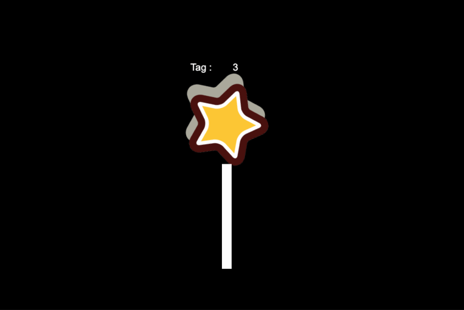

### Introduction

project created based on CocosCreator version 3.6.2 **物理碰撞标签** 

### Preview

### Related Links
[Gitee](https://gitee.com/mirrors_cocos-creator/cocos-example-physics/tree/v3.x/2d/common/assets/cases) | [Github](https://github.com/cocos/cocos-example-physics/tree/v3.x/2d/common/assets/cases)