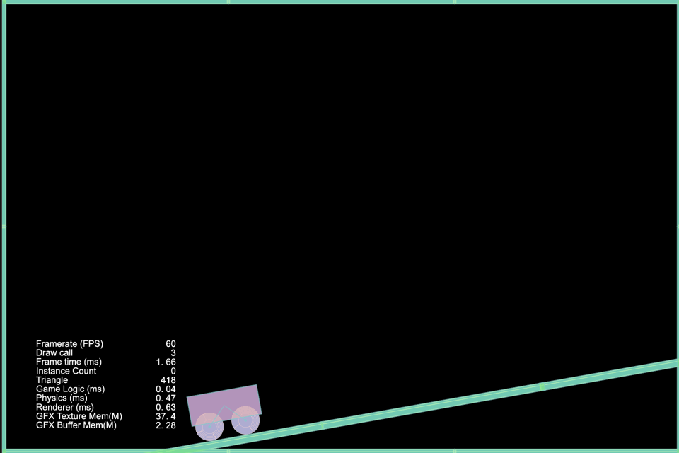
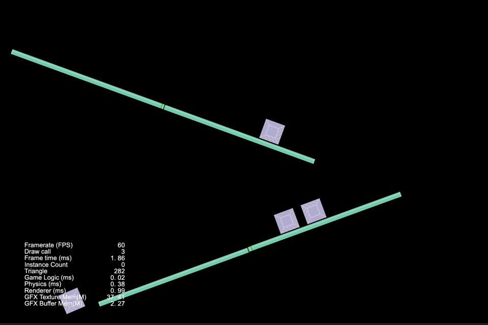

### Physics
| 序号 | 类型 | 项目 | 演示 |
| :---: | :---: | :---: | :---: |
| 31 | 2D | [基于box2D链条关节](https://github.com/yeshao2069/CocosCreatorHowToUse/tree/v3.6.x/proj/Physics2/Creator3.6.1_Box2D_HingeJoint) | 

 |
| 32 | 2D | [基于box2D链条关节曲柄](https://github.com/yeshao2069/CocosCreatorHowToUse/tree/v3.6.x/proj/Physics2/Creator3.6.1_Box2D_HingeJointCrank) | 

 |
| 33 | 2D | [基于box2D鼠标关节](https://github.com/yeshao2069/CocosCreatorHowToUse/tree/v3.6.x/proj/Physics2/Creator3.6.1_Box2D_MouseJoint) | 

 |
| 34 | 2D | [基于box2D相对关节人偶](https://github.com/yeshao2069/CocosCreatorHowToUse/tree/v3.6.x/proj/Physics2/Creator3.6.1_Box2D_RelativeJointHuman) | 

 |
| 35 | 2D | [基于box2D相对关节线性偏移](https://github.com/yeshao2069/CocosCreatorHowToUse/tree/v3.6.x/proj/Physics2/Creator3.6.1_Box2D_RelativeJointLinearOffset) | 

 |
| 36 | 2D | [基于box2D滑块关节](https://github.com/yeshao2069/CocosCreatorHowToUse/tree/v3.6.x/proj/Physics2/Creator3.6.1_Box2D_SliderJoint) | 

 |
| 37 | 2D | [基于box2D弹簧关节](https://github.com/yeshao2069/CocosCreatorHowToUse/tree/v3.6.x/proj/Physics2/Creator3.6.1_Box2D_SpringJointDamp) | 

 |
| 38 | 2D | [基于box2D弹簧关节频率](https://github.com/yeshao2069/CocosCreatorHowToUse/tree/v3.6.x/proj/Physics2/Creator3.6.1_Box2D_SpringJointFrequency) | 

 |
| 39 | 2D | [基于box2D轮轴关节](https://github.com/yeshao2069/CocosCreatorHowToUse/tree/v3.6.x/proj/Physics2/Creator3.6.1_Box2D_WheelJoint) | 

 |
| 40 | 2D | [基于box2D动画](https://github.com/yeshao2069/CocosCreatorHowToUse/tree/v3.6.x/proj/Physics2/Creator3.6.1_Box2D_Animated) | 

 |
| 41 | 2D | [基于box2D线性冲力](https://github.com/yeshao2069/CocosCreatorHowToUse/tree/v3.6.x/proj/Physics2/Creator3.6.1_Box2D_LinearImpulse) | 

 |
| 42 | 2D | [基于box2D物体摩擦力](https://github.com/yeshao2069/CocosCreatorHowToUse/tree/v3.6.x/proj/Physics2/Creator3.6.1_Box2D_VaringFriction) | 

 |
| 43 | 2D | [基于box2D物体恢复原状](https://github.com/yeshao2069/CocosCreatorHowToUse/tree/v3.6.x/proj/Physics2/Creator3.6.1_Box2D_VaringRestitution) | 

 |
| 44 | 2D | [物理点击测试(2D)](https://github.com/yeshao2069/CocosCreatorHowToUse/tree/v3.6.x/proj/Physics2/Creator3.6.2_2D_PhysicalHitTest) | 

 |
| 45 | 2D | [物理碰撞标签](https://github.com/yeshao2069/CocosCreatorHowToUse/tree/v3.6.x/proj/Physics2/Creator3.6.2_2D_PhysicalTag) | 

 |
| 46 | 2D | [物理形状碰撞](https://github.com/yeshao2069/CocosCreatorHowToUse/tree/v3.6.x/proj/Physics2/Creator3.6.2_2D_PhysicalShape) | 

 |
| 47 | 2D | [物理碰撞分组](https://github.com/yeshao2069/CocosCreatorHowToUse/tree/v3.6.x/proj/Physics2/Creator3.6.2_2D_PhysicalMask) | 

 |