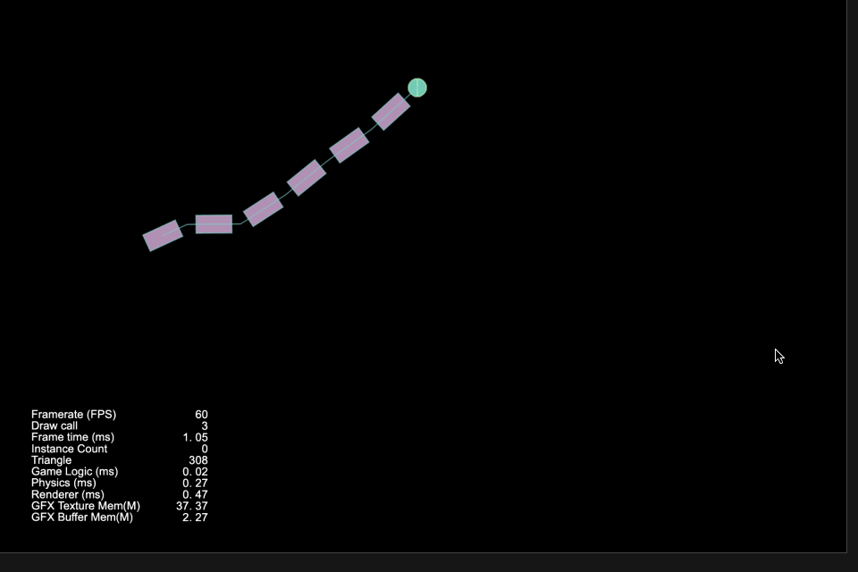

### Physics
| No. | Type | Project | Preview |
| :---: | :---: | :---: | :---: |
| 31 | 2D | [Box2D Hinge Joint](https://github.com/yeshao2069/CocosCreatorHowToUse/tree/v3.6.x/proj/Physics2/Creator3.6.1_Box2D_HingeJoint) | 

 |
| 32 | 2D | [Box2D Hinge Joint Crank](https://github.com/yeshao2069/CocosCreatorHowToUse/tree/v3.6.x/proj/Physics2/Creator3.6.1_Box2D_HingeJointCrank) | 

 |
| 33 | 2D | [Box2D Mouse Joint](https://github.com/yeshao2069/CocosCreatorHowToUse/tree/v3.6.x/proj/Physics2/Creator3.6.1_Box2D_MouseJoint) | 

 |
| 34 | 2D | [Box2D Relative Joint Human](https://github.com/yeshao2069/CocosCreatorHowToUse/tree/v3.6.x/proj/Physics2/Creator3.6.1_Box2D_RelativeJointHuman) | 

 |
| 35 | 2D | [Box2D Relative Joint Linear Offset](https://github.com/yeshao2069/CocosCreatorHowToUse/tree/v3.6.x/proj/Physics2/Creator3.6.1_Box2D_RelativeJointLinearOffset) | 

 |
| 36 | 2D | [Box2D Slider Joint](https://github.com/yeshao2069/CocosCreatorHowToUse/tree/v3.6.x/proj/Physics2/Creator3.6.1_Box2D_SliderJoint) | 

 |
| 37 | 2D | [Box2D Spring Joint Damp](https://github.com/yeshao2069/CocosCreatorHowToUse/tree/v3.6.x/proj/Physics2/Creator3.6.1_Box2D_SpringJointDamp) | 

 |
| 38 | 2D | [Box2D Spring Joint Frequency](https://github.com/yeshao2069/CocosCreatorHowToUse/tree/v3.6.x/proj/Physics2/Creator3.6.1_Box2D_SpringJointFrequency) | 

 |
| 39 | 2D | [Box2D Wheel Joint](https://github.com/yeshao2069/CocosCreatorHowToUse/tree/v3.6.x/proj/Physics2/Creator3.6.1_Box2D_WheelJoint) | 

 |
| 40 | 2D | [Box2D Animated](https://github.com/yeshao2069/CocosCreatorHowToUse/tree/v3.6.x/proj/Physics2/Creator3.6.1_Box2D_Animated) | 

 |
| 41 | 2D | [Box2D Linear Impulse](https://github.com/yeshao2069/CocosCreatorHowToUse/tree/v3.6.x/proj/Physics2/Creator3.6.1_Box2D_LinearImpulse) | 

 |
| 42 | 2D | [Box2D Varing Friction](https://github.com/yeshao2069/CocosCreatorHowToUse/tree/v3.6.x/proj/Physics2/Creator3.6.1_Box2D_VaringFriction) | 

 |
| 43 | 2D | [Box2D Varing Restitution](https://github.com/yeshao2069/CocosCreatorHowToUse/tree/v3.6.x/proj/Physics2/Creator3.6.1_Box2D_VaringRestitution) | 

 |
| 44 | 2D | [Physical Hit Test](https://github.com/yeshao2069/CocosCreatorHowToUse/tree/v3.6.x/proj/Physics2/Creator3.6.2_2D_PhysicalHitTest) | 

 |
| 45 | 2D | [Physical Tag](https://github.com/yeshao2069/CocosCreatorHowToUse/tree/v3.6.x/proj/Physics2/Creator3.6.2_2D_PhysicalTag) | 

 |
| 46 | 2D | [Physical Shape](https://github.com/yeshao2069/CocosCreatorHowToUse/tree/v3.6.x/proj/Physics2/Creator3.6.2_2D_PhysicalShape) | 

 |
| 47 | 2D | [Physical Mask](https://github.com/yeshao2069/CocosCreatorHowToUse/tree/v3.6.x/proj/Physics2/Creator3.6.2_2D_PhysicalMask) | 

 |