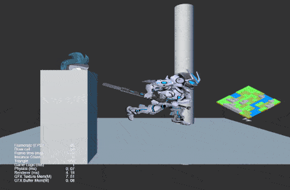

### Renderer
| No. | Type | Project | Preview |
| :---: | :---: | :---: | :---: |
| 1 | 3D | [2D Rendering In 3D](https://github.com/yeshao2069/CocosCreatorHowToUse/tree/v3.6.x/proj/Renderer/Creator3.6.0_2dRenderingIn3d)  | 

 |
| 2 | 2D | [Web Capture](https://github.com/yeshao2069/CocosCreatorHowToUse/tree/v3.6.x/proj/Renderer/Creator3.6.0_Capture)  | 

  |