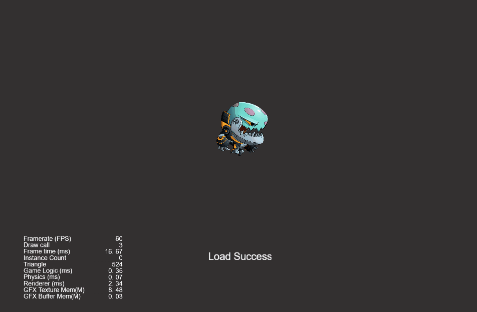
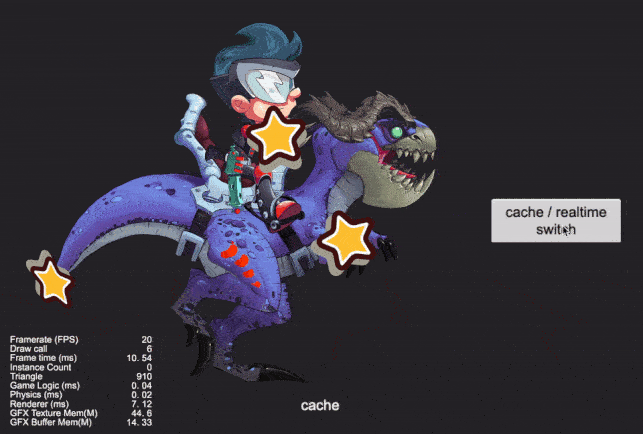
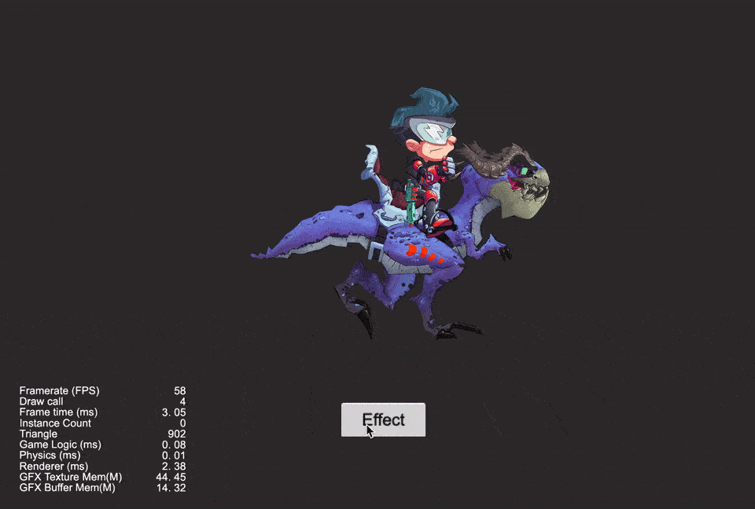
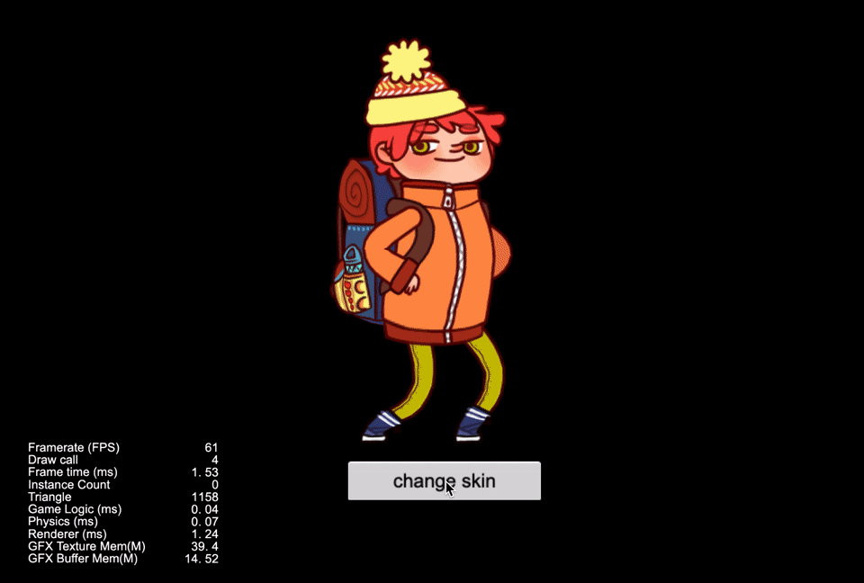
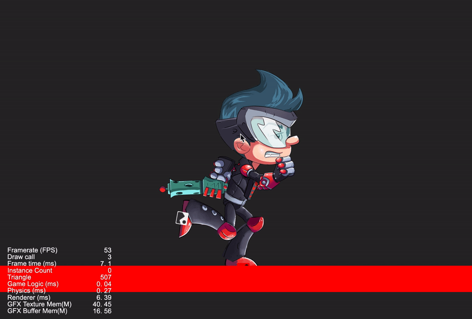
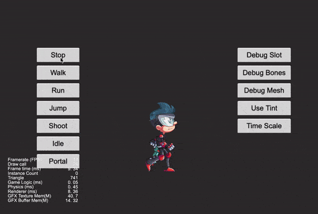
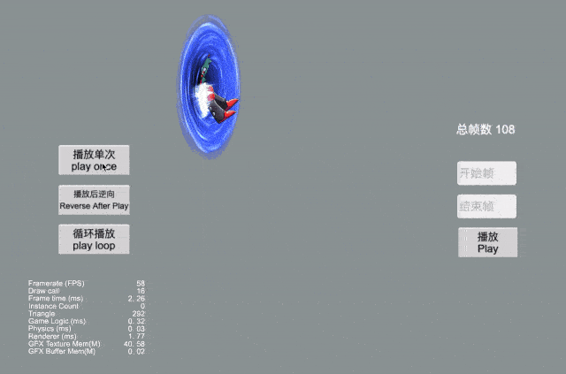

### Spine
| No. | Type | Project | Preview |
| :---: | :---: | :---: | :---: |
| 1 | 2D | [Dynamic Load Spine](https://github.com/yeshao2069/CocosCreatorHowToUse/tree/v3.6.x/proj/Spine/Creator3.6.0_2D_LoadSpine) | 

  |
| 2 | 2D | [Spine Attach](https://github.com/yeshao2069/CocosCreatorHowToUse/tree/v3.6.x/proj/Spine/Creator3.6.0_2D_SpineAttach) | 

  |
| 3 | 2D | [Spine Mesh](https://github.com/yeshao2069/CocosCreatorHowToUse/tree/v3.6.x/proj/Spine/Creator3.6.0_2D_SpineMesh) | 

 |
| 4 | 2D | [Spine Change Skin](https://github.com/yeshao2069/CocosCreatorHowToUse/tree/v3.6.x/proj/Spine/Creator3.6.0_2D_SpineSkin) | 

 |
| 5 | 2D | [Spine Collider](https://github.com/yeshao2069/CocosCreatorHowToUse/tree/v3.6.x/proj/Spine/Creator3.6.0_2D_SpineCollider) | 

 |
| 6 | 2D | [Spine Boy](https://github.com/yeshao2069/CocosCreatorHowToUse/tree/v3.6.x/proj/Spine/Creator3.6.0_2D_SpineBoy) | 

 |
| 7 | 2D | [Spine Specified Frame](https://github.com/yeshao2069/CocosCreatorHowToUse/tree/v3.6.x/proj/Spine/Creator3.6.0_2D_SpineSpecifiedFrame) | 

