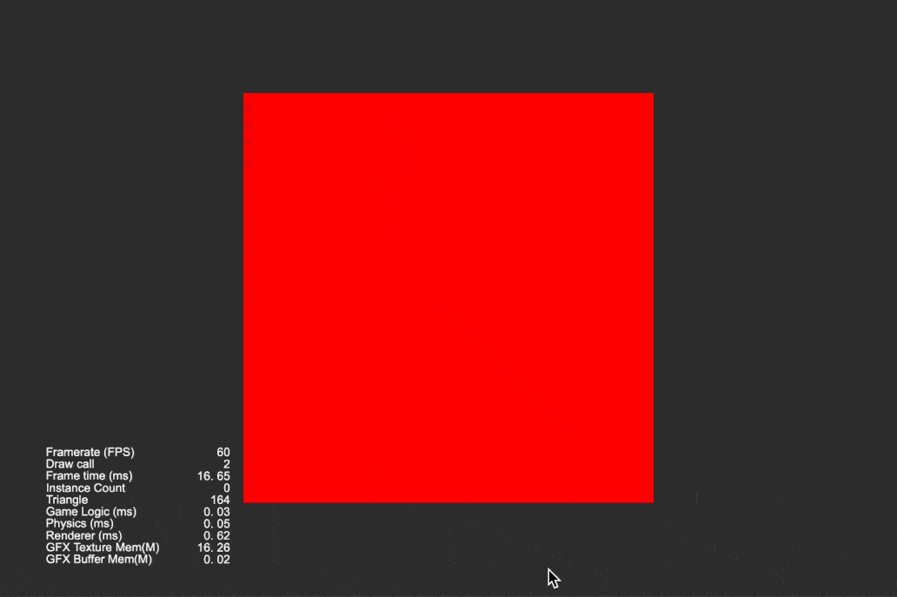

### Tween
| No. | Type | Project | Preview |
| :---: | :---: | :---: | :---: |
| 1 | 2D | [透明度渐变](https://github.com/yeshao2069/CocosCreatorHowToUse/tree/v3.6.x/proj/Tween/Creator3.6.0_2D_TweenOpacityChange) | 

 |
| 2 | 2D | [旋转](https://github.com/yeshao2069/CocosCreatorHowToUse/tree/v3.6.x/proj/Tween/Creator3.6.0_3D_TweenRotateChange) | 

 |
| 3 | 2D | [环形运动](https://github.com/yeshao2069/CocosCreatorHowToUse/tree/v3.6.x/proj/Tween/Creator3.6.0_2D_TweenCircleMove) | 

 |
| 4 | 2D | [旋转并缩放](https://github.com/yeshao2069/CocosCreatorHowToUse/tree/v3.6.x/proj/Tween/Creator3.6.0_2D_TweenRotateAndScaleForever)  | 

 |
| 5 | 2D | [使用Easing示例](https://github.com/yeshao2069/CocosCreatorHowToUse/tree/v3.6.x/proj/Tween/Creator3.6.0_2D_TweenShowMonster)  | 

 |
| 6 | 2D | [Tween封装](https://github.com/yeshao2069/CocosCreatorHowToUse/tree/v3.6.x/proj/Tween/Creator3.6.0_2D_TweenCCUtils)  |   |