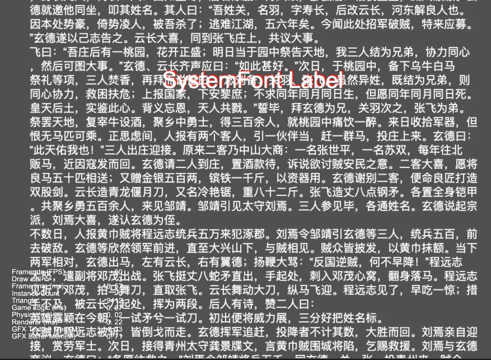
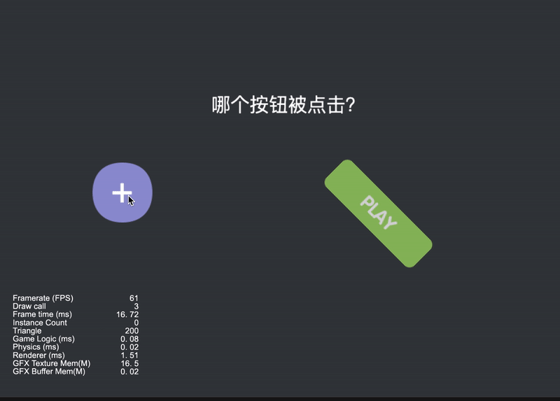
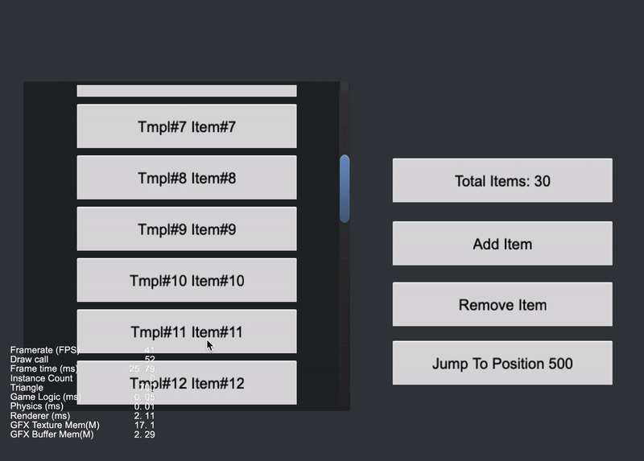
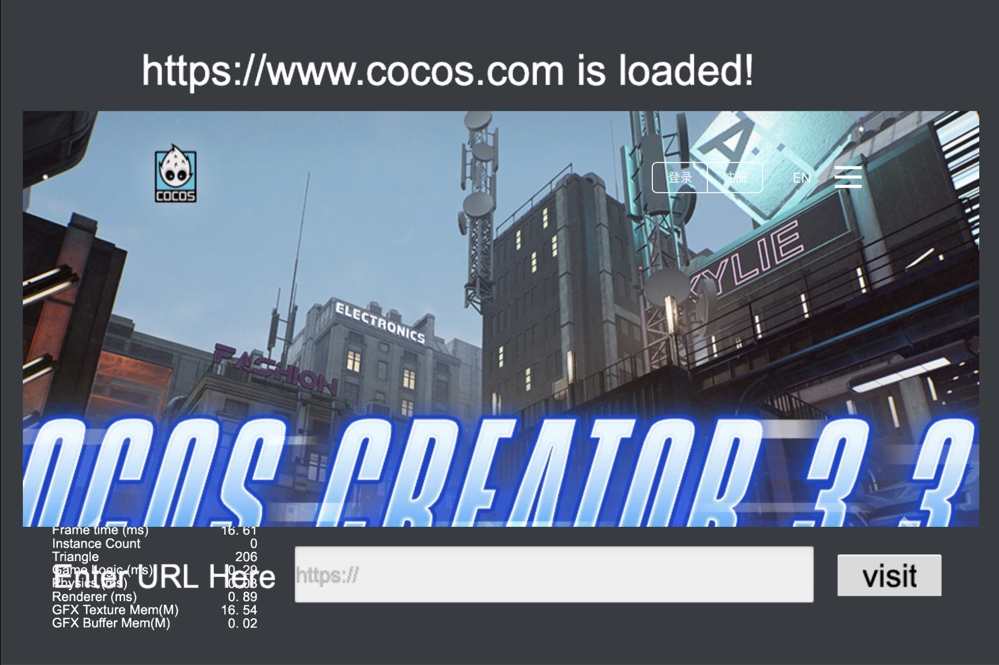
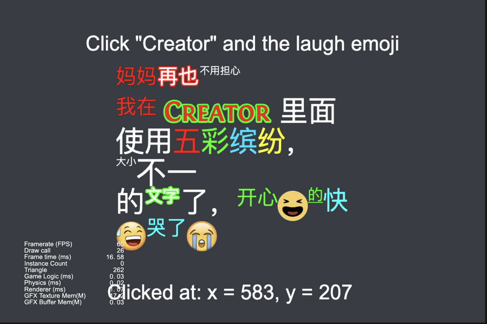
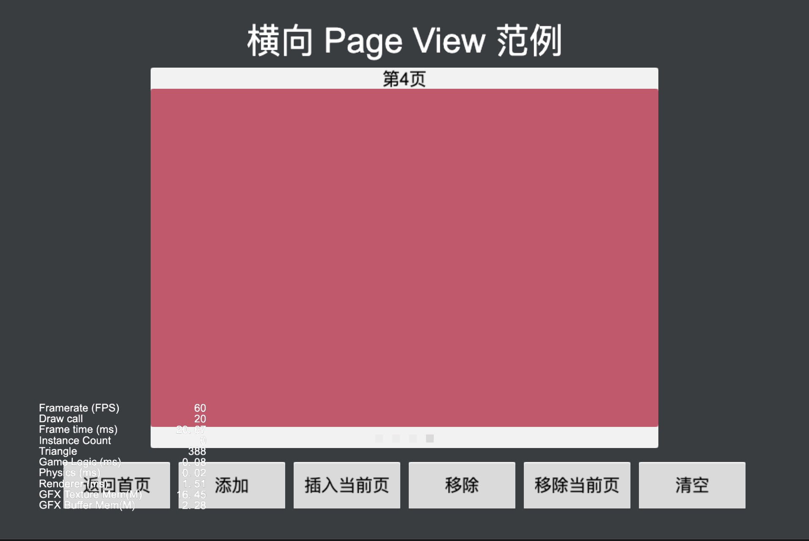
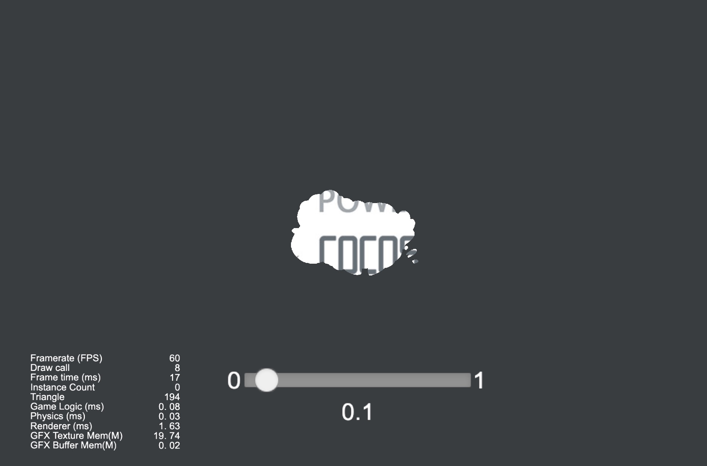
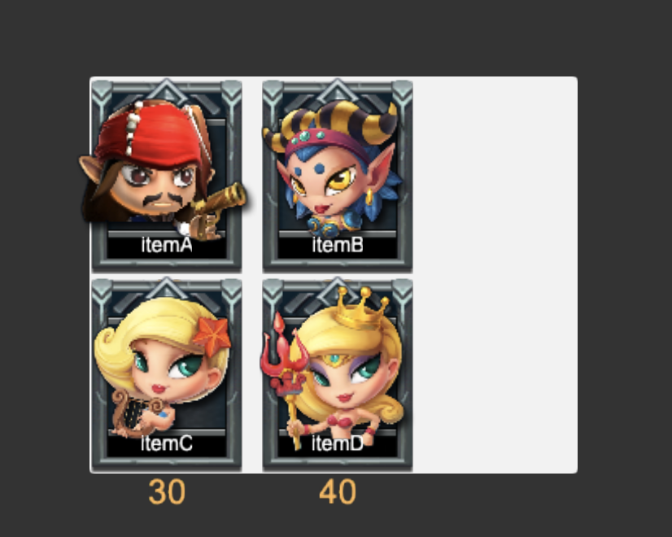
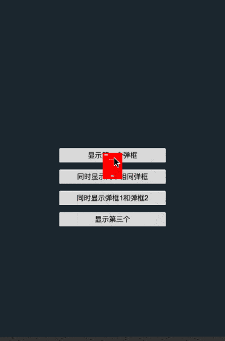

### UI
| No. | Type | Project | Mark | Preview |
| :---: | :---: | :---: | :---: | :---: |
|  | Widget | AlignOnceWidget | DEMO Link [Gitee](https://gitee.com/mirrors_cocos-creator/example-cases/tree/v2.4.3/assets/cases/02_ui/01_widget) && [Github](https://github.com/cocos-creator/example-cases/tree/v2.4.3/assets/cases/02_ui/01_widget)  |    |
|  | Widget | AnimatedWidget | DEMO Link [Gitee](https://gitee.com/mirrors_cocos-creator/example-cases/tree/v2.4.3/assets/cases/02_ui/01_widget) && [Github](https://github.com/cocos-creator/example-cases/tree/v2.4.3/assets/cases/02_ui/01_widget)  |    |
|  | Label | AlignFontLabel | DEMO Link [Gitee](https://gitee.com/mirrors_cocos-creator/example-cases/tree/v2.4.3/assets/cases/02_ui/02_label) && [Github](https://github.com/cocos-creator/example-cases/tree/v2.4.3/assets/cases/02_ui/02_label)  |    |
|  | Label | AlignFontLabelTTF | DEMO Link [Gitee](https://gitee.com/mirrors_cocos-creator/example-cases/tree/v2.4.3/assets/cases/02_ui/02_label) && [Github](https://github.com/cocos-creator/example-cases/tree/v2.4.3/assets/cases/02_ui/02_label)  |    |
|  | Label | Label | DEMO Link [Gitee](https://gitee.com/mirrors_cocos-creator/example-cases/tree/v2.4.3/assets/cases/02_ui/02_label) && [Github](https://github.com/cocos-creator/example-cases/tree/v2.4.3/assets/cases/02_ui/02_label)  |    |
|  | Label | LabelTTFUpdateAttributes | DEMO Link [Gitee](https://gitee.com/mirrors_cocos-creator/example-cases/tree/v2.4.3/assets/cases/02_ui/02_label) && [Github](https://github.com/cocos-creator/example-cases/tree/v2.4.3/assets/cases/02_ui/02_label)  |    |
|  | Label | TTFLabelEffects | DEMO Link [Gitee](https://gitee.com/mirrors_cocos-creator/example-cases/tree/v2.4.3/assets/cases/02_ui/02_label) && [Github](https://github.com/cocos-creator/example-cases/tree/v2.4.3/assets/cases/02_ui/02_label)  |    |
|  | Label | LargeTTFText | DEMO Link [Gitee](https://gitee.com/mirrors_cocos-creator/example-cases/tree/v2.4.3/assets/cases/02_ui/02_label) && [Github](https://github.com/cocos-creator/example-cases/tree/v2.4.3/assets/cases/02_ui/02_label)  |    |
| 1 | Label | [Large System Font Text](https://github.com/yeshao2069/CocosCreatorHowToUse/tree/v3.6.x/proj/UI/Creator3.6.0_2D_LargeSystemFontText)  LargeSystemFontText  | DEMO Link [Gitee](https://gitee.com/mirrors_cocos-creator/example-cases/tree/v2.4.3/assets/cases/02_ui/02_label) && [Github](https://github.com/cocos-creator/example-cases/tree/v2.4.3/assets/cases/02_ui/02_label)  | 

  |
|  | Button | ButtonSizeMode | DEMO Link [Gitee](https://gitee.com/mirrors_cocos-creator/example-cases/tree/v2.4.3/assets/cases/02_ui/03_button) && [Github](https://github.com/cocos-creator/example-cases/tree/v2.4.3/assets/cases/02_ui/03_button)  |    |
|  | Button | ButtonTransition | DEMO Link [Gitee](https://gitee.com/mirrors_cocos-creator/example-cases/tree/v2.4.3/assets/cases/02_ui/03_button) && [Github](https://github.com/cocos-creator/example-cases/tree/v2.4.3/assets/cases/02_ui/03_button)  |    |
| 2 | Button | [Simple Button](https://github.com/yeshao2069/CocosCreatorHowToUse/tree/v3.6.x/proj/UI/Creator3.6.0_2D_SimpleButton)  SimpleButton | DEMO Link [Gitee](https://gitee.com/mirrors_cocos-creator/example-cases/tree/v2.4.3/assets/cases/02_ui/03_button) && [Github](https://github.com/cocos-creator/example-cases/tree/v2.4.3/assets/cases/02_ui/03_button)   | 

  |    |
|  | ProgressBar | progressbar | DEMO Link [Gitee](https://gitee.com/mirrors_cocos-creator/example-cases/tree/v2.4.3/assets/cases/02_ui/04_progressbar) && [Github](https://github.com/cocos-creator/example-cases/tree/v2.4.3/assets/cases/02_ui/04_progressbar)  |    |
| 3 | ListView | [ListView Usage](https://github.com/yeshao2069/CocosCreatorHowToUse/tree/v3.6.x/proj/UI/Creator3.6.0_2D_ListViewUse)  ListView  | DEMO Link [Gitee](https://gitee.com/mirrors_cocos-creator/example-cases/tree/v2.4.3/assets/cases/02_ui/05_listView) && [Github](https://github.com/cocos-creator/example-cases/tree/v2.4.3/assets/cases/02_ui/05_listView)  | 

  |
|  | Layout | Layout_None_Basic | DEMO Link [Gitee](https://gitee.com/mirrors_cocos-creator/example-cases/tree/v2.4.3/assets/cases/02_ui/06_layout) && [Github](https://github.com/cocos-creator/example-cases/tree/v2.4.3/assets/cases/02_ui/06_layout)  |    |
|  | Layout | Layout_None_Grid | DEMO Link [Gitee](https://gitee.com/mirrors_cocos-creator/example-cases/tree/v2.4.3/assets/cases/02_ui/06_layout) && [Github](https://github.com/cocos-creator/example-cases/tree/v2.4.3/assets/cases/02_ui/06_layout)  |    |
|  | Layout | Layout_None_Horizontal_Vertical | DEMO Link [Gitee](https://gitee.com/mirrors_cocos-creator/example-cases/tree/v2.4.3/assets/cases/02_ui/06_layout) && [Github](https://github.com/cocos-creator/example-cases/tree/v2.4.3/assets/cases/02_ui/06_layout)  |    |
|  | Layout | Layout_ResizeChildren_Grid | DEMO Link [Gitee](https://gitee.com/mirrors_cocos-creator/example-cases/tree/v2.4.3/assets/cases/02_ui/06_layout) && [Github](https://github.com/cocos-creator/example-cases/tree/v2.4.3/assets/cases/02_ui/06_layout)  |    |
|  | Layout | Layout_ResizeChildren_Normal | DEMO Link [Gitee](https://gitee.com/mirrors_cocos-creator/example-cases/tree/v2.4.3/assets/cases/02_ui/06_layout) && [Github](https://github.com/cocos-creator/example-cases/tree/v2.4.3/assets/cases/02_ui/06_layout)  |    |
|  | Layout | Layout_ResizeContainer_Basic | DEMO Link [Gitee](https://gitee.com/mirrors_cocos-creator/example-cases/tree/v2.4.3/assets/cases/02_ui/06_layout) && [Github](https://github.com/cocos-creator/example-cases/tree/v2.4.3/assets/cases/02_ui/06_layout)  |    |
|  | Layout | Layout_ResizeContainer_Grid | DEMO Link [Gitee](https://gitee.com/mirrors_cocos-creator/example-cases/tree/v2.4.3/assets/cases/02_ui/06_layout) && [Github](https://github.com/cocos-creator/example-cases/tree/v2.4.3/assets/cases/02_ui/06_layout)  |    |
|  | Layout | Layout_ResizeContainer_Normal | DEMO Link [Gitee](https://gitee.com/mirrors_cocos-creator/example-cases/tree/v2.4.3/assets/cases/02_ui/06_layout) && [Github](https://github.com/cocos-creator/example-cases/tree/v2.4.3/assets/cases/02_ui/06_layout)  |    |
|  | Layout | Layout_ScrollViewGrid | DEMO Link [Gitee](https://gitee.com/mirrors_cocos-creator/example-cases/tree/v2.4.3/assets/cases/02_ui/06_layout) && [Github](https://github.com/cocos-creator/example-cases/tree/v2.4.3/assets/cases/02_ui/06_layout)  |    |
|  | Canvas | BottomLeftAnchor | DEMO Link [Gitee](https://gitee.com/mirrors_cocos-creator/example-cases/tree/v2.4.3/assets/cases/02_ui/07_change_canvas_anchor) && [Github](https://github.com/cocos-creator/example-cases/tree/v2.4.3/assets/cases/02_ui/07_change_canvas_anchor)  |    |
|  | EditBox | EditBox | DEMO Link [Gitee](https://gitee.com/mirrors_cocos-creator/example-cases/tree/v2.4.3/assets/cases/02_ui/08_editBox) && [Github](https://github.com/cocos-creator/example-cases/tree/v2.4.3/assets/cases/02_ui/08_editBox)  |    |
|  |  | EditBox | EditBoxEvent | DEMO Link [Gitee](https://gitee.com/mirrors_cocos-creator/example-cases/tree/v2.4.3/assets/cases/02_ui/08_editBox) && [Github](https://github.com/cocos-creator/example-cases/tree/v2.4.3/assets/cases/02_ui/08_editBox)  |    |
| 4 | WebView | [WebView Usage](https://github.com/yeshao2069/CocosCreatorHowToUse/tree/v3.6.x/proj/UI/Creator3.6.0_2D_WebViewUse)  WebView | DEMO Link [Gitee](https://gitee.com/mirrors_cocos-creator/example-cases/tree/v2.4.3/assets/cases/02_ui/10_webview) && [Github](https://github.com/cocos-creator/example-cases/tree/v2.4.3/assets/cases/02_ui/10_webview)  |  

  |
| 5 | RichText | [RichText Usage](https://github.com/yeshao2069/CocosCreatorHowToUse/tree/v3.6.x/proj/UI/Creator3.6.0_2D_RichTextUse)  RichText | DEMO Link [Gitee](https://gitee.com/mirrors_cocos-creator/example-cases/tree/v2.4.3/assets/cases/02_ui/11_richtext) && [Github](https://github.com/cocos-creator/example-cases/tree/v2.4.3/assets/cases/02_ui/11_richtext)  |  

  |
|  | Slider | Slider | DEMO Link [Gitee](https://gitee.com/mirrors_cocos-creator/example-cases/tree/v2.4.3/assets/cases/02_ui/12_slider) && [Github](https://github.com/cocos-creator/example-cases/tree/v2.4.3/assets/cases/02_ui/12_slider)  |    |
|  | Toggle | Toggle | DEMO Link [Gitee](https://gitee.com/mirrors_cocos-creator/example-cases/tree/v2.4.3/assets/cases/02_ui/13_toggle) && [Github](https://github.com/cocos-creator/example-cases/tree/v2.4.3/assets/cases/02_ui/13_toggle)  |    |
|  | PageView | PageView_Free_Horizontal | DEMO Link [Gitee](https://gitee.com/mirrors_cocos-creator/example-cases/tree/v2.4.3/assets/cases/02_ui/14_pageView) && [Github](https://github.com/cocos-creator/example-cases/tree/v2.4.3/assets/cases/02_ui/14_pageView)  |    |
|  | PageView | PageView_Free_Vertical | DEMO Link [Gitee](https://gitee.com/mirrors_cocos-creator/example-cases/tree/v2.4.3/assets/cases/02_ui/14_pageView) && [Github](https://github.com/cocos-creator/example-cases/tree/v2.4.3/assets/cases/02_ui/14_pageView)  |    |
| 6 | PageView | [PageView Usage](https://github.com/yeshao2069/CocosCreatorHowToUse/tree/v3.6.x/proj/UI/Creator3.6.0_2D_PageViewUse)  PageView_Unified_Horizontal | DEMO Link [Gitee](https://gitee.com/mirrors_cocos-creator/example-cases/tree/v2.4.3/assets/cases/02_ui/14_pageView) && [Github](https://github.com/cocos-creator/example-cases/tree/v2.4.3/assets/cases/02_ui/14_pageView)  |  

  |
|  | PageView | PageView_Unified_Vertical | DEMO Link [Gitee](https://gitee.com/mirrors_cocos-creator/example-cases/tree/v2.4.3/assets/cases/02_ui/14_pageView) && [Github](https://github.com/cocos-creator/example-cases/tree/v2.4.3/assets/cases/02_ui/14_pageView)  |    |
| 7 | Mask | [Mask Usage](https://github.com/yeshao2069/CocosCreatorHowToUse/tree/v3.6.x/proj/UI/Creator3.6.0_2D_MaskUse)  Mask_IMAGE_STENCIL | DEMO Link [Gitee](https://gitee.com/mirrors_cocos-creator/example-cases/tree/v2.4.3/assets/cases/02_ui/15_mask) && [Github](https://github.com/cocos-creator/example-cases/tree/v2.4.3/assets/cases/02_ui/15_mask)  |  

   |
|  | SafeArea | SafeArea | DEMO Link [Gitee](https://gitee.com/mirrors_cocos-creator/example-cases/tree/v2.4.3/assets/cases/02_ui/16_safeArea) && [Github](https://github.com/cocos-creator/example-cases/tree/v2.4.3/assets/cases/02_ui/16_safeArea)  |    |
| 8 | UI | [Update ListView With Data](https://github.com/yeshao2069/CocosCreatorHowToUse/tree/v3.6.x/proj/UI/Creator3.6.0_2D_UpdateListWithData)  | DEMO Link [Gitee](https://gitee.com/mirrors_cocos-creator/demo-ui/tree/v3.0/assets/scene) && [Github](https://github.com/cocos-creator/demo-ui/tree/v3.0/assets/scene)  | 

  |
| 9 | Camera | [Camera Usage](https://github.com/yeshao2069/CocosCreatorHowToUse/tree/v3.6.x/proj/UI/Creator3.6.0_2D_CameraUseSample)  |  | 

  |
| 10 | UI | [Popup Controller](https://github.com/yeshao2069/CocosCreatorHowToUse/tree/v3.6.x/proj/UI/Creator3.6.1_2D_PopupController) | | 

 |
| 11 | UI | [Text Alignment At Both Ends](https://github.com/yeshao2069/CocosCreatorHowToUse/tree/v3.6.x/proj/UI/Creator3.6.2_2D_TextAlignmentAtBothEnds) | | 

 |